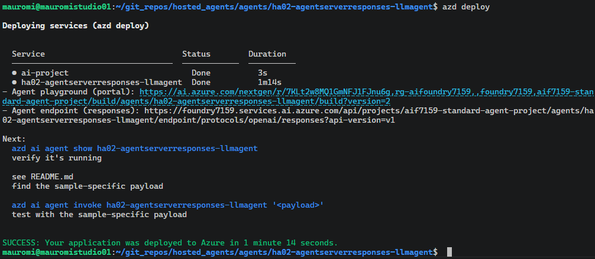

# Microsoft Foundry Hosted Agents — Building, Testing, and Deploying an Agent End‑to‑End

> A complete, hands‑on walkthrough for building a **Foundry Hosted Agent** in Python, running and debugging it locally, upgrading it to the **Microsoft Agent Framework (MAF)**, wiring a **Microsoft Graph** tool through **On‑Behalf‑Of (OBO)**, and finally deploying it into an existing **Microsoft Foundry** project with the **Azure Developer CLI (`azd`)**.
>
> This guide is based on a real, working end‑to‑end setup: the agent is created, tested locally, and then published into a Foundry project — the full round trip.

---

> [!IMPORTANT]
> **Before publishing this repository publicly**, replace the real identifiers in the examples (tenant ID, client ID, subscription ID, resource IDs, Key Vault URL, project endpoint, and especially the **Application Insights connection string**) with placeholders. Never commit a real `.env`, connection string, or client secret to source control.

---

## Table of Contents

- [Introduction](#introduction)
- [Final Result](#final-result)
- [1. Clarifying the Terminology](#1-clarifying-the-terminology)
- [2. Choosing the Right Sample (Host, Not Framework)](#2-choosing-the-right-sample-host-not-framework)
- [3. Which Agent Server Samples Exist](#3-which-agent-server-samples-exist)
- [4. Schema Change — July 6, 2026 (`0.1.0-preview` → `1.0.0-beta.4`)](#4-schema-change--july-6-2026-010-preview--100-beta4)
- [5. Setting Up the Agent Locally](#5-setting-up-the-agent-locally)
- [6. Testing the Hosted Agent Locally](#6-testing-the-hosted-agent-locally)
- [7. Adding a Dockerfile](#7-adding-a-dockerfile)
- [8. From "Responses" to "Responses + Agent Framework (MAF)"](#8-from-responses-to-responses--agent-framework-maf)
- [9. Real vs. Simulated Streaming](#9-real-vs-simulated-streaming)
- [10. Adding a Tool to the MAF Agent (Graph + OBO)](#10-adding-a-tool-to-the-maf-agent-graph--obo)
- [11. Agent Provisioning and Deployment](#11-agent-provisioning-and-deployment)
- [12. Where Do We Keep the Secrets?](#12-where-do-we-keep-the-secrets)

---

## Introduction

A **Foundry Hosted Agent** is an agent whose code runs as a container on the **Microsoft Foundry** hosting infrastructure. You write ordinary Python, the platform turns it into an HTTP service that speaks Foundry's container protocol, and Foundry hosts, scales, and exposes it through a standard endpoint (Playground, Teams, or a raw API).

This document builds one such agent from the ground up, with a very specific requirement in mind: the agent must be able to **read the custom `x-client-*` request headers**, because that is how we securely pass a **user assertion token** into the agent so it can later call downstream APIs (such as Microsoft Graph) **On‑Behalf‑Of (OBO)** the signed‑in user.

That single requirement drives most of the early design decisions — in particular, **which hosting library** we choose. From there the guide follows the natural lifecycle:

1. Understand the three moving parts (Agent Service, Agent Framework, and the `azure-ai-agentserver-*` libraries).
2. Pick the right starter sample.
3. Scaffold, run, and debug the agent **locally**.
4. Upgrade it from raw *Responses* handling to the **Microsoft Agent Framework**.
5. Add a **Graph tool** that uses the propagated user token via OBO.
6. **Provision and deploy** it into a Foundry project with `azd`.
7. Decide **where the secrets live**.

Every step below corresponds to something that was actually executed, with the relevant screenshots included.

---

## Final Result

This is the end state we reach by the end of this analysis — the "full round trip" works:

✅ **We can create the agent** from the *Hello World (Responses, bring‑your‑own)* sample, using the `azure-ai-agentserver-responses` host so that the custom `x-client-*` headers (and therefore the user assertion token) are accessible to our code.

✅ **We can run and test it locally.** The agent starts on `http://0.0.0.0:8088`, answers real prompts through the Responses protocol, and we can verify that the `x-client-user-token` header is received by the handler — the foundation for OBO.

✅ **We can upgrade it to the Microsoft Agent Framework (MAF)** without losing the `-responses` host, gaining automatic tool/function calling, orchestration, and a one‑line handler — while keeping Playground/Teams compatibility.

✅ **We can add a Microsoft Graph tool** that reads the propagated user assertion from a per‑request `ContextVar` and performs the OBO exchange to call Graph as the user.

✅ **We can deploy it into an existing Foundry project** with `azd deploy` (code deploy, no infrastructure provisioning), producing an immutable agent version with a live Playground and Responses endpoint.

**Concretely, the final `azd deploy` succeeds and returns the hosted agent's live endpoints:**



```text
AGENT_..._ENDPOINT       = https://foundry7159.services.ai.azure.com/api/projects/aif7159-standard-agent-project/agents/ha02-agentserverresponses-llmagent/versions/2
AGENT_..._NAME           = ha02-agentserverresponses-llmagent
AGENT_..._RESPONSES_ENDPOINT = https://foundry7159.services.ai.azure.com/api/projects/aif7159-standard-agent-project/agents/ha02-agentserverresponses-llmagent/endpoint/protocols/openai/responses?api-version=v1
AGENT_..._VERSION        = 2
```

The rest of this document explains **how** we get there, chapter by chapter.

---

## 1. Clarifying the Terminology

Before anything else, we need to separate three concepts that are easy to confuse.

| Concept | What it is |
|---|---|
| **Foundry Agent Service** | The **hosting platform**. Our agents run as **containers** on the Foundry infrastructure. |
| **Microsoft Agent Framework (MAF)** | An **authoring library** for writing agents (`ChatAgent`, workflows, orchestration). It is a **programming model — optional**. |
| **`azure-ai-agentserver-*`** | The **hosting / protocol libraries**. They turn our code into an HTTP server that speaks Foundry's container protocol (gateway ↔ container). |

### Two hosting libraries, one important difference

Microsoft ships **two** Python libraries for building a Foundry Hosted Agent:

- `azure-ai-agentserver-agentframework`
- `azure-ai-agentserver-responses`

The critical difference for **our** scenario is header access:

| | `azure-ai-agentserver-agentframework` | `azure-ai-agentserver-responses` |
|---|---|---|
| **Authoring model** | Microsoft Agent Framework | Bring‑your‑own (you write the handler) |
| **Reads `x-client-*`?** | ❌ No — the adapter did not expose them | ✅ Yes — via `context.client_headers` |
| **Protocol** | Responses / Invocations (via adapter) | Responses (direct) |

Because `azure-ai-agentserver-agentframework` does **not** expose the custom `x-client-*` headers — which we need in order to securely pass the assertion token — **we will use `azure-ai-agentserver-responses`.**

> **Key relationship:** *Agent Service is always present*; *Agent Framework* is present **only** with `azure-ai-agentserver-agentframework`, **not** with `azure-ai-agentserver-responses`.

### Breaking down the `azure-ai-agentserver-*` family

- **`-core`** — shared foundations (ASGI host, `PlatformHeaders`, the `x-client-*` passthrough, …).
- **`-responses`** — hosts the **Responses** protocol; **you** write `@app.response_handler`. This is the *bring‑your‑own* option.
- **`-invocations`** — hosts the **Invocations** protocol (arbitrary JSON).
- **`-agentframework`** — an **adapter** that hosts an agent written with the Microsoft Agent Framework (`from_agent_framework`), without making you write the protocol handler.

You can see this in the sample list too: *"Basic agent (Responses, Agent Framework)"* vs. *"Hello World (Responses, without a framework)"* → **same** Responses protocol, but the first uses Agent Framework and the second does not.

[↑ Back to top](#table-of-contents)

---

## 2. Choosing the Right Sample (Host, Not Framework)

**Question:** Do we start from the *Hello World agent (Responses, without a framework, Python)*, or from a sample based on the Agent Framework?

**Answer: choose the sample for its *host*, not its *framework*. The framework is additive; the host is not.**

- If we need a hosting library that exposes `x-client-*` → **`azure-ai-agentserver-responses`**.
- So we start from a template that is **`agentserver-responses`‑compatible** — like *Hello World agent (Responses, without a framework, Python)* — and then we add the Agent Framework (or LangGraph, or nothing) **by hand**.

The alternative — picking a sample that integrates `azure-ai-agentserver-agentframework` and then switching it to `azure-ai-agentserver-responses` — would force us to **rip out the hosting mechanism** (exactly the part that hides the headers) and rebuild it, which is the most delicate piece.

> A framework (MAF, LangGraph, …) is **additive**: we import it as a library inside `@app.response_handler`. So we don't choose the sample by framework, we choose it by **host**.

Later — in theory even in parallel — once the agent is ready, we can choose a starter kit for the **infrastructure** part, such as `azd-ai-starter-basic`, which is framework‑agnostic.

[↑ Back to top](#table-of-contents)

---

## 3. Which Agent Server Samples Exist

Regardless of whether we ultimately use MAF, we first list the available samples and find one based on `azure-ai-agentserver-responses`:

```bash
azd ai agent sample list --language python --output json
```

As of **July 8, 2026**, there are **18** samples. From this list we can see the sample **Hello World agent (Responses, without a framework, Python)**, described as:

> *"Minimal Hello World agent using the Responses protocol with a bring‑your‑own approach. Calls a Foundry model via the Responses API and returns the response."*


It is perfect because:

- **Responses protocol + no framework** → it uses `azure-ai-agentserver-responses` (so it reads the `x-client-*` headers).
- It is **minimal** (unlike the *background* / *notetaking* / *toolbox* samples).
- It **already calls an LLM** → which is exactly our goal: "hook up an LLM without worrying about OBO yet."

### Two decisions to make before running `init`

1. **Where it scaffolds.** `azd ai agent init` creates an `azure.yaml` + `src/<agent-name>/…` structure (not the simple `agents/ha01_echoagent` layout). We decide the init folder, e.g. `~/git_repos/hosted_agents/e2e/ha02_llmagent`.
2. **Which model.** The sample calls the model through the **Foundry project** (project endpoint + deployment, using the agent's managed identity). We can either **(a)** keep the sample's approach (model via the Foundry project), or **(b)** repoint it to a specific Azure OpenAI resource. In this guide we keep the Foundry‑project approach with the `gpt-5.4-mini` deployment.

[↑ Back to top](#table-of-contents)

---

## 4. Schema Change — July 6, 2026 (`0.1.0-preview` → `1.0.0-beta.4`)

During the development of this hosted agent, the **Azure Developer CLI (`azd`) + Foundry agents extension** changed its configuration model. This is **not** a simple update: it is a **major‑version** jump, from **`0.1.0-preview`** to **`1.0.0-beta.4`** (still in beta), with a restructuring of the definition files.

### Before — dedicated agent schema (extension `azure.ai.agents` `0.x`)

The definition was split across two files, each with its own schema:

| File | Schema | Role |
|---|---|---|
| `agent.manifest.yaml` | `AgentManifest.yaml` | Agent manifest/template (name, parameters, resources) |
| `agent.yaml` | `ContainerAgent.yaml` | Container runtime (kind, protocols, resources, env vars) |

The init command pointed at the dedicated manifest:

```bash
azd ai agent init -m agent.manifest.yaml
```

### After — native `azd` schema (extension `azure.ai.agents` `>=1.0.0-beta.4`)

Everything is consolidated into a **single `azure.yaml`**, which uses the **native `azd` schema** (`azure.yaml.json`) — the same as any `azd` project. The agent becomes a normal **service**, and so does the model:

```yaml
# azure.yaml (new format)
name: <project-name>
services:
  ai-project:                 # the Foundry project + the model deployment
    host: azure.ai.project
    deployments: [ ... ]
  <agent-name>:               # the hosted agent
    host: azure.ai.agent
    codeConfiguration: { ... }
    environmentVariables: [ ... ]
infra:
  provider: microsoft.foundry # (or bicep)
```

The init command now points at this file:

```bash
azd ai agent init -m azure.yaml
```

### What changes, in short

| | Before (`0.x`) | After (`1.x` beta) |
|---|---|---|
| **Definition files** | `agent.manifest.yaml` + `agent.yaml` | a single `azure.yaml` |
| **Schema** | dedicated agent schemas | native `azd` schema |
| **Agent** | standalone manifest | `service host: azure.ai.agent` |
| **Model** | resource inside the manifest | `service host: azure.ai.project` |
| **Infrastructure** | implicit | `infra` section (`microsoft.foundry` or `bicep`) |
| **`azd` extension** | `azure.ai.agents 0.x` | `azure.ai.agents >=1.0.0-beta.4` |

**Why it matters.** The new format aligns hosted agents with standard `azd` conventions: a single manifest, the same lifecycle commands (`azd provision`, `azd deploy`), and the same service structure used by any `azd` app. The result is **fewer files, more consistency, and portability** — at the price of still being on a **major beta** (`1.0.0-beta.x`), where names and details can still change.

[↑ Back to top](#table-of-contents)

---

## 5. Setting Up the Agent Locally

### 5.1 Clone the sample

Among all the Foundry samples, the one we want is **Hello World agent (Responses, without a framework, Python)**, placed at `~/git_repos/hosted_agents/agents/ha02_agentserverresponses_llmagent`.

> **Note:** the target project must contain the `gpt-5.4-mini` deployment.

Inside `requirements.txt`, remove the commented line (UV does not like it) and add the libraries listed at the bottom of `requirements.txt`:

```text
python-dotenv
azure-monitor-opentelemetry
agent-framework
```

Clone the sample and open it in VS Code:

```bash
rm -rf ~/git_repos/hosted_agents/agents/ha02-agentserverresponses-llmagent
cd /tmp && rm -rf foundry-samples
git clone --depth 1 https://github.com/microsoft-foundry/foundry-samples.git
cp -r foundry-samples/samples/python/hosted-agents/bring-your-own/responses/hello-world \
  ~/git_repos/hosted_agents/agents/ha02-agentserverresponses-llmagent
cd ~/git_repos/hosted_agents/agents/ha02-agentserverresponses-llmagent
code .
```


### 5.2 Create the environment and verify the imports

Create the local virtual environment with **uv** and install the dependencies:

```bash
cd ~/git_repos/hosted_agents/agents/ha02-agentserverresponses-llmagent
uv init . --python 3.13
uv venv
source .venv/bin/activate
uv add --active $(cat requirements.txt) --prerelease=allow
```

Then test that all the key imports resolve:

```bash
uv run python -c "
from azure.ai.agentserver.responses import ResponsesAgentServerHost, CreateResponse, ResponseContext, TextResponse
from agent_framework import Agent
from agent_framework_foundry import FoundryChatClient
from azure.identity import DefaultAzureCredential
from azure.ai.projects import AIProjectClient
print('ALL IMPORTS OK')
"
```

Expected output (the experimental warnings are normal):

```text
Resolving despite existing lockfile due to change in pre-release mode: `allow` vs. `if-necessary-or-explicit`
.../agent_framework/_skills.py:122: ExperimentalWarning: [SKILLS] SkillResource is experimental and may change or be removed in future versions without notice.
.../agent_framework/_harness/_file_access.py:602: ExperimentalWarning: [HARNESS] AgentFileStore is experimental and may change or be removed in future versions without notice.
ALL IMPORTS OK
```

If you see **`ALL IMPORTS OK`**, the configuration is in place. The uv‑generated `pyproject.toml` captures the resolved dependency set:


### 5.3 Add the `.env` file (local run) — and understand the three "environment" surfaces

We add a `.env` file in the agent root, with the variables needed **while the agent runs locally**. The idea is to keep **no real secrets** in this file — only "durable" strings such as the `client_id` and the **name** of the secret (`APP-OBO-CLIENT-SECRET`), which is stored in the Key Vault at `KEY_VAULT_URL` under the key `APP_OBO_CLIENT_SECRET_NAME`.

Because this file is **not** carried into the container, we will have to **inject** those variables into the container at deployment time. The variables to inject are declared in the `environmentVariables` section of `azure.yaml`.

That file does **not** include two of the variables present in the agent's `.env`, namely `APPLICATIONINSIGHTS_CONNECTION_STRING` and `FOUNDRY_PROJECT_ENDPOINT`. The reason is that **these two are injected directly by the Foundry runtime**.

For the CLI to find the values to inject (declared in `azure.yaml`) during `azd deploy`, the CLI environment running `azd` must have them available. That is why they are placed in **another** `.env`, specific to each environment, located under `.azure/<env_name>/`. Note that this file **does** contain `FOUNDRY_PROJECT_ENDPOINT` — not because the value must be injected, but because the `azd` CLI must know **where** the Foundry project is, in order to publish the agent.

**And the Key Vault?** At startup, `main.py` retrieves its endpoint and puts it into `os.environ["APP_OBO_CLIENT_SECRET"]`, so `utils.py` reads it as before. Naturally, `APP_OBO_CLIENT_SECRET_NAME` is **not** a vault key — it is the variable that holds the **name** of the secret.

There are therefore **three distinct surfaces**, side by side:

**① `.env` — variables used by the agent when it runs locally**

```dotenv
# --------------------------------------------------------
# .env.example for ha02-azureopenaiagent — copy to .env
# and fill in values. NEVER commit .env to source control.
# --------------------------------------------------------

# --------------------------------------------------------
# Microsoft Azure section
# --------------------------------------------------------
KEY_VAULT_URL="https://mauromikeyvault01.vault.azure.net/"
APP_OBO_TENANT_ID="<APP_OBO_TENANT_ID>"
APP_OBO_CLIENT_ID="<APP_OBO_CLIENT_ID>"
APP_OBO_CLIENT_SECRET_NAME="APP-OBO-CLIENT-SECRET"
GRAPH_SCOPES='["https://graph.microsoft.com/Files.Read"]'

# --------------------------------------------------------
# Microsoft Foundry section
# --------------------------------------------------------
# Format: https://<foundry-account>.services.ai.azure.com/api/projects/<project-name>
FOUNDRY_PROJECT_ENDPOINT="https://foundry7159.services.ai.azure.com/api/projects/aif7159-standard-agent-project"
AZURE_AI_MODEL_DEPLOYMENT_NAME="gpt-5.4-mini"
CLIENT_USER_TOKEN_HEADER="x-client-user-token"

# --------------------------------------------------------
# Monitoring section
# --------------------------------------------------------
APPLICATIONINSIGHTS_CONNECTION_STRING="<APPLICATIONINSIGHTS_CONNECTION_STRING>"
AZURE_EXPERIMENTAL_ENABLE_GENAI_TRACING="true"
ENABLE_SENSITIVE_DATA="true"
```

**② `.azure/<env>/.env` — variables used by the CLI for provisioning/deploy** (populated with `azd env set`)

```dotenv
APP_OBO_CLIENT_ID="<APP_OBO_CLIENT_ID>"
APP_OBO_CLIENT_SECRET_NAME="APP-OBO-CLIENT-SECRET"
APP_OBO_TENANT_ID="<APP_OBO_TENANT_ID>"
AZURE_AI_MODEL_DEPLOYMENT_NAME="gpt-5.4-mini"
AZURE_AI_PROJECT_ID="/subscriptions/<SUBSCRIPTION_ID>/resourceGroups/rg-aifoundry7159/providers/Microsoft.CognitiveServices/accounts/foundry7159/projects/aif7159-standard-agent-project"
AZURE_ENV_NAME="ha02-agentserverresponses-llmagent-dev"
AZURE_EXPERIMENTAL_ENABLE_GENAI_TRACING="true"
AZURE_LOCATION="swedencentral"
AZURE_SUBSCRIPTION_ID="<SUBSCRIPTION_ID>"
CLIENT_USER_TOKEN_HEADER="x-client-user-token"
ENABLE_CAPABILITY_HOST="false"
ENABLE_HOSTED_AGENTS="true"
ENABLE_SENSITIVE_DATA="true"
FOUNDRY_PROJECT_ENDPOINT="https://foundry7159.services.ai.azure.com/api/projects/aif7159-standard-agent-project"
GRAPH_SCOPES="[\"https://graph.microsoft.com/Files.Read\"]"
KEY_VAULT_URL="https://mauromikeyvault01.vault.azure.net/"
```

**③ `azure.yaml` — variables made available inside the container**, resolved at deploy time from surface ②

```yaml
environmentVariables:
  - name: KEY_VAULT_URL
    value: ${KEY_VAULT_URL}
  - name: APP_OBO_TENANT_ID
    value: ${APP_OBO_TENANT_ID}
  - name: APP_OBO_CLIENT_ID
    value: ${APP_OBO_CLIENT_ID}
  - name: APP_OBO_CLIENT_SECRET_NAME
    value: ${APP_OBO_CLIENT_SECRET_NAME}
  - name: GRAPH_SCOPES
    value: ${GRAPH_SCOPES}
  - name: AZURE_AI_MODEL_DEPLOYMENT_NAME
    value: ${AZURE_AI_MODEL_DEPLOYMENT_NAME}
  - name: CLIENT_USER_TOKEN_HEADER
    value: ${CLIENT_USER_TOKEN_HEADER}
  - name: AZURE_EXPERIMENTAL_ENABLE_GENAI_TRACING
    value: ${AZURE_EXPERIMENTAL_ENABLE_GENAI_TRACING}
  - name: ENABLE_SENSITIVE_DATA
    value: ${ENABLE_SENSITIVE_DATA}
```

### 5.4 Add `monitoring.py` and run `main.py` in debug

Add `monitoring.py`, import it in `main.py` (remembering that `load_dotenv()` is called inside `monitoring`), and launch `main.py` in debug.

`monitoring.py` (excerpt):

```python
import os
import logging
from dotenv import load_dotenv

load_dotenv()

if os.environ.get("APPLICATIONINSIGHTS_CONNECTION_STRING"):
    from azure.monitor.opentelemetry import configure_azure_monitor
    configure_azure_monitor(logging_level=logging.INFO)
```

`main.py` (import the logger from monitoring):

```python
# Copyright (c) Microsoft. All rights reserved.
"""Hello World — Bring Your Own Responses agent.

Forwards user input to a Foundry model via the Responses API and streams
the reply back through the Responses protocol. See README.md for setup.
"""
from monitoring import logger
```

Expected terminal output when the host starts:

```text
2026-07-06 00:22:51,588 INFO azure.ai.agentserver: AgentServerHost starting on 0.0.0.0:8088
2026-07-06 00:22:51,591 INFO azure.ai.agentserver: AgentServerHost started
2026-07-06 00:22:51,592 INFO azure.ai.agentserver: Connectivity:
2026-07-06 00:22:51,592 INFO azure.ai.agentserver: Connectivity: project_endpoint=https://foundry7159.services.ai.azure.com
[2026-07-06 00:22:51 +0200] [397896] [INFO] Running on http://0.0.0.0:8088 (CTRL + C to quit)
2026-07-06 00:22:51,593 INFO hypercorn.error: Running on http://0.0.0.0:8088 (CTRL + C to quit)
```

### 5.5 The handler (bring‑your‑own Responses)

The **key difference** compared to `azure-ai-agentserver-agentframework`: there, `from_agent_framework(agent)` did everything; **here we write the handler ourselves and call the model**. That is the price *and* the power of *bring‑your‑own* — and it gives us access to `context`, hence (soon) to the `x-client-*` headers.

```python
@app.response_handler
async def handler(
    request: CreateResponse,
    context: ResponseContext,
    _cancellation_signal: asyncio.Event,
):
    """Forward user input to the model with conversation history."""
    user_assertion = context.client_headers.get(os.environ["CLIENT_USER_TOKEN_HEADER"], "")
    logger.info(f"User assertion: {user_assertion}")

    user_input = await context.get_input_text() or "Hello!"
    history = await context.get_history()
    input_items = _build_input(user_input, history)

    response = await asyncio.get_running_loop().run_in_executor(
        None,
        lambda: _responses_client.create(
            model=_model,
            instructions=_SYSTEM_PROMPT,
            input=input_items,
            store=False,
        ),
    )
    return TextResponse(context, request, text=response.output_text)
```

What each piece does:

- We **write the handler ourselves** — in the `agentframework` version it did not exist, because the adapter generated it.
- We **retrieve the token** transmitted via `CLIENT_USER_TOKEN_HEADER` (i.e. `x-client-user-token`).
- `context.get_input_text()` → the user message; `context.get_history()` → the history managed by the platform.
- `_build_input(...)` transforms history + message into the Responses API input format (a list of `{role, content}`).
- `_responses_client.create(...)` calls the model (a blocking call → wrapped in `run_in_executor` so it does not block the event loop).
- It returns `TextResponse(... text=response.output_text)`.

[↑ Back to top](#table-of-contents)

---

## 6. Testing the Hosted Agent Locally

We test the `azure-ai-agentserver-responses` hosted agent. Notably, we are also able to pass the `x-client-user-token` parameter. True, we are local and it *could* behave differently once published — but, as we will see, it works as a hosted agent on Foundry too.

Request file (`agent_via_responses_simple.http`):

```http
@baseUrl = http://localhost:8088
@query = What is a meaning function? Please answer in less than 10 words.

POST {{baseUrl}}/responses
Content-Type: application/json
x-client-user-token: aaa

{
  "input": "{{query}}"
}
```

In the debugger we can confirm that the handler receives the request input **and** the `x-client-user-token` header (here set to `aaa`), which lands in `user_assertion`:


And the HTTP response comes back `200 OK` with the model's answer:


### How streaming works here

The client (Playground, Teams, API) decides whether it wants `stream: true` or `false`. When you return a `TextResponse`, it is the **host** that bridges:

- Non‑streaming client → receives the complete response.
- Streaming client → the host wraps your text in the Responses protocol's streaming events.

So our current handler **already works for both Playground and Teams** — no need to handle the two cases by hand.

### The real difference (true streaming vs. not)

There is a UX/latency nuance:

- **`TextResponse`** = you produce the entire text and then the host delivers it (possibly "packaged" as a stream). The user waits for the model to finish before seeing anything.
- **True streaming (token‑by‑token)** = the model's tokens flow as they are generated (more responsive feel). To do this you do **not** return a `TextResponse`, but a **streaming response** (an async generator of events provided by the responses SDK), fed by the model's stream.

| What you want | What you return | Works in Playground/Teams? |
|---|---|---|
| Simple, complete response | `TextResponse` (current) | ✅ Yes (the host adapts) |
| Real‑time token‑by‑token | streaming response (async gen of events) | ✅ Yes, with better UX |

When we add MAF: `await agent.run(text)` → non‑streaming (returns the complete result) → maps to `TextResponse`. Perfect to start. MAF also offers `agent.run_stream(...)` → if you later want true streaming, we use that plus the host's streaming response.

[↑ Back to top](#table-of-contents)

---

## 7. Adding a Dockerfile

```dockerfile
FROM python:3.13-slim
WORKDIR /app

# Copy only the application files — do NOT copy .env (secrets must be
# injected at runtime via environment variables or --env-file).

# Copy requirements first to leverage Docker layer caching:
# pip install is re-executed only when requirements.txt changes,
# not on every source code change.
COPY requirements.txt user_agent/
WORKDIR /app/user_agent
RUN if [ -f requirements.txt ]; then \
    pip install --no-cache-dir --upgrade pip && \
    pip install --no-cache-dir -r requirements.txt; \
    fi

# Copy source code after dependencies. Changes here only invalidate this layer.
COPY main.py utils.py monitoring.py ./

EXPOSE 8088
CMD ["python", "main.py"]
```

> As we will see in [Chapter 11](#11-agent-provisioning-and-deployment), because we use **code deploy** (a `codeConfiguration` block in `azure.yaml`), this **Dockerfile is ignored** at deploy time — Foundry builds the image server‑side from `requirements.txt`. The `COPY` list here matters only for a **local** Docker build.

[↑ Back to top](#table-of-contents)

---

## 8. From "Responses" to "Responses + Agent Framework (MAF)"

The downloaded project already works as‑is: the handler calls the Foundry model via the "raw" Responses API and returns the text. Now we transform it into the **MAF** version, which brings:

- **Automatic tool/function calling** (MAF manages the model→tool→model loop).
- **Multi‑step / multi‑agent orchestration**, thread/memory management.
- A **simpler handler**: one line (`agent.run`) instead of building input/history by hand.
- **Provider abstraction** + integrated middleware/telemetry.
- It keeps the **`-responses` host** → access to `x-client-*` and Playground/Teams compatibility.

**Prerequisite (dependencies):** add `agent-framework` (which brings `agent-framework-foundry` → `FoundryChatClient`). Do **not** add `agent-framework-azure-ai` (incompatible with `1.10`).

### Modification 1 — Imports: add MAF

*Why:* `Agent` is the MAF authoring model; `FoundryChatClient` is the MAF client to the Foundry project's model.

```python
# after
from agent_framework import Agent
from agent_framework_foundry import FoundryChatClient
```

### Modification 2 — Imports: remove the "raw" Foundry client

*Why:* we no longer create the raw Responses client; `FoundryChatClient` handles it.

```python
# before (removed)
from azure.ai.projects import AIProjectClient
```

### Modification 3 — Imports: remove the input‑building models

*Why:* they were only used to build the input/history manually, which with MAF we no longer do.

```python
# before (removed)
from azure.ai.agentserver.responses.models import (
    MessageContentInputTextContent,
    MessageContentOutputTextContent,
)
```

### Modification 4 — Replace the "raw" client with a MAF client + agent

*Why:* we create the MAF agent once, bound to the Foundry model; this is where tools, instructions, etc. attach.

```python
# before
_responses_client = AIProjectClient(
    endpoint=_endpoint,
    credential=DefaultAzureCredential()
).get_openai_client().responses

# after
_chat_client = FoundryChatClient(
    project_endpoint=_endpoint,
    model=_model,
    credential=DefaultAzureCredential(),
)
_agent = Agent(
    _chat_client,                 # 1st positional = client
    _SYSTEM_PROMPT,               # 2nd positional = instructions
    name="BYO Responses Agent",
    # tools=[...],                # <-- MAF tools go here
)
```

### Modification 5 — Remove `_ROLE_MAP` and `_build_input`

*Why:* the conversation is managed by the MAF agent; there is no need to build the input list by hand.

```python
# before (removed)
_ROLE_MAP = {
    MessageContentOutputTextContent: "assistant",
    MessageContentInputTextContent: "user",
}

def _build_input(current_input: str, history: list) -> list[dict]:
    items = []
    for item in history:
        for content in getattr(item, "content", None) or []:
            role = _ROLE_MAP.get(type(content))
            if role and content.text:
                items.append({"role": role, "content": content.text})
    items.append({"role": "user", "content": current_input})
    return items
```

### Modification 6 — Handler: a single call to the agent

*Why:* `_agent.run()` is natively async (no `run_in_executor`) and encapsulates the LLM call plus any tool‑calling. You return `result.text`.

```python
# before
user_input = await context.get_input_text() or "Hello!"
history = await context.get_history()
input_items = _build_input(user_input, history)
response = await asyncio.get_running_loop().run_in_executor(
    None,
    lambda: _responses_client.create(
        model=_model,
        instructions=_SYSTEM_PROMPT,
        input=input_items,
        store=False,
    ),
)
return TextResponse(context, request, text=response.output_text)

# after
user_input = await context.get_input_text() or "Hello!"
result = await _agent.run(user_input)
return TextResponse(context, request, text=result.text)
```

**Unchanged:** `app = ResponsesAgentServerHost(...)`, the `@app.response_handler` decorator, `TextResponse`, and the rest of the host.

[↑ Back to top](#table-of-contents)

---

## 9. Real vs. Simulated Streaming

**Is this true streaming or simulated?** It is **simulated: full‑then‑deliver** — and for now we leave it as is.

It is the same case as before: with `result = await _agent.run(user_input)` + `TextResponse(...)`:

- `agent.run()` waits for the **entire** model response to complete;
- then you return all the text in a `TextResponse`;
- the host **can** deliver it to a streaming client by "packaging" it into the protocol's events, but the tokens **do not** flow in real time from the model.

So it is exactly like the default with plain Responses (`_responses_client.create(...)` without `stream=True`): produce‑all‑then‑return. Only **who** makes the call changes (MAF instead of the raw client), not the streaming.

### To get true (token‑by‑token) streaming

Two changes are needed:

1. Use `_agent.run_stream(user_input)` instead of `_agent.run(...)` → MAF gives you an async iterator that emits partial updates as the model generates.
2. Return from the handler a **streaming response** of the `-responses` host (an async generator of events) instead of a `TextResponse`, forwarding the chunks arriving from `run_stream`.

*(The exact name of the streaming response type we will verify in the SDK when we implement it.)*

### Summary

| Version | Streaming |
|---|---|
| Default Responses (`create`, no stream) | Simulated (full‑then‑deliver) |
| Current MAF (`agent.run` + `TextResponse`) | Simulated (full‑then‑deliver) |
| MAF streaming (`agent.run_stream` + streaming response) | True (token‑by‑token) |

**Recommendation:** for the "from scratch" documentation, keep the **non‑streaming** version as the baseline (simple, works everywhere) and add streaming as an **optional advanced variant**.

[↑ Back to top](#table-of-contents)

---

## 10. Adding a Tool to the MAF Agent (Graph + OBO)

To test **Microsoft Graph** engagement, we add a **tool** to the agent. MAF makes this extremely convenient: we define an async function and register it in the agent definition.

```python
async def onedrive_root_folders_async() -> str:
    ...

_agent = Agent(
    _chat_client,            # 1st positional = client
    _SYSTEM_PROMPT,          # 2nd positional = instructions
    name=maf_agent_name,
    tools=[onedrive_root_folders_async],
)
```

So, when the agent's LLM deems it necessary, it has the framework invoke the function. If a tool had parameters, the **LLM** would fill them in; ours has none, but the principle is the same.

### The OBO subtlety: never pass the token as a parameter

Clearly, somewhere the function will have to use the **user token** to access Graph via **OBO**. But that token **cannot** be passed as a parameter: the LLM that prepares the tool call **does not know it** (and rightly so — it is a secret).

So we **inject the user assertion (Token C) into a `ContextVar`**, so the tool can read it on its own.

Specifically, instead of implementing the Graph call inside the tool, we write a **helper function** and have the tool invoke it. For consistency we name it the same as the tool without the `_async` suffix (`onedrive_root_folders`); being internal and never called by the LLM, it can freely accept the user assertion **as a parameter**, because the tool passes it in after reading it from the `ContextVar`. The helper then performs the **OBO** (Token C → Token D, the real bearer to Graph) and calls the API.

> The `ContextVar` is a **per‑request** variable: it prevents concurrent requests from overwriting each other, which would happen with a normal global variable.

[↑ Back to top](#table-of-contents)

---

## 11. Agent Provisioning and Deployment

### 11.1 The AZD environment

An **`azd` environment** is a **named deployment profile**. It lives in `.azure/<name>/` at the project root (next to `azure.yaml`) and contains: subscription, region, and the `.env` file from which `azd` resolves the `${...}` placeholders. Normally `azd` creates it on the first `provision`/`up`, or you create it by hand with `azd env new`. **It has nothing to do with your code** — it is just the deploy state.

When you run `azd env new`, nothing is duplicated: `azd env set` and `azd env get-values` are the same thing — the CLI interface to write/read that `.azure/<env>/.env` file. You could edit the file by hand with the same effect.

```bash
# 1. create the environment
azd env new ha02-agentserverresponses-llmagent-dev

# 2. set the 4 variables
azd env set AZURE_AI_MODEL_DEPLOYMENT_NAME gpt-5.4-mini
azd env set CLIENT_USER_TOKEN_HEADER x-client-user-token
azd env set AZURE_EXPERIMENTAL_ENABLE_GENAI_TRACING true
azd env set ENABLE_SENSITIVE_DATA true

# 3. check
azd env get-values
```


> ⚠️ **Do not confuse** this with a possible `.env` in the project root (the one `load_dotenv()` uses in `monitoring.py` for the local `python main.py` run): that is a **different** file, for a **different** purpose. The one under `.azure/…/` belongs only to `azd`.

### 11.2 Container environment variables

The `environmentVariables` section of the agent's service declares **which environment variables the hosting container will receive**. Each entry has the form `name` / `value`. At provision/deploy time, `azd` resolves it by reading the value from the **active environment** (`.azure/<environment>/.env`, populated with `azd env set`). The resolved value is then injected as an environment variable into the agent's container.

It follows that `azure.yaml` **assumes those variables exist** in the selected environment: if one is missing, `${NAME}` resolves to an **empty string** and the container starts with that variable unset. Switching environment (e.g. dev → prod), the same `${NAME}` references pull different values, without touching `azure.yaml`.

**Exception:** `FOUNDRY_PROJECT_ENDPOINT` and `APPLICATIONINSIGHTS_CONNECTION_STRING` are **not** declared here, because the hosting platform injects them automatically at runtime (locally, `azd` provides them). They must be left **out** of the `environmentVariables` section.

```yaml
environmentVariables:
  # FOUNDRY_PROJECT_ENDPOINT and APPLICATIONINSIGHTS_CONNECTION_STRING are
  # injected automatically by the hosting platform — do NOT declare them here.
  - name: AZURE_AI_MODEL_DEPLOYMENT_NAME
    value: ${AZURE_AI_MODEL_DEPLOYMENT_NAME}
  - name: CLIENT_USER_TOKEN_HEADER
    value: ${CLIENT_USER_TOKEN_HEADER}
  - name: AZURE_EXPERIMENTAL_ENABLE_GENAI_TRACING
    value: ${AZURE_EXPERIMENTAL_ENABLE_GENAI_TRACING}
  - name: ENABLE_SENSITIVE_DATA
    value: ${ENABLE_SENSITIVE_DATA}
```

> One technical clarification: the `${...}` resolution happens on the `azd` side, on our machine; the container receives the **final values**, not the placeholders.

### 11.3 Installing extensions in AZD

When we install `microsoft.foundry`, `azd` automatically pulls in all its Foundry dependencies (projects, connections, inspector, routines, skills, toolboxes). So `microsoft.foundry` is effectively the **meta‑package** that bundles everything.


### 11.4 Provisioning: one rule to keep in mind

> **`azure.yaml` = WHAT I deploy. The `azd` environment = WHERE I deploy it.** The "where" is never in `azure.yaml`: it lives in the environment.

All these commands run from the same root folder that contains `azure.yaml`, `.azure`, and `main.py`. There are **two orthogonal, independent choices** (hence 4 possible combinations):

1. Create a **new environment** (`azd env new <name>`) or use an **existing** one (`azd env select <name>`) — represented by a folder under `.azure/<name>` containing `.env`, `.env.lock`, `config.json`.
2. Create a **new Foundry project** or use an **existing** one.

#### (a) NEW Foundry project — `azd` creates everything

```bash
# create environment and variables
azd env new <env-name>
azd env set APP_OBO_CLIENT_ID "<APP_OBO_CLIENT_ID>"
azd env set APP_OBO_CLIENT_SECRET_NAME "APP-OBO-CLIENT-SECRET"
azd env set APP_OBO_TENANT_ID "<APP_OBO_TENANT_ID>"
azd env set AZURE_AI_MODEL_DEPLOYMENT_NAME "gpt-5.4-mini"
azd env set AZURE_EXPERIMENTAL_ENABLE_GENAI_TRACING "true"
azd env set ENABLE_SENSITIVE_DATA "true"
azd env set CLIENT_USER_TOKEN_HEADER "x-client-user-token"
azd env set GRAPH_SCOPES "[\"https://graph.microsoft.com/Files.Read\"]"
azd env set KEY_VAULT_URL "https://mauromikeyvault01.vault.azure.net/"

# provisioning
azd provision   # asks subscription + region, CREATES project + model + infra

# deployment
azd deploy      # publishes the agent into the new Foundry project
```

#### (b) EXISTING Foundry project — `azd` adopts it, NO provision

```bash
# create environment and variables — exactly as for the "new project" case
azd env new <env-name>
azd env set APP_OBO_CLIENT_ID "<APP_OBO_CLIENT_ID>"
azd env set APP_OBO_CLIENT_SECRET_NAME "APP-OBO-CLIENT-SECRET"
azd env set APP_OBO_TENANT_ID "<APP_OBO_TENANT_ID>"
azd env set AZURE_AI_MODEL_DEPLOYMENT_NAME "gpt-5.4-mini"
azd env set AZURE_EXPERIMENTAL_ENABLE_GENAI_TRACING "true"
azd env set ENABLE_SENSITIVE_DATA "true"
azd env set CLIENT_USER_TOKEN_HEADER "x-client-user-token"
azd env set GRAPH_SCOPES "[\"https://graph.microsoft.com/Files.Read\"]"
azd env set KEY_VAULT_URL "https://mauromikeyvault01.vault.azure.net/"

# specify the existing project
azd env set AZURE_SUBSCRIPTION_ID "<SUBSCRIPTION_ID>"
azd env set FOUNDRY_PROJECT_ENDPOINT "https://foundry7159.services.ai.azure.com/api/projects/aif7159-standard-agent-project"
azd env set AZURE_AI_PROJECT_ID "/subscriptions/<SUBSCRIPTION_ID>/resourceGroups/rg-aifoundry7159/providers/Microsoft.CognitiveServices/accounts/foundry7159/projects/aif7159-standard-agent-project"
azd env set AZURE_LOCATION swedencentral

# NO provisioning
# deployment
azd deploy      # publishes the agent INTO the existing project
```

Note the **two variables, side by side**:

| Variable | What it is (format) | Who uses it |
|---|---|---|
| `FOUNDRY_PROJECT_ENDPOINT` | URL → `https://foundry7159…/projects/…` | `azd ai project show`, to resolve the project |
| `AZURE_AI_PROJECT_ID` | ARM ID → `/subscriptions/…/projects/…` | `azd deploy`, which requires it explicitly |

Different formats, different consumers → **both are needed**. Plus `AZURE_SUBSCRIPTION_ID`.

**Practical consideration — the environment remembers what it contains.** If we reuse an existing environment, we carry over the values already written in its `.env` (subscription, endpoint, output of a previous deploy). So:

- Want to continue/update an existing deployment → **reuse** that environment.
- Want a clean start (e.g. change target project) → **create a new env**, or overwrite the old values with `azd env set`.

> The healthy rule is: **one environment ≈ one deploy target.** Don't mix two different targets in the same environment, to avoid confusion from residual values.

### 11.5 What happens when we run `azd deploy`?

1. **`azd deploy` ties `azure.yaml` + environment together.** It reads `azure.yaml` (the *what*: the service, `codeConfiguration`, the `environmentVariables`), takes the active environment (`.azure/<env>/.env`: the *where* + the `${...}` values), resolves the placeholders, and publishes to the target. Yes, it merges them for you.
2. **How it picks the files: NOT from the Dockerfile.** We are using **code deploy** (`codeConfiguration` in `azure.yaml`), so the **Dockerfile is ignored**. The mechanism is different: `azd` takes the service folder (`project: .`) and **zips it entirely**; excludes what is listed in `.agentignore` (`.gitignore`‑style syntax); uploads the ZIP; **Foundry builds the image server‑side**, installs from `requirements.txt`, and runs `entryPoint: main.py`.

So `main.py`, `monitoring.py`, `utils.py`, `requirements.txt` end up in the package because they are **in the folder**, not because they are in the Dockerfile's `COPY`. The Dockerfile's `COPY` list matters only for a **local** Docker build.

#### ⚠️ We are missing `.agentignore` — a serious problem

Because `project: .` zips the **entire** folder and this project was born with the old flow (without `.agentignore`), **without that file `azd` would also package** `.venv`, `__pycache__`, and — above all — `.azure`, which contains your **secrets**. So creating this file is **indispensable**:

```gitignore
# Allowlist model: exclude everything, then re-include ONLY what the agent
# needs at runtime. This mirrors the COPY set of the Dockerfile
# (requirements.txt + main.py + utils.py + monitoring.py).
#
# To add a runtime file, add another `!<file>` line below.
/*
!main.py
!monitoring.py
!utils.py
!requirements.txt
```

#### Deploy method: Code or Docker Container?

The method (code vs. container) is decided by the presence of `codeConfiguration` in `azure.yaml`, **not** by the Dockerfile:

- **Code deploy:** activates automatically when we have (as here) the `codeConfiguration` branch in `azure.yaml`:

  ```yaml
  codeConfiguration:
    runtime: python_3_13
    entryPoint: main.py
  ```

- **Container deploy:** activates automatically if the `codeConfiguration` branch is **absent**: `azd` builds the Dockerfile and pushes it to the Foundry project's ACR.

> If one day you see `Packaging container` in the logs while expecting a code deploy, it means `azd` took the container path by mistake → check that `codeConfiguration` is present and correctly written.

#### `.agentignore` vs. `.azdignore`

`.agentignore` is read by the **agents extension's code deploy**; `.azdignore` is used by **`azd` core**. We keep them **identical**, so that whichever mechanism actually runs, we always package the same set.

### 11.6 Python packages and dependencies

**Basic principle.** `requirements.txt` is the input we manage by hand. The same file is used in two moments:

- **Locally**, by `uv`, to create your virtual environment.
- **At deploy time**, by the hosted‑agent build in Foundry, which installs it with `pip` inside the container (code deploy).

So what we write here must be resolvable **by both `uv` and `pip`**: we act manually only on `requirements.txt`, adding/removing libraries there, and then we regenerate the environment. `pyproject.toml` and `uv.lock` are generated by `uv` from this file.

**Two mandatory rules:**

1. **Use the sub‑packages you import, NOT the `agent-framework` meta‑package.** The meta drags in all integrations (openai, anthropic, bedrock, redis, hyperlight…). `hyperlight` requires `hyperlight-sandbox-backend-wasm`, which `pip` **cannot** install in the container (`uv` locally can, `pip` in the build cannot → deploy fails).

   | Import in code | Package in `requirements.txt` |
   |---|---|
   | `from agent_framework import ...` | `agent-framework-core` |
   | `from agent_framework_foundry import ...` | `agent-framework-foundry` |

   *General rule:* if in the future you import another integration, add that specific sub‑package (e.g. `agent-framework-openai`), **never** the meta.

2. **No comments (`#`) in `requirements.txt`.** The install script uses `uv add $(cat requirements.txt)`: every line becomes an argument, so a comment line would be interpreted as a package name → error. Keep the file to package lines only.

**Current `requirements.txt`:**

```text
azure-ai-agentserver-responses==1.0.0b8
azure-ai-projects==2.0.1
azure-identity==1.25.3
debugpy==1.8.21
python-dotenv==1.2.2
azure-monitor-opentelemetry==1.8.9
agent-framework-core==1.10.0
agent-framework-foundry==1.0.1
```

`--prerelease=allow` (see script) is necessary because some versions are pre‑release (e.g. `azure-ai-agentserver-responses==1.0.0b8`).

**Local environment creation (script):**

```bash
# 1. mkdir the new folder and cd into it

# 2. initialize the uv project (creates pyproject.toml)
uv init . --python 3.13

# 3. create the local virtual environment
uv venv

# 4. activate the environment:
source .venv/bin/activate         # Linux/macOS
# .\.venv\Scripts\activate.ps1    # Windows

# 5. add the libraries (--active is ESSENTIAL: uses the active venv):
uv add --active $(cat requirements.txt) --prerelease=allow   # in bulk from the file (NO comments in the file!)
uv add --active <package-name> --prerelease=allow            # single manual add

# 6. verify the installed packages
uv pip list

# 7. sync the structure (only needed with a pre-existing pyproject.toml)
uv sync --active --prerelease=allow

# 8. deactivate
deactivate
```

**What extra is needed for the deploy (beyond the local install)?** Nothing specific. `azd deploy` sends the same `requirements.txt` to the container build, which installs it with `pip`. You do not maintain a separate file for the deploy. The only two conditions for the remote build to succeed are the two rules above: specific sub‑packages (no `agent-framework` meta); no comments in the file.

> If one day a package installs locally with `uv` but fails in the build with `pip`, the cause is almost always a package `pip` cannot fetch (like `hyperlight-sandbox-backend-wasm`): the fix is to not depend on the meta and declare only the sub‑packages you actually use.

### 11.7 Run the deployment

In our case we do **not** want to provision, because we want to use the **existing** Foundry project. A quick status check first, then deploy:

```bash
# confirm project endpoint + the variables
azd env get-values

# must see your existing project
azd ai project show --output json
```

```json
{
  "endpoint": "https://foundry7159.services.ai.azure.com/api/projects/aif7159-standard-agent-project",
  "source": "azdEnv",
  "sourceDetail": "azd env",
  "azdEnv": "ha02-agentserverresponses-llmagent-dev"
}
```

```bash
azd deploy
```

Deployment output — both services report **Done**, and `azd` prints the Playground portal URL and the Responses endpoint:


The environment now records the published agent's endpoints and version:

```text
AGENT_HA02_AGENTSERVERRESPONSES_LLMAGENT_ENDPOINT="https://foundry7159.services.ai.azure.com/api/projects/aif7159-standard-agent-project/agents/ha02-agentserverresponses-llmagent/versions/2"
AGENT_HA02_AGENTSERVERRESPONSES_LLMAGENT_NAME="ha02-agentserverresponses-llmagent"
AGENT_HA02_AGENTSERVERRESPONSES_LLMAGENT_RESPONSES_ENDPOINT="https://foundry7159.services.ai.azure.com/api/projects/aif7159-standard-agent-project/agents/ha02-agentserverresponses-llmagent/endpoint/protocols/openai/responses?api-version=v1"
AGENT_HA02_AGENTSERVERRESPONSES_LLMAGENT_VERSION=2
```

### 11.8 What if I need to re‑deploy?

Suppose we changed the code, or `requirements.txt`, or even just the project's `.env`. The short answer is: **`azd deploy` for almost everything.** But it depends on what changed:

| What we changed | Command |
|---|---|
| Code (`main.py`, `utils.py`, …) | `azd deploy` |
| `requirements.txt` | `azd deploy` (the remote build reinstalls) |
| Value of an env var in the `azd` environment (`azd env set …`) | `azd deploy` |
| `azure.yaml`: add/remove an env var, cpu/memory | `azd deploy` |
| `azure.yaml`: model/infra (deployments, sku, capacity) | `azd provision` → then `azd deploy` |

> **Rule:** `azd deploy` covers code, dependencies, and env‑var values. You need `azd provision` only if you touch the **infrastructure** (model, capacity, resources). Every `azd deploy` creates a **new immutable version** of the agent.

#### ⚠️ There are TWO `.env` files (a typical source of confusion)

| File | What it is for | Effect on the deploy |
|---|---|---|
| `.env` in the project root | Local run only (`python main.py`, via `python-dotenv`) | **None.** Editing it does NOT change the agent on Foundry |
| `.azure/<env>/.env` (`azd` environment) | Source of the `${...}` in `azure.yaml` at deploy | Change here + `azd deploy` → the container gets the new values |

**In short, very practically:** if we change only the **project** `.env`, the cloud does not change. To change a value in the container you must put it in the **`azd` environment**:

```bash
azd env set NAME_VAR new_value
azd deploy
```

**The typical flow:**

```bash
# (optional) align the local venv if you touched requirements.txt
uv add --active $(cat requirements.txt) --prerelease=allow

# publish the new version
azd deploy
```

> **Note:** if you change only the endpoint/agent‑card (not env, not code), there is the shortcut `azd ai agent endpoint update`, which does **not** create a new version. For env var / code / deps, it is `azd deploy` (new version).

[↑ Back to top](#table-of-contents)

---

## 12. Where Do We Keep the Secrets?

### Correct solution: Azure Key Vault + Managed Identity

The standard pattern that **decouples rotation from deployment**:

1. Store `APP_OBO_CLIENT_SECRET` in a **Key Vault**.
2. Give the agent's **managed identity** (the one that already uses `DefaultAzureCredential` and has *Cognitive Services User* on the project) the role **Key Vault Secrets User** on the vault.
3. In code, read the secret **at runtime** (not from an env var).
4. In `azure.yaml`, pass only **non‑secret** values.

**No redeploy on rotation:** rotate the secret in the Key Vault → the agent reads the updated value at the next `get_secret` (or on container restart). **No `azd deploy`.** That is why Key Vault beats the `.env`.

### Even better (if you want to eliminate the secret entirely)

For OBO we can use **Workload Identity Federation**: the app registration trusts the agent's managed identity, which obtains tokens **without a client secret**. **Zero secrets to rotate.** It is more setup but it is the ideal long‑term approach — there is a dedicated skill (`entra-agent-id`).

### Required addition to `requirements.txt`

To read from Key Vault you need the library:

```text
azure-keyvault-secrets
```

[↑ Back to top](#table-of-contents)

---

*Document generated from the source Word document “Microsoft Foundry Hosted Agents.docx”, translated from Italian to English and reorganized into chapters for publication. All screenshots are the original captures from the source document.*
