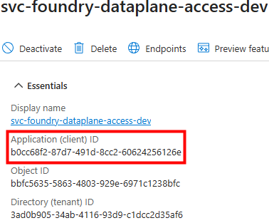
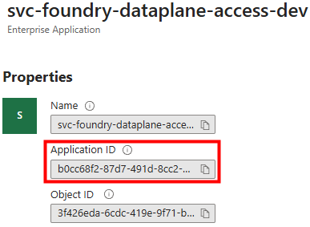
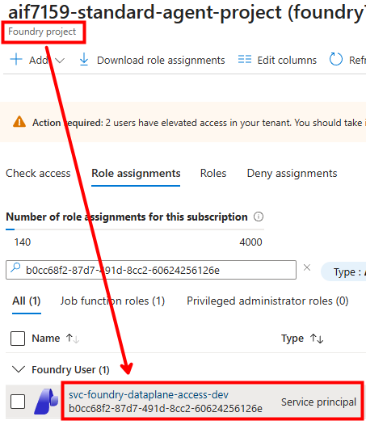
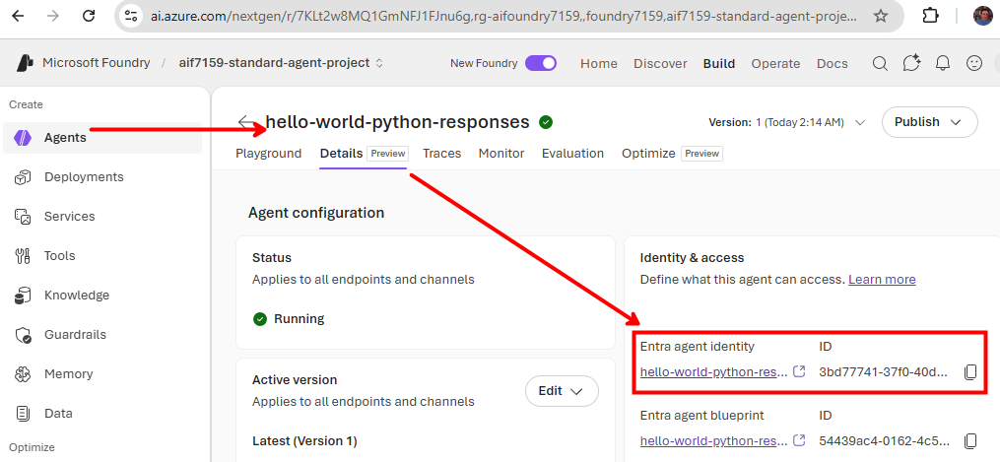

# Microsoft Foundry Hosted Agents — Building, Testing, and Deploying an Agent End‑to‑End

> A complete, hands‑on walkthrough for building a **Foundry Hosted Agent** in Python, running and debugging it locally, securing its secrets with **Azure Key Vault + Managed Identity**, upgrading it to the **Microsoft Agent Framework (MAF)**, wiring a **Microsoft Graph** tool through **On‑Behalf‑Of (OBO)**, and finally deploying it into a **Microsoft Foundry** project with the **Azure Developer CLI (`azd`)**.
>
> This guide is based on a real, working end‑to‑end setup: the agent (`hello-world-python-responses`) is created, tested locally, and then published into a Foundry project — the full round trip.

---

## Table of Contents

- [Introduction](#introduction)
- [Final Result](#final-result)
- [1. Clarifying the Terminology](#1-clarifying-the-terminology)
- [2. Choosing the Right Sample (Host, Not Framework)](#2-choosing-the-right-sample-host-not-framework)
- [3. Which Agent Server Samples Exist](#3-which-agent-server-samples-exist)
- [4. Schema Change — July 6, 2026 (`0.1.0-preview` → `1.0.0-beta.4`)](#4-schema-change--july-6-2026-010-preview--100-beta4)
- [5. Setting Up the Agent Locally](#5-setting-up-the-agent-locally)
- [6. Storing Secrets: Key Vault and Managed Identity](#6-storing-secrets-key-vault-and-managed-identity)
- [7. The Agent Code: monitoring.py and the Handler](#7-the-agent-code-monitoringpy-and-the-handler)
- [8. First Local Test of the Hosted Agent](#8-first-local-test-of-the-hosted-agent)
- [9. Adding a Dockerfile (Optional)](#9-adding-a-dockerfile-optional)
- [10. From "Responses" to "Responses + Agent Framework (MAF)"](#10-from-responses-to-responses--agent-framework-maf)
- [11. Real vs. Simulated Streaming](#11-real-vs-simulated-streaming)
- [12. Adding a Tool to the MAF Agent (Graph + OBO)](#12-adding-a-tool-to-the-maf-agent-graph--obo)
- [13. Agent Provisioning and Deployment](#13-agent-provisioning-and-deployment)

---

## Introduction

A **Foundry Hosted Agent** is an agent whose code runs as a container on the **Microsoft Foundry** hosting infrastructure. You write ordinary Python, the platform turns it into an HTTP service that speaks Foundry's container protocol, and Foundry hosts, scales, and exposes it through a standard endpoint (Playground, Teams, or a raw API).

This document builds one such agent from the ground up, with a very specific requirement in mind: the agent must be able to **read the custom `x-client-*` request headers**, because that is how we securely pass a **user assertion token** into the agent so it can later call downstream APIs (such as Microsoft Graph) **On‑Behalf‑Of (OBO)** the signed‑in user.

That single requirement drives most of the early design decisions — in particular, **which hosting library** we choose. From there the guide follows the natural lifecycle:

1. Understand the three moving parts (Agent Service, Agent Framework, and the `azure-ai-agentserver-*` libraries).
2. Pick the right starter sample.
3. Scaffold and configure the agent **locally**.
4. **Secure the secrets** with Key Vault + Managed Identity, and understand the agent's own identity (Microsoft Entra Agent ID).
5. Run and debug the agent locally.
6. Upgrade it from raw *Responses* handling to the **Microsoft Agent Framework**, and add a **Graph tool** that uses the propagated user token via OBO.
7. **Provision and deploy** it into a Foundry project with `azd`.

Every step below corresponds to something that was actually executed, with the relevant screenshots included.

---

## Final Result

This is the end state we reach by the end of this analysis — the "full round trip" works:

✅ **We can create the agent** from the *Hello World (Responses, bring‑your‑own)* sample, using the `azure-ai-agentserver-responses` host so that the custom `x-client-*` headers (and therefore the user assertion token) are accessible to our code.

✅ **We keep secrets out of `.env` and in Key Vault.** The OBO client secret lives in **Azure Key Vault**; locally the agent reads it with the developer's `az login` identity, and in the Foundry container it reads it with its own **Agent Identity (Microsoft Entra Agent ID)**, which is granted the **Key Vault Secrets User** role.

✅ **We can run and test it locally.** The agent starts on `http://0.0.0.0:8088`, answers real prompts through the Responses protocol, and we can verify (with a breakpoint) that the `x-client-user-token` header reaches `context.client_headers` — the foundation for OBO.

✅ **We can upgrade it to the Microsoft Agent Framework (MAF)** without losing the `-responses` host, gaining automatic tool/function calling, orchestration, and a one‑line handler — while keeping Playground/Teams compatibility.

✅ **We can add a Microsoft Graph tool** (`onedrive_root_folders_async`) that reads the propagated user assertion from a per‑request `ContextVar` and performs the OBO token exchange (via MSAL, with the client secret pulled from Key Vault) to call Graph as the user.

✅ **We can deploy it into the Foundry project** with `azd deploy` (code deploy, no container build). If the project does not exist yet, `azd provision` creates the account, project, and model first; otherwise we skip provisioning and deploy straight into the existing project.

**Concretely, the final `azd deploy` succeeds and publishes the hosted agent as version 1, returning its live endpoints:**


```text
AGENT_HELLO_WORLD_PYTHON_RESPONSES_ENDPOINT="https://foundry7159.services.ai.azure.com/api/projects/aif7159-standard-agent-project/agents/hello-world-python-responses/versions/1"
AGENT_HELLO_WORLD_PYTHON_RESPONSES_NAME="hello-world-python-responses"
AGENT_HELLO_WORLD_PYTHON_RESPONSES_RESPONSES_ENDPOINT="https://foundry7159.services.ai.azure.com/api/projects/aif7159-standard-agent-project/agents/hello-world-python-responses/endpoint/protocols/openai/responses?api-version=v1"
AGENT_HELLO_WORLD_PYTHON_RESPONSES_VERSION=1
```

The rest of this document explains **how** we get there, chapter by chapter.

---

## 1. Clarifying the Terminology

Before anything else, we need to separate three concepts that are easy to confuse.

| Concept | What it is |
|---|---|
| **Foundry Agent Service** | The **hosting platform**. Our agents run as **containers** on the Foundry infrastructure. |
| **Microsoft Agent Framework (MAF)** | An **authoring library** for writing agents (`ChatAgent`, workflows, orchestration). It is a **programming model — optional**. |
| **`azure-ai-agentserver-*`** | The **hosting / protocol libraries**. They turn our code into an HTTP server that speaks Foundry's container protocol (gateway ↔ container). |

### Two hosting libraries, one important difference

Microsoft ships **two** Python libraries for building a Foundry Hosted Agent:

- `azure-ai-agentserver-agentframework`
- `azure-ai-agentserver-responses`

The critical difference for **our** scenario is header access:

| | `azure-ai-agentserver-agentframework` | `azure-ai-agentserver-responses` |
|---|---|---|
| **Authoring model** | Microsoft Agent Framework | Bring‑your‑own (you write the handler) |
| **Reads `x-client-*`?** | ❌ No — the adapter did not expose them | ✅ Yes — via `context.client_headers` |
| **Protocol** | Responses / Invocations (via adapter) | Responses (direct) |

Because `azure-ai-agentserver-agentframework` does **not** expose the custom `x-client-*` headers — which we need in order to securely pass the assertion token — **we will use `azure-ai-agentserver-responses`.**

> **Key relationship:** *Agent Service is always present*; *Agent Framework* is present **only** with `azure-ai-agentserver-agentframework`, **not** with `azure-ai-agentserver-responses`.

### Breaking down the `azure-ai-agentserver-*` family

- **`-core`** — shared foundations (ASGI host, `PlatformHeaders`, the `x-client-*` passthrough, …).
- **`-responses`** — hosts the **Responses** protocol; **you** write `@app.response_handler`. This is the *bring‑your‑own* option.
- **`-invocations`** — hosts the **Invocations** protocol (arbitrary JSON).
- **`-agentframework`** — an **adapter** that hosts an agent written with the Microsoft Agent Framework (`from_agent_framework`), without making you write the protocol handler.

You can see this in the sample list too: *"Basic agent (Responses, Agent Framework)"* vs. *"Hello World (Responses, without a framework)"* → **same** Responses protocol, but the first uses Agent Framework and the second does not.

[↑ Back to top](#table-of-contents)

---

## 2. Choosing the Right Sample (Host, Not Framework)

**Question:** Do we start from the *Hello World agent (Responses, without a framework, Python)*, or from a sample based on the Agent Framework?

**Answer: choose the sample for its *host*, not its *framework*. The framework is additive; the host is not.**

- If we need a hosting library that exposes `x-client-*` → **`azure-ai-agentserver-responses`**.
- So we start from a template that is **`agentserver-responses`‑compatible** — like *Hello World agent (Responses, without a framework, Python)* — and then we add the Agent Framework (or LangGraph, or nothing) **by hand**.

The alternative — picking a sample that integrates `azure-ai-agentserver-agentframework` and then switching it to `azure-ai-agentserver-responses` — would force us to **rip out the hosting mechanism** (exactly the part that hides the headers) and rebuild it, which is the most delicate piece.

> A framework (MAF, LangGraph, …) is **additive**: we import it as a library inside `@app.response_handler`. So we don't choose the sample by framework, we choose it by **host**.

Later — in theory even in parallel — once the agent is ready, we can choose a starter kit for the **infrastructure** part, such as `azd-ai-starter-basic`, which is framework‑agnostic.

[↑ Back to top](#table-of-contents)

---

## 3. Which Agent Server Samples Exist

Regardless of whether we ultimately use MAF, we first list the available samples and find one based on `azure-ai-agentserver-responses`:

```bash
azd ai agent sample list --language python --output json
```

As of **July 8, 2026**, there are **18** samples. From this list we can see the sample **Hello World agent (Responses, without a framework, Python)**, described as:

> *"Minimal Hello World agent using the Responses protocol with a bring‑your‑own approach. Calls a Foundry model via the Responses API and returns the response."*


It is perfect because:

- **Responses protocol + no framework** → it uses `azure-ai-agentserver-responses` (so it reads the `x-client-*` headers).
- It is **minimal** (unlike the *background* / *notetaking* / *toolbox* samples).
- It **already calls an LLM** → which is exactly our goal: "hook up an LLM without worrying about OBO yet."

### Two decisions to make before running `init`

1. **Where it scaffolds.** `azd ai agent init` creates an `azure.yaml` + `src/<agent-name>/…` structure (not the simple `agents/ha01_echoagent` layout). We decide the init folder.
2. **Which model.** The sample calls the model through the **Foundry project** (project endpoint + deployment, using the agent's managed identity). We can either **(a)** keep the sample's approach (model via the Foundry project), or **(b)** repoint it to a specific Azure OpenAI resource. In this guide we keep the Foundry‑project approach with the `gpt-5.4-mini` deployment.

[↑ Back to top](#table-of-contents)

---

## 4. Schema Change — July 6, 2026 (`0.1.0-preview` → `1.0.0-beta.4`)

During the development of this hosted agent, the **Azure Developer CLI (`azd`) + Foundry agents extension** changed its configuration model. This is **not** a simple update: it is a **major‑version** jump, from **`0.1.0-preview`** to **`1.0.0-beta.4`** (still in beta), with a restructuring of the definition files.

### Before — dedicated agent schema (extension `azure.ai.agents` `0.x`)

The definition was split across two files, each with its own schema:

| File | Schema | Role |
|---|---|---|
| `agent.manifest.yaml` | `AgentManifest.yaml` | Agent manifest/template (name, parameters, resources) |
| `agent.yaml` | `ContainerAgent.yaml` | Container runtime (kind, protocols, resources, env vars) |

The init command pointed at the dedicated manifest:

```bash
azd ai agent init -m agent.manifest.yaml
```

### After — native `azd` schema (extension `azure.ai.agents` `>=1.0.0-beta.4`)

Everything is consolidated into a **single `azure.yaml`**, which uses the **native `azd` schema** (`azure.yaml.json`) — the same as any `azd` project. The agent becomes a normal **service**, and so does the model:

```yaml
# azure.yaml (new format)
name: <project-name>
services:
  ai-project:                 # the Foundry project + the model deployment
    host: azure.ai.project
    deployments: [ ... ]
  <agent-name>:               # the hosted agent
    host: azure.ai.agent
    codeConfiguration: { ... }
    environmentVariables: [ ... ]
infra:
  provider: microsoft.foundry # (or bicep)
```

The init command now points at this file:

```bash
azd ai agent init -m azure.yaml
```

### What changes, in short

| | Before (`0.x`) | After (`1.x` beta) |
|---|---|---|
| **Definition files** | `agent.manifest.yaml` + `agent.yaml` | a single `azure.yaml` |
| **Schema** | dedicated agent schemas | native `azd` schema |
| **Agent** | standalone manifest | `service host: azure.ai.agent` |
| **Model** | resource inside the manifest | `service host: azure.ai.project` |
| **Infrastructure** | implicit | `infra` section (`microsoft.foundry` or `bicep`) |
| **`azd` extension** | `azure.ai.agents 0.x` | `azure.ai.agents >=1.0.0-beta.4` |

**Why it matters.** The new format aligns hosted agents with standard `azd` conventions: a single manifest, the same lifecycle commands (`azd provision`, `azd deploy`), and the same service structure used by any `azd` app. The result is **fewer files, more consistency, and portability** — at the price of still being on a **major beta** (`1.0.0-beta.x`), where names and details can still change.

[↑ Back to top](#table-of-contents)

---

## 5. Setting Up the Agent Locally

### 5.1 Clone the sample

Among all the Foundry samples, the one we want is **Hello World agent (Responses, without a framework, Python)**.

> **Note:** the target project must contain the `gpt-5.4-mini` deployment.

Inside `requirements.txt`, remove what **uv** does not like — **every empty line** and **the comment line** — then add the libraries listed at the bottom of `requirements.txt` (now with pinned versions, `agent-framework` split into its `-core` and `-foundry` sub‑packages, plus `azure-keyvault-secrets` for reading the OBO secret from Key Vault):

```text
python-dotenv==1.2.2
azure-monitor-opentelemetry==1.8.9
agent-framework-core==1.10.0
agent-framework-foundry==1.0.1
azure-keyvault-secrets==4.11.0
```

Clone the sample and open it in VS Code:

```bash
rm -rf ~/git_repos/hosted_agents/agents/ha02-agentserverresponses-llmagent
cd /tmp && rm -rf foundry-samples
git clone --depth 1 https://github.com/microsoft-foundry/foundry-samples.git
cp -r foundry-samples/samples/python/hosted-agents/bring-your-own/responses/hello-world \
  ./hello-world-responses
cd ./hello-world-responses
code .
```


### 5.2 Create the environment and verify the imports

Create the local virtual environment with **uv**, install the dependencies, and test that all the key imports resolve:

```bash
cd ./src/hello-world-python-responses
uv init . --python 3.13
uv venv
source .venv/bin/activate
uv add --active $(cat requirements.txt) --prerelease=allow

uv run python -c "
from azure.ai.agentserver.responses import ResponsesAgentServerHost, CreateResponse, ResponseContext, TextResponse
from agent_framework import Agent
from agent_framework_foundry import FoundryChatClient
from azure.identity import DefaultAzureCredential
from azure.ai.projects import AIProjectClient
print('ALL IMPORTS OK')
"
```

Expected output (the experimental warnings are normal):

```text
Resolving despite existing lockfile due to change in pre-release mode: `allow` vs. `if-necessary-or-explicit`
.../agent_framework/_skills.py:122: ExperimentalWarning: [SKILLS] SkillResource is experimental and may change or be removed in future versions without notice.
.../agent_framework/_harness/_file_access.py:602: ExperimentalWarning: [HARNESS] AgentFileStore is experimental and may change or be removed in future versions without notice.
ALL IMPORTS OK
```

If you see **`ALL IMPORTS OK`**, the configuration is in place. The uv‑generated `pyproject.toml` captures the resolved dependency set:


### 5.3 Variables for running the agent (the `.env` file)

We add a `.env` file in the agent root, with the variables needed **while the agent runs locally**. The idea is to keep **no real secrets** in this file — only "durable" strings such as the `client_id` and the **name** of the secret (`APP-OBO-CLIENT-SECRET`), which is stored in the Key Vault at `KEY_VAULT_URL` under the key `APP_OBO_CLIENT_SECRET_NAME`.

This `.env` holds **11 variables**. As we will see in [Chapter 13 — container environment variables](#132-container-environment-variables), the hosted agent on Foundry needs **two fewer** — `FOUNDRY_PROJECT_ENDPOINT` and `APPLICATIONINSIGHTS_CONNECTION_STRING` — because they are **auto‑injected by the Foundry runtime**, so there it is **9 instead of 11**.

**And the Key Vault?** At startup, `main.py` retrieves its endpoint and puts the secret into `os.environ["APP_OBO_CLIENT_SECRET"]`, so `utils.py` reads it as before. Naturally, `APP_OBO_CLIENT_SECRET_NAME` is **not** a vault key — it is the local variable that holds the **name** of the Key Vault secret. Reading from the vault requires it to be in **Azure RBAC** mode with the **Key Vault Secrets User** role — the topic of the [next chapter](#6-storing-secrets-key-vault-and-managed-identity).

**`.env`** — variables used by the agent when it runs locally (11 variables; all are needed to run inside the Foundry container **except** the 2 auto‑injected ones — App Insights + project endpoint):

```dotenv
# --------------------------------------------------------
# .env.example for ha02-azureopenaiagent — copy to .env
# and fill in values. NEVER commit .env to source control.
# --------------------------------------------------------

# --------------------------------------------------------
# Microsoft Azure section
# --------------------------------------------------------
KEY_VAULT_URL="https://mauromikeyvault01.vault.azure.net/"
APP_OBO_TENANT_ID="3ad0b905-34ab-4116-93d9-c1dcc2d35af6"
APP_OBO_CLIENT_ID="3a0fad96-b026-4f5f-914a-fc6348656f6b"
APP_OBO_CLIENT_SECRET_NAME="APP-OBO-CLIENT-SECRET"
GRAPH_SCOPES='["https://graph.microsoft.com/Files.Read"]'

# --------------------------------------------------------
# Microsoft Foundry section
# --------------------------------------------------------
# Format: https://<foundry-account>.services.ai.azure.com/api/projects/<project-name>
FOUNDRY_PROJECT_ENDPOINT="https://foundry7159.services.ai.azure.com/api/projects/aif7159-standard-agent-project"
AZURE_AI_MODEL_DEPLOYMENT_NAME="gpt-5.4-mini"
CLIENT_USER_TOKEN_HEADER="x-client-user-token"

# --------------------------------------------------------
# Monitoring section
# --------------------------------------------------------
APPLICATIONINSIGHTS_CONNECTION_STRING="InstrumentationKey=b8637e87-3083-427a-8b03-32391c706b58;IngestionEndpoint=https://swedencentral-0.in.applicationinsights.azure.com/;LiveEndpoint=https://swedencentral.livediagnostics.monitor.azure.com/;ApplicationId=15bfc2ba-379c-4422-b11c-bbcac3cecac7"
AZURE_EXPERIMENTAL_ENABLE_GENAI_TRACING="true"
ENABLE_SENSITIVE_DATA="true"
```

[↑ Back to top](#table-of-contents)

---

## 6. Storing Secrets: Key Vault and Managed Identity

**Should we store the secrets right next to the variables, in `.env`? No!** We use **Azure Key Vault + Managed Identity**. The standard pattern **decouples secret rotation from deployment**: the OBO client secret lives in the vault, the code reads it at runtime, and `azure.yaml` carries only non‑secret values.

### The challenge — a different identity locally vs. in the container

- **Locally**, access to the Key Vault happens by default through the **developer's credentials** stored via the CLI (`az login` / the user), because authentication uses `DefaultAzureCredential`. So if the user who ran `az login` has at least the **Key Vault Secrets User** RBAC role, they can read the secrets even from code running locally (executed by the CLI or by VS Code).
- **In the Foundry container**, instead, `DefaultAzureCredential` uses the **container's managed identity**. We therefore need to retrieve the object ID of the identity that runs the agent and assign **it** the **Key Vault Secrets User** RBAC role.

### Two planes that must be kept distinct

Before the solution, one fundamental point: there are **two separate, independent planes** — the first is *"who gets in"*, the second is *"with which identity the agent presents itself to the outside"*.

**1) Ingress — who can invoke the agent.** The caller (a user or a service principal) must hold the **Foundry User** role **on the project** (not on the agent). This governs invocation access.

**2) Egress — with which identity the agent accesses remote resources.** The agent runs under its own **Agent Identity (Microsoft Entra Agent ID)**: a **per‑instance service principal**, distinct both from the caller and from the Foundry account's managed identity. Roles on resources (e.g. **Key Vault Secrets User**) are assigned to **this** identity.

Two handy verification commands (post‑assignment):

```bash
# Identities that can invoke a Foundry Project (Foundry User role):
PROJECT_SCOPE="/subscriptions/<sub>/resourceGroups/<rg>/providers/Microsoft.CognitiveServices/accounts/<account>/projects/<project>"
az role assignment list --scope "$PROJECT_SCOPE" \
  --query "[?roleDefinitionName=='Foundry User'].{principal:principalId, type:principalType}" -o table

# Identities that can access the Key Vault resource:
RES_SCOPE="/subscriptions/.../providers/Microsoft.KeyVault/vaults/<kv>"
az role assignment list --scope "$RES_SCOPE" \
  --query "[?principalType=='ServicePrincipal'].{principal:principalId, role:roleDefinitionName}" -o table
```

### Assigning **Foundry User** to a service principal (ingress)

The following three screenshots show how to assign the **Foundry User** role to an *Entra ID registered application* — or, more precisely, to its **Service Principal** instance `svc-foundry-dataplane-access-dev`.

First, note the application's **Application (client) ID** on the App registration blade:



The same application also appears as an **Enterprise Application** (its Service Principal), with a matching Application ID:



Then, on the **Foundry project's** Access control (IAM) → Role assignments, we grant that service principal the **Foundry User** role:



### Assigning **Key Vault Secrets User** to the Agent Identity (egress)

The next two screenshots show how to retrieve the **agent's identity** inside the Foundry portal → select the agent, open **Details**, and read the **Entra agent identity** ID. That ID is then added to the **Key Vault** IAM with the **Key Vault Secrets User** role.




### Summary

| Needed for… | Correct identity | How to obtain it |
|---|---|---|
| **Invoking** the agent | the caller, with **Foundry User** on the project | `az role assignment list` on the project scope |
| The agent **accessing a resource** | the **Agent Identity** (per‑instance SP) | from the resource's role assignments / the Foundry portal / Microsoft Entra Agent ID |

### Why Key Vault beats `.env`, and what's even better

- **No redeploy on rotation:** rotate the secret in the Key Vault → the agent reads the updated value at the next `get_secret` (or on container restart). **No `azd deploy`.**
- **Even better (remove the secret entirely):** for OBO you can use **Workload Identity Federation** — the app registration trusts the agent's managed identity, which obtains tokens **without a client secret**. **Zero secrets to rotate.** It is more setup but is the ideal long‑term approach (there is a dedicated skill, `entra-agent-id`).
- **Library:** the only package to add to `requirements.txt` to access Key Vault programmatically is **`azure-keyvault-secrets`** (already added in [Chapter 5](#51-clone-the-sample)).

### References

- **Foundry RBAC** — roles and assignments on the project: <https://learn.microsoft.com/azure/ai-foundry/concepts/rbac-ai-foundry>
- **Microsoft Entra Agent ID** — the Blueprint → BlueprintPrincipal → Agent Identity model, per‑identity permissions, and OBO / `fmi_path` token exchange: Microsoft Learn, search *"Microsoft Entra Agent ID"*.

[↑ Back to top](#table-of-contents)

---

## 7. The Agent Code: monitoring.py and the Handler

### 7.1 Add `monitoring.py` and run `main.py` in debug

Add `monitoring.py`, import it in `main.py` (remembering that `load_dotenv()` is called inside `monitoring`), and launch `main.py` in debug.

`monitoring.py` (excerpt):

```python
import os
import logging
from dotenv import load_dotenv

load_dotenv()

if os.environ.get("APPLICATIONINSIGHTS_CONNECTION_STRING"):
    from azure.monitor.opentelemetry import configure_azure_monitor
    configure_azure_monitor(logging_level=logging.INFO)
```

`main.py` (import the logger from monitoring):

```python
# Copyright (c) Microsoft. All rights reserved.
"""Hello World — Bring Your Own Responses agent.

Forwards user input to a Foundry model via the Responses API and streams
the reply back through the Responses protocol. See README.md for setup.
"""
from monitoring import logger
```

Expected terminal output when the host starts:

```text
2026-07-06 00:22:51,588 INFO azure.ai.agentserver: AgentServerHost starting on 0.0.0.0:8088
2026-07-06 00:22:51,591 INFO azure.ai.agentserver: AgentServerHost started
2026-07-06 00:22:51,592 INFO azure.ai.agentserver: Connectivity:
2026-07-06 00:22:51,592 INFO azure.ai.agentserver: Connectivity: project_endpoint=https://foundry7159.services.ai.azure.com
[2026-07-06 00:22:51 +0200] [397896] [INFO] Running on http://0.0.0.0:8088 (CTRL + C to quit)
2026-07-06 00:22:51,593 INFO hypercorn.error: Running on http://0.0.0.0:8088 (CTRL + C to quit)
```

### 7.2 The handler (bring‑your‑own Responses)

The **key difference** compared to `azure-ai-agentserver-agentframework`: there, `from_agent_framework(agent)` did everything; **here we write the handler ourselves and call the model**. That is the price *and* the power of *bring‑your‑own* — and it gives us access to `context`, hence to the `x-client-*` headers.

```python
@app.response_handler
async def handler(
    request: CreateResponse,
    context: ResponseContext,
    _cancellation_signal: asyncio.Event,
):
    """Forward user input to the model with conversation history."""
    user_assertion = context.client_headers.get(os.environ["CLIENT_USER_TOKEN_HEADER"], "")
    logger.info(f"User assertion: {user_assertion}")

    user_input = await context.get_input_text() or "Hello!"
    history = await context.get_history()
    input_items = _build_input(user_input, history)

    response = await asyncio.get_running_loop().run_in_executor(
        None,
        lambda: _responses_client.create(
            model=_model,
            instructions=_SYSTEM_PROMPT,
            input=input_items,
            store=False,
        ),
    )
    return TextResponse(context, request, text=response.output_text)
```

What each piece does:

- We **write the handler ourselves** — in the `agentframework` version it did not exist, because the adapter generated it.
- We **retrieve the token** transmitted via `CLIENT_USER_TOKEN_HEADER` (i.e. `x-client-user-token`).
- `context.get_input_text()` → the user message; `context.get_history()` → the history managed by the platform.
- `_build_input(...)` transforms history + message into the Responses API input format (a list of `{role, content}`).
- `_responses_client.create(...)` calls the model (a blocking call → wrapped in `run_in_executor` so it does not block the event loop).
- It returns `TextResponse(... text=response.output_text)`.

[↑ Back to top](#table-of-contents)

---

## 8. First Local Test of the Hosted Agent

We are ready for the first test of this `azure-ai-agentserver-responses` hosted agent. The procedure:

1. Put a **breakpoint** in `main.py` on the line `user_input = await context.get_input_text() or "Hello!"`.
2. Run the **first** REST request from `agent_via_responses_simple.http` — the one **without** `x-client-user-token`.
3. Run the **second** REST request and verify the value in `context.client_headers["x-client-user-token"]`.

True, we are local and it *could* behave differently once published — but, as we will see, it works as a hosted agent on Foundry too.

Request file (`agent_via_responses_simple.http`):

```http
@baseUrl = http://localhost:8088
@query = What is a meaning function? Please answer in less than 10 words.

POST {{baseUrl}}/responses
Content-Type: application/json
x-client-user-token: aaa

{
  "input": "{{query}}"
}
```

In the debugger we can confirm that the handler receives the request input **and** the `x-client-user-token` header (here set to `aaa`), visible under `context.client_headers`:


And the HTTP response comes back `200 OK` with the model's answer:


### How streaming works here

The client (Playground, Teams, API) decides whether it wants `stream: true` or `false`. When you return a `TextResponse`, it is the **host** that bridges:

- Non‑streaming client → receives the complete response.
- Streaming client → the host wraps your text in the Responses protocol's streaming events.

So our current handler **already works for both Playground and Teams** — no need to handle the two cases by hand.

### The real difference (true streaming vs. not)

There is a UX/latency nuance:

- **`TextResponse`** = you produce the entire text and then the host delivers it (possibly "packaged" as a stream). The user waits for the model to finish before seeing anything.
- **True streaming (token‑by‑token)** = the model's tokens flow as they are generated (more responsive feel). To do this you do **not** return a `TextResponse`, but a **streaming response** (an async generator of events provided by the responses SDK), fed by the model's stream.

| What you want | What you return | Works in Playground/Teams? |
|---|---|---|
| Simple, complete response | `TextResponse` (current) | ✅ Yes (the host adapts) |
| Real‑time token‑by‑token | streaming response (async gen of events) | ✅ Yes, with better UX |

When we add MAF: `await agent.run(text)` → non‑streaming (returns the complete result) → maps to `TextResponse`. Perfect to start. MAF also offers `agent.run_stream(...)` → if you later want true streaming, we use that plus the host's streaming response.

[↑ Back to top](#table-of-contents)

---

## 9. Adding a Dockerfile (Optional)

In this context a Dockerfile is **not strictly needed**, because later we do a **code deployment**, not a **container deployment**. Still, it is useful to see and costs very little. The steps:

1. **Duplicate `.env` into `.env.docker`** and add the last 3 lines, so Docker can authenticate to Foundry with a **service principal** that is a *Foundry User* of that project:

   ```dotenv
   AZURE_TENANT_ID=3ad0b905-34ab-4116-93d9-c1dcc2d35af6
   AZURE_CLIENT_ID=b0cc68f2-87d7-491d-8cc2-60624256126e
   AZURE_CLIENT_SECRET=4bp***
   ```

2. **Clean the environment** if needed:

   ```bash
   for id in $(docker images -aq); do docker rmi -f "$id"; done
   for id in $(docker ps -aq); do docker rm -f "$id"; done
   ```

3. **Build the container and run it on port 8080** (mapping to the container's 8088):

   ```bash
   docker build -t hello-world-python-responses .
   docker run --rm -p 8080:8088 --env-file .env.docker hello-world-python-responses
   ```

The `Dockerfile` itself:

```dockerfile
FROM python:3.13-slim
WORKDIR /app

# Copy only the application files — do NOT copy .env (secrets must be
# injected at runtime via environment variables or --env-file).

# Copy requirements first to leverage Docker layer caching:
# pip install is re-executed only when requirements.txt changes,
# not on every source code change.
COPY requirements.txt user_agent/
WORKDIR /app/user_agent
RUN if [ -f requirements.txt ]; then \
    pip install --no-cache-dir --upgrade pip && \
    pip install --no-cache-dir -r requirements.txt; \
    fi

# Copy source code after dependencies. Changes here only invalidate this layer.
COPY main.py utils.py monitoring.py ./

EXPOSE 8088
CMD ["python", "main.py"]
```

> As we will see in [Chapter 13](#13-agent-provisioning-and-deployment), because we use **code deploy** (a `codeConfiguration` block in `azure.yaml`), this **Dockerfile is ignored** at deploy time — Foundry builds the image server‑side from `requirements.txt`. The `COPY` list here matters only for a **local** Docker build.

[↑ Back to top](#table-of-contents)

---

## 10. From "Responses" to "Responses + Agent Framework (MAF)"

The downloaded project already works as‑is: the handler calls the Foundry model via the "raw" Responses API and returns the text. Now we transform it into the **MAF** version, which brings:

- **Automatic tool/function calling** (MAF manages the model→tool→model loop).
- **Multi‑step / multi‑agent orchestration**, thread/memory management.
- A **simpler handler**: one line (`agent.run`) instead of building input/history by hand.
- **Provider abstraction** + integrated middleware/telemetry.
- It keeps the **`-responses` host** → access to `x-client-*` and Playground/Teams compatibility.

**Prerequisite (dependencies):** add `agent-framework` (which brings `agent-framework-foundry` → `FoundryChatClient`). Do **not** add `agent-framework-azure-ai` (incompatible with `1.10`).

### Modification 1 — Imports: add MAF

*Why:* `Agent` is the MAF authoring model; `FoundryChatClient` is the MAF client to the Foundry project's model.

```python
# after
from agent_framework import Agent
from agent_framework_foundry import FoundryChatClient
```

### Modification 2 — Imports: remove the "raw" Foundry client

*Why:* we no longer create the raw Responses client; `FoundryChatClient` handles it.

```python
# before (removed)
from azure.ai.projects import AIProjectClient
```

### Modification 3 — Imports: remove the input‑building models

*Why:* they were only used to build the input/history manually, which with MAF we no longer do.

```python
# before (removed)
from azure.ai.agentserver.responses.models import (
    MessageContentInputTextContent,
    MessageContentOutputTextContent,
)
```

### Modification 4 — Replace the "raw" client with a MAF client + agent

*Why:* we create the MAF agent once, bound to the Foundry model; this is where tools, instructions, etc. attach.

```python
# before
_responses_client = AIProjectClient(
    endpoint=_endpoint,
    credential=DefaultAzureCredential()
).get_openai_client().responses

# after
_chat_client = FoundryChatClient(
    project_endpoint=_endpoint,
    model=_model,
    credential=DefaultAzureCredential(),
)
_agent = Agent(
    _chat_client,                 # 1st positional = client
    _SYSTEM_PROMPT,               # 2nd positional = instructions
    name="BYO Responses Agent",
    # tools=[...],                # <-- MAF tools go here
)
```

### Modification 5 — Remove `_ROLE_MAP` and `_build_input`

*Why:* the conversation is managed by the MAF agent; there is no need to build the input list by hand.

```python
# before (removed)
_ROLE_MAP = {
    MessageContentOutputTextContent: "assistant",
    MessageContentInputTextContent: "user",
}

def _build_input(current_input: str, history: list) -> list[dict]:
    items = []
    for item in history:
        for content in getattr(item, "content", None) or []:
            role = _ROLE_MAP.get(type(content))
            if role and content.text:
                items.append({"role": role, "content": content.text})
    items.append({"role": "user", "content": current_input})
    return items
```

### Modification 6 — Handler: a single call to the agent

*Why:* `_agent.run()` is natively async (no `run_in_executor`) and encapsulates the LLM call plus any tool‑calling. You return `result.text`. Keep the first line (`user_input = await context.get_input_text() or "Hello!"`) and replace the rest:

```python
# before (keeping the first line)
user_input = await context.get_input_text() or "Hello!"
history = await context.get_history()
input_items = _build_input(user_input, history)
response = await asyncio.get_running_loop().run_in_executor(
    None,
    lambda: _responses_client.create(
        model=_model,
        instructions=_SYSTEM_PROMPT,
        input=input_items,
        store=False,
    ),
)
return TextResponse(context, request, text=response.output_text)

# after
user_input = await context.get_input_text() or "Hello!"
result = await _agent.run(user_input)
return TextResponse(context, request, text=result.text)
```

**Unchanged:** `app = ResponsesAgentServerHost(...)`, the `@app.response_handler` decorator, `TextResponse`, and the rest of the host.

[↑ Back to top](#table-of-contents)

---

## 11. Real vs. Simulated Streaming

**Is this true streaming or simulated?** It is **simulated: full‑then‑deliver** — and for now we leave it as is.

It is the same case as before: with `result = await _agent.run(user_input)` + `TextResponse(...)`:

- `agent.run()` waits for the **entire** model response to complete;
- then you return all the text in a `TextResponse`;
- the host **can** deliver it to a streaming client by "packaging" it into the protocol's events, but the tokens **do not** flow in real time from the model.

So it is exactly like the default with plain Responses (`_responses_client.create(...)` without `stream=True`): produce‑all‑then‑return. Only **who** makes the call changes (MAF instead of the raw client), not the streaming.

### To get true (token‑by‑token) streaming

Two changes are needed:

1. Use `_agent.run_stream(user_input)` instead of `_agent.run(...)` → MAF gives you an async iterator that emits partial updates as the model generates.
2. Return from the handler a **streaming response** of the `-responses` host (an async generator of events) instead of a `TextResponse`, forwarding the chunks arriving from `run_stream`.

*(The exact name of the streaming response type we will verify in the SDK when we implement it.)*

### Summary

| Version | Streaming |
|---|---|
| Default Responses (`create`, no stream) | Simulated (full‑then‑deliver) |
| Current MAF (`agent.run` + `TextResponse`) | Simulated (full‑then‑deliver) |
| MAF streaming (`agent.run_stream` + streaming response) | True (token‑by‑token) |

**Recommendation:** for the "from scratch" documentation, keep the **non‑streaming** version as the baseline (simple, works everywhere) and add streaming as an **optional advanced variant**.

[↑ Back to top](#table-of-contents)

---

## 12. Adding a Tool to the MAF Agent (Graph + OBO)

To test **Microsoft Graph** engagement, we add a **tool** to the agent. MAF makes this extremely convenient.

First we import the **`utils`** library, which contains the function `onedrive_root_folders(user_assertion: str)` — given the correct Graph‑scoped token via the `user_assertion` parameter, it returns the folders in the user's OneDrive root. In the imports we also add **`contextvars`**, which lets us store per‑session ("per‑request") globals.

### The OBO subtlety: never pass the token as a parameter

Clearly, somewhere the function will have to use the **user token** to access Graph via **OBO**. But that token **cannot** be passed as a tool parameter: the LLM that prepares the tool call **does not know it** (and rightly so — it is a secret). So we **inject the user assertion (Token C) into a `ContextVar`**, so the tool can read it on its own:

```python
from utils import onedrive_root_folders
import contextvars

# Per-request user assertion (Token C), exposed to tools via a ContextVar so it is
# NOT an LLM-visible tool parameter. The handler sets it; the tool reads it.
_current_user_assertion: contextvars.ContextVar[str] = contextvars.ContextVar(
    "current_user_assertion", default=""
)
```

### The helper that calls Graph (`onedrive_root_folders`)

Instead of implementing the Graph call inside the tool, we write a **helper function** and have the tool invoke it. Being internal and never called by the LLM, it can freely accept `user_assertion` **as a parameter**, because the tool passes it in after reading it from the `ContextVar`. This function does the **token exchange**: from **Token C** it derives **Token D**, the real bearer to Graph, with which it calls the Graph API.

```python
def onedrive_root_folders(user_assertion: str) -> list[dict]:
    """OBO-exchange the user assertion (Token C) for a Microsoft Graph token,
    then return the biggest folder in the user's OneDrive root.
    Returns a human-readable string and never raises (any failure is reported
    in the returned text)."""
    scopes = ast.literal_eval(
        os.environ.get("GRAPH_SCOPES", '["https://graph.microsoft.com/Files.Read"]')
    )
    token = token_exchange(user_assertion, scopes)  # Token D
    if token.startswith("[graph]"):  # token_exchange returns an error string on failure
        return token
    try:
        resp = requests.get(
            GRAPH_ROOT_CHILDREN,
            headers={"Authorization": f"Bearer {token}"},
            timeout=30,
        )
        if resp.status_code != 200:
            return f"[graph] /me/drive/root/children -> {resp.status_code}: {resp.text[:300]}"
        folders = [
            {"name": it["name"], "size": it["size"], "childCount": it["folder"]["childCount"]}
            for it in resp.json().get("value", [])
            if "folder" in it
        ]
        if not folders:
            return "No folders found in the OneDrive root."
        return f"Here are the folders on your OneDrive root: {folders}"
    except Exception as e:  # noqa: BLE001 - report any failure as text, never crash the tool
        return f"[graph] error: {type(e).__name__}: {e}"
```

### The OBO token exchange (`token_exchange`)

To call Graph, `onedrive_root_folders` needs a token with `aud="https://graph.microsoft.com/Files.Read"`. That token is obtained by **exchanging** the user assertion through a `ConfidentialClientApplication` that authenticates **silently** — no consent prompts — using its `APP_OBO_CLIENT_ID` and `APP_OBO_CLIENT_SECRET`:

```python
def token_exchange(user_assertion: str, scopes: list) -> str:
    tenant_id = os.environ.get("APP_OBO_TENANT_ID")
    client_id = os.environ.get("APP_OBO_CLIENT_ID")
    client_secret = os.environ.get("APP_OBO_CLIENT_SECRET")
    if not (tenant_id and client_id and client_secret):
        return (
            "[graph] OBO not configured "
            "(set APP_OBO_TENANT_ID / APP_OBO_CLIENT_ID / APP_OBO_CLIENT_SECRET)"
        )
    # Token D: App-OBO (confidential client) exchanges Token C for a Graph token.
    app = msal.ConfidentialClientApplication(
        client_id,
        client_credential=client_secret,
        authority=f"https://login.microsoftonline.com/{tenant_id}",
    )
    result = app.acquire_token_on_behalf_of(user_assertion=user_assertion, scopes=scopes)
    if "access_token" not in result:
        return (
            f"[graph] OBO failed: {result.get('error')}: "
            f"{str(result.get('error_description', ''))[:300]}"
        )
    return result["access_token"]
```

The `APP_OBO_CLIENT_SECRET` is pulled from Key Vault via the `SecretClient` of the `azure.keyvault.secrets` library (see [Chapter 6](#6-storing-secrets-key-vault-and-managed-identity)):

```python
from azure.keyvault.secrets import SecretClient

os.environ["APP_OBO_CLIENT_SECRET"] = SecretClient(
    vault_url=os.environ["APP_OBO_CLIENT_SECRET_NAME_VAULT_URL"],
    credential=DefaultAzureCredential(),
).get_secret("APP_OBO_CLIENT_SECRET_NAME").value
```

### Registering the tool on the agent

We leverage the flexibility of Agent Framework to add **tools** to the agent. Here the tool is simply the async function `onedrive_root_folders_async`, which calls the "real" `onedrive_root_folders`:

```python
async def onedrive_root_folders_async() -> str:
    """Return the name and size of all folders in the signed-in user's OneDrive root.
    Use ONLY for questions about the user's own OneDrive files or folders (e.g.
    "what is the biggest folder in my OneDrive?")."""
    assertion = _current_user_assertion.get()
    if not assertion:
        return "No user token is available, so I cannot access the user's OneDrive."
    # token_exchange + Graph REST are blocking -> run off the event loop.
    return await asyncio.to_thread(onedrive_root_folders, assertion)
```

Finally, we add `onedrive_root_folders_async` as a tool of the agent. When the agent's LLM deems it necessary, it has the framework invoke the function. If a tool had parameters, the **LLM** would fill them in; ours has none, but the principle is the same:

```python
_agent = Agent(
    _chat_client,            # 1st positional = client
    _SYSTEM_PROMPT,          # 2nd positional = instructions
    name=maf_agent_name,
    tools=[onedrive_root_folders_async],
)
```

> The `ContextVar` is a **per‑request** variable: it prevents concurrent requests from overwriting each other, which would happen with a normal global variable.

[↑ Back to top](#table-of-contents)

---

## 13. Agent Provisioning and Deployment

### 13.1 The AZD environment

Now that we have a working hosted agent, we create the **named deployment profile** — the `azd` **environment**. It lives in `.azure/<name>/` at the project root (next to `azure.yaml`) and contains: subscription, region, and the `.env` file from which `azd` resolves the `${...}` placeholders. Normally `azd` creates it on the first `provision`/`up`, or you create it by hand with `azd env new`. **It has nothing to do with your code** — it records only the deploy state.

```bash
# Create the environment
azd env new hello-world-responses-dev
```


> ⚠️ **Do not confuse** this with a possible `.env` in the project root (the one `load_dotenv()` uses in `monitoring.py` for the local `python main.py` run): that is a **different** file, for a **different** purpose. The one under `.azure/…/` belongs only to `azd`.

### 13.2 Container environment variables

In the ["variables for running the agent"](#53-variables-for-running-the-agent-the-env-file) section we saw the agent needs **11 variables**. We also anticipated that the hosted agent on Foundry needs **two fewer** — `FOUNDRY_PROJECT_ENDPOINT` and `APPLICATIONINSIGHTS_CONNECTION_STRING` — because they are **auto‑injected by the Foundry runtime**, so it is **9 instead of 11**.

The variables to inject into the container at deployment are declared in the `environmentVariables` section of `azure.yaml`, which therefore contains only **9** variables (the other 2 are injected by the Foundry runtime). For the CLI to find the values to inject during `azd deploy`, the CLI environment running `azd` must have them available — which is why they live in the environment's own `.env` under `.azure/<env_name>/`.

Note that this environment `.env` **does** contain `FOUNDRY_PROJECT_ENDPOINT` — not because the value must be injected into the container, but because the `azd` CLI must know **where** the Foundry project is, in order to publish the agent. Counting that one, the environment `.env` holds **7 extra** variables beyond the 9 that go into the container.

`azure.yaml` **assumes** those variables exist in the selected environment: if one is missing, `${NAME}` resolves to an **empty string** and the container starts with that variable unset. Switching environment (e.g. dev → prod), the same `${NAME}` references pull different values, without touching `azure.yaml`. Values can be written directly in the `.env`, or set with `azd env set X y` (which writes into `.azure/<env>/.env`); `azd env get-values` reads them back.

**The three surfaces, side by side:**

**① Project `.env` — 11 variables used to run the agent** (see [5.3](#53-variables-for-running-the-agent-the-env-file)).

**② `azure.yaml` — 9 variables made available inside the container**, resolved at deploy time from surface ③:

```yaml
environmentVariables:
  - name: KEY_VAULT_URL
    value: ${KEY_VAULT_URL}
  - name: APP_OBO_TENANT_ID
    value: ${APP_OBO_TENANT_ID}
  - name: APP_OBO_CLIENT_ID
    value: ${APP_OBO_CLIENT_ID}
  - name: APP_OBO_CLIENT_SECRET_NAME
    value: ${APP_OBO_CLIENT_SECRET_NAME}
  - name: GRAPH_SCOPES
    value: ${GRAPH_SCOPES}
  - name: AZURE_AI_MODEL_DEPLOYMENT_NAME
    value: ${AZURE_AI_MODEL_DEPLOYMENT_NAME}
  - name: CLIENT_USER_TOKEN_HEADER
    value: ${CLIENT_USER_TOKEN_HEADER}
  - name: AZURE_EXPERIMENTAL_ENABLE_GENAI_TRACING
    value: ${AZURE_EXPERIMENTAL_ENABLE_GENAI_TRACING}
  - name: ENABLE_SENSITIVE_DATA
    value: ${ENABLE_SENSITIVE_DATA}
```

**③ Environment `.env` (`.azure/<env>/.env`) — 16 variables** (the 9 for the container + 7 for the CLI/provisioning):

```dotenv
APP_OBO_CLIENT_ID="3a0fad96-b026-4f5f-914a-fc6348656f6b"
APP_OBO_CLIENT_SECRET_NAME="APP-OBO-CLIENT-SECRET"
APP_OBO_TENANT_ID="3ad0b905-34ab-4116-93d9-c1dcc2d35af6"
AZURE_AI_MODEL_DEPLOYMENT_NAME="gpt-5.4-mini"
AZURE_AI_PROJECT_ID="/subscriptions/eca2eddb-0f0c-4351-a634-52751499eeea/resourceGroups/rg-aifoundry7159/providers/Microsoft.CognitiveServices/accounts/foundry7159/projects/aif7159-standard-agent-project"
AZURE_ENV_NAME="hello-world-python-responses"
AZURE_EXPERIMENTAL_ENABLE_GENAI_TRACING="true"
AZURE_LOCATION="swedencentral"
AZURE_SUBSCRIPTION_ID="eca2eddb-0f0c-4351-a634-52751499eeea"
CLIENT_USER_TOKEN_HEADER="x-client-user-token"
ENABLE_CAPABILITY_HOST="false"
ENABLE_HOSTED_AGENTS="true"
ENABLE_SENSITIVE_DATA="true"
FOUNDRY_PROJECT_ENDPOINT="https://foundry7159.services.ai.azure.com/api/projects/aif7159-standard-agent-project"
GRAPH_SCOPES="[\"https://graph.microsoft.com/Files.Read\"]"
KEY_VAULT_URL="https://mauromikeyvault01.vault.azure.net/"
```

> One technical clarification: the `${...}` resolution happens on the `azd` side, on our machine; the container receives the **final values**, not the placeholders.

### 13.3 Installing extensions in AZD

When we install `microsoft.foundry`, `azd` automatically pulls in all its Foundry dependencies (projects, connections, inspector, routines, skills, toolboxes). So `microsoft.foundry` is effectively the **meta‑package** that bundles everything.


### 13.4 Do we provision? It depends…

> **`azure.yaml` = WHAT I deploy. The `azd` environment = WHERE I deploy it.** The "where" is never in `azure.yaml`: it lives in the environment.

Whether to run `azd provision` depends on the target project:

| Scenario | Commands |
|---|---|
| **Deploy into a NEW project** | `azd provision` (creates account + project + model) → `azd deploy` |
| **Deploy into an EXISTING project** | *skip provision* → set `FOUNDRY_PROJECT_ENDPOINT` + `AZURE_AI_PROJECT_ID` → `azd deploy` |

If we choose the **new‑project** path, `azd provision` creates everything and reports success:


**Practical consideration — the environment remembers what it contains.** If we reuse an existing environment, we carry over the values already written in its `.env` (subscription, endpoint, output of a previous deploy). So:

- Want to continue/update an existing deployment → **reuse** that environment.
- Want a clean start (e.g. change target project) → **create a new env**, or overwrite the old values with `azd env set`.

> The healthy rule is: **one environment ≈ one deploy target.** Don't mix two different targets in the same environment, to avoid confusion from residual values.

Regardless of whether we provisioned, the environment's `.env` must be filled in, for example:

```dotenv
APP_OBO_CLIENT_ID="3a0fad96-b026-4f5f-914a-fc6348656f6b"
APP_OBO_CLIENT_SECRET_NAME="APP-OBO-CLIENT-SECRET"
APP_OBO_TENANT_ID="3ad0b905-34ab-4116-93d9-c1dcc2d35af6"
AZURE_AI_ACCOUNT_NAME="foundry7159"
AZURE_AI_MODEL_DEPLOYMENT_NAME="gpt-5.4-mini"
AZURE_AI_PROJECT_ID="/subscriptions/eca2eddb-0f0c-4351-a634-52751499eeea/resourceGroups/rg-aifoundry7159/providers/Microsoft.CognitiveServices/accounts/foundry7159/projects/aif7159-standard-agent-project"
AZURE_AI_PROJECT_NAME="aif7159-standard-agent-project"
AZURE_ENV_NAME="hello-world-responses-dev"
AZURE_EXPERIMENTAL_ENABLE_GENAI_TRACING="true"
AZURE_LOCATION="swedencentral"
AZURE_OPENAI_ENDPOINT="https://foundry7159.openai.azure.com/"
AZURE_RESOURCE_GROUP="rg-aifoundry7159"
AZURE_SUBSCRIPTION_ID="eca2eddb-0f0c-4351-a634-52751499eeea"
AZURE_TENANT_ID="3ad0b905-34ab-4116-93d9-c1dcc2d35af6"
CLIENT_USER_TOKEN_HEADER="x-client-user-token"
ENABLE_HOSTED_AGENTS="true"
ENABLE_SENSITIVE_DATA="true"
FOUNDRY_PROJECT_ENDPOINT="https://foundry7159.services.ai.azure.com/api/projects/aif7159-standard-agent-project"
GRAPH_SCOPES="[\"https://graph.microsoft.com/Files.Read\"]"
KEY_VAULT_URL="https://mauromikeyvault01.vault.azure.net/"
```

### 13.5 And now — Deployment!

**1. Verify the environment `.env`** (above).

**2–3. Verify `.agentignore` and `.azdignore` (in the root).** Because `project: .` zips the **entire** folder and this project was born with the old flow (without an ignore file), **without them** `azd` would also package `.venv`, `__pycache__`, and — above all — `.azure`, which contains your **secrets**. So creating these files is **indispensable**. `.agentignore` is read by the **agents extension's code deploy**; `.azdignore` is used by **`azd` core** (special cases, traditional deployment). We keep them **identical**, so that whichever mechanism actually runs, we always package the same set.

`.agentignore` (root):

```gitignore
# Allowlist model: exclude everything, then re-include ONLY what the agent
# needs at runtime. This mirrors the COPY set of the Dockerfile
# (requirements.txt + main.py + utils.py + monitoring.py).
#
# To add a runtime file, add another `!<file>` line below.
/*
!main.py
!monitoring.py
!utils.py
!requirements.txt
```

`.azdignore` (root) — identical:

```gitignore
# Allowlist model: exclude everything, then re-include ONLY what the agent
# needs at runtime. This mirrors the COPY set of the Dockerfile
# (requirements.txt + main.py + utils.py + monitoring.py).
#
# To add a runtime file, add another `!<file>` line below.
/*
!main.py
!monitoring.py
!utils.py
!requirements.txt
```

**4. `azd deploy` ties `azure.yaml` + environment together.** It reads `azure.yaml` (the *what*: the service, `codeConfiguration`, the `environmentVariables`), takes the active environment (`.azure/<env>/.env`: the *where* + the `${...}` values), resolves the placeholders, and publishes to the target.

**5. How it picks the files: NOT from the Dockerfile.** We are using **code deploy** (`codeConfiguration` in `azure.yaml`), so the **Dockerfile is ignored**. The mechanism is different: `azd` takes the service folder (`project: .`) and **zips it entirely**; excludes what is listed in `.agentignore`; uploads the ZIP; **Foundry builds the image server‑side**, installs from `requirements.txt`, and runs `entryPoint: main.py`. So `main.py`, `monitoring.py`, `utils.py`, `requirements.txt` end up in the package because they are **in the folder**, not because they are in the Dockerfile's `COPY`.

#### Deploy method: Code or Docker Container?

The method (code vs. container) is decided by the presence of `codeConfiguration` in `azure.yaml`, **not** by the Dockerfile:

- **Code deploy:** activates automatically when we have (as here) the `codeConfiguration` branch:

  ```yaml
  codeConfiguration:
    runtime: python_3_13
    entryPoint: main.py
  ```

- **Container deploy:** activates automatically if the `codeConfiguration` branch is **absent**: `azd` builds the Dockerfile and pushes it to the Foundry project's ACR.

> If one day you see `Packaging container` in the logs while expecting a code deploy, it means `azd` took the container path by mistake → check that `codeConfiguration` is present and correctly written.

#### Is `requirements.txt` a convention?

With a Dockerfile you explicitly run `pip install -r requirements.txt`. Here, `runtime: python_3_13` tells the remote build "this is a Python app". The builder (buildpack / Oryx style) then scans the folder for the standard Python dependency filenames, in precedence order: `requirements.txt` → `pip install -r requirements.txt`; `pyproject.toml` (+ lock) → install via PEP 517/uv/poetry; `setup.py` / `Pipfile` … It finds `requirements.txt` → uses it. `entryPoint: main.py` tells it what to start. Neither is "hand‑configured" toward a specific file — they are canonical names recognized by convention. With your allowlist you expose only `requirements.txt` → deterministic. Exposing both `requirements.txt` and `pyproject.toml` would invoke the builder's precedence (usually `requirements.txt` wins, but it depends) → potential ambiguity; keeping only `requirements.txt` is more predictable.

#### Run the deployment

In our case we do **not** provision, because we use the **existing** Foundry project. A quick status check first, then deploy:

```bash
# confirm project endpoint + the variables
azd env get-values

# must see your existing project
azd ai project show --output json
```

```json
{
  "endpoint": "https://foundry7159.services.ai.azure.com/api/projects/aif7159-standard-agent-project",
  "source": "azdEnv",
  "sourceDetail": "azd env",
  "azdEnv": "hello-world-responses-dev"
}
```

```bash
azd deploy
```

Deployment output — both services report **Done**, and `azd` prints the Playground portal URL and the Responses endpoint:


#### What the deploy adds to the environment `.env`

After `azd deploy`, the environment `.env` gains the published agent's endpoints, name, version, and the resolved model deployment (`AGENT_HELLO_WORLD_PYTHON_RESPONSES_*` and `AI_PROJECT_DEPLOYMENTS`):

```dotenv
# ── added after the deployment ──
AGENT_HELLO_WORLD_PYTHON_RESPONSES_ENDPOINT="https://foundry7159.services.ai.azure.com/api/projects/aif7159-standard-agent-project/agents/hello-world-python-responses/versions/1"
AGENT_HELLO_WORLD_PYTHON_RESPONSES_NAME="hello-world-python-responses"
AGENT_HELLO_WORLD_PYTHON_RESPONSES_RESPONSES_ENDPOINT="https://foundry7159.services.ai.azure.com/api/projects/aif7159-standard-agent-project/agents/hello-world-python-responses/endpoint/protocols/openai/responses?api-version=v1"
AGENT_HELLO_WORLD_PYTHON_RESPONSES_VERSION=1
AI_PROJECT_DEPLOYMENTS="[{\"name\":\"gpt-5.4-mini\",\"model\":{\"name\":\"gpt-5.4-mini\",\"format\":\"OpenAI\",\"version\":\"2026-03-17\"},\"sku\":{\"name\":\"GlobalStandard\",\"capacity\":10}}]"
```

### 13.6 Python packages and dependencies

**Basic principle.** `requirements.txt` is the input we manage by hand. The same file is used in two moments:

- **Locally**, by `uv`, to create your virtual environment.
- **At deploy time**, by the hosted‑agent build in Foundry, which installs it with `pip` inside the container (code deploy).

So what we write here must be resolvable **by both `uv` and `pip`**: we act manually only on `requirements.txt`, adding/removing libraries there, and then we regenerate the environment. `pyproject.toml` and `uv.lock` are generated by `uv` from this file.

**Two mandatory rules:**

1. **Use the sub‑packages you import, NOT the `agent-framework` meta‑package.** The meta drags in all integrations (openai, anthropic, bedrock, redis, hyperlight…). `hyperlight` requires `hyperlight-sandbox-backend-wasm`, which `pip` **cannot** install in the container (`uv` locally can, `pip` in the build cannot → deploy fails).

   | Import in code | Package in `requirements.txt` |
   |---|---|
   | `from agent_framework import ...` | `agent-framework-core` |
   | `from agent_framework_foundry import ...` | `agent-framework-foundry` |

   *General rule:* if in the future you import another integration, add that specific sub‑package (e.g. `agent-framework-openai`), **never** the meta.

2. **No comments (`#`) in `requirements.txt`.** The install script uses `uv add $(cat requirements.txt)`: every line becomes an argument, so a comment line would be interpreted as a package name → error. Keep the file to package lines only.

**Current `requirements.txt`:**

```text
azure-ai-agentserver-responses==1.0.0b8
azure-ai-projects==2.0.1
azure-identity==1.25.3
debugpy==1.8.21
python-dotenv==1.2.2
azure-monitor-opentelemetry==1.8.9
agent-framework-core==1.10.0
agent-framework-foundry==1.0.1
```

`--prerelease=allow` (see script) is necessary because some versions are pre‑release (e.g. `azure-ai-agentserver-responses==1.0.0b8`).

**Local environment creation (script):**

```bash
# 1. mkdir the new folder and cd into it

# 2. initialize the uv project (creates pyproject.toml)
uv init . --python 3.13

# 3. create the local virtual environment
uv venv

# 4. activate the environment:
source .venv/bin/activate         # Linux/macOS
# .\.venv\Scripts\activate.ps1    # Windows

# 5. add the libraries (--active is ESSENTIAL: uses the active venv):
uv add --active $(cat requirements.txt) --prerelease=allow   # in bulk from the file (NO comments in the file!)
uv add --active <package-name> --prerelease=allow            # single manual add

# 6. verify the installed packages
uv pip list

# 7. sync the structure (only needed with a pre-existing pyproject.toml)
uv sync --active --prerelease=allow

# 8. deactivate
deactivate
```

> If one day a package installs locally with `uv` but fails in the build with `pip`, the cause is almost always a package `pip` cannot fetch (like `hyperlight-sandbox-backend-wasm`): the fix is to not depend on the meta and declare only the sub‑packages you actually use.

### 13.7 What if I need to re‑deploy?

Suppose we changed the code, or `requirements.txt`, or even just the project's `.env`. The short answer is: **`azd deploy` for almost everything.** But it depends on what changed:

| What we changed | Command |
|---|---|
| Code (`main.py`, `utils.py`, …) | `azd deploy` |
| `requirements.txt` | `azd deploy` (the remote build reinstalls) |
| Value of an env var in the `azd` environment (`azd env set …`) | `azd deploy` |
| `azure.yaml`: add/remove an env var, cpu/memory | `azd deploy` |
| `azure.yaml`: model/infra (deployments, sku, capacity) | `azd provision` → then `azd deploy` |

> **Rule:** `azd deploy` covers code, dependencies, and env‑var values. You need `azd provision` only if you touch the **infrastructure** (model, capacity, resources). Every `azd deploy` creates a **new immutable version** of the agent.

#### ⚠️ There are TWO `.env` files (a typical source of confusion)

| File | What it is for | Effect on the deploy |
|---|---|---|
| `.env` in the project root | Local run only (`python main.py`, via `python-dotenv`) | **None.** Editing it does NOT change the agent on Foundry |
| `.azure/<env>/.env` (`azd` environment) | Source of the `${...}` in `azure.yaml` at deploy | Change here + `azd deploy` → the container gets the new values |

**In short, very practically:** if we change only the **project** `.env`, the cloud does not change. To change a value in the container you must put it in the **`azd` environment**:

```bash
azd env set NAME_VAR new_value
azd deploy
```

**The typical flow:**

```bash
# (optional) align the local venv if you touched requirements.txt
uv add --active $(cat requirements.txt) --prerelease=allow

# publish the new version
azd deploy
```

> **Note:** if you change only the endpoint/agent‑card (not env, not code), there is the shortcut `azd ai agent endpoint update`, which does **not** create a new version. For env var / code / deps, it is `azd deploy` (new version).

[↑ Back to top](#table-of-contents)

---

*Document generated from the source Word document “2026-07-10-B Microsoft Foundry Hosted Agents.docx”, translated from Italian to English and reorganized into chapters for publication. All screenshots are the original captures from the source document.*
