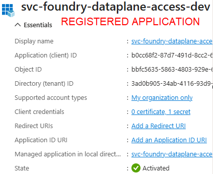
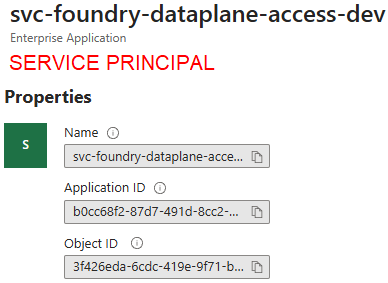
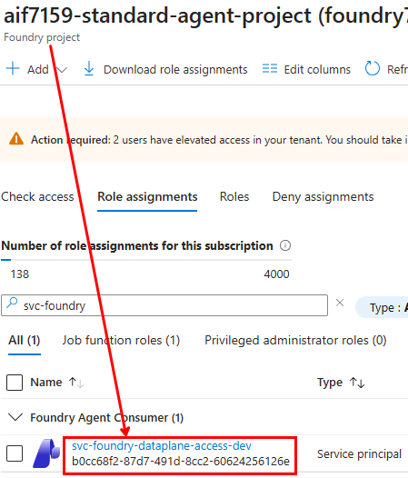
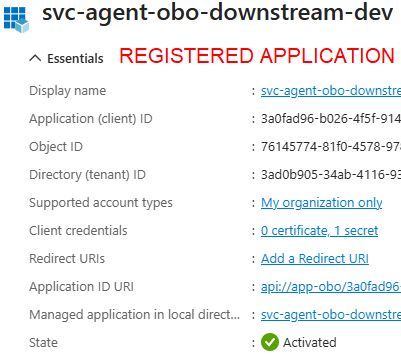
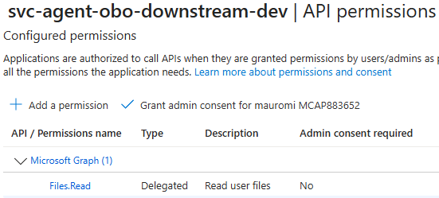
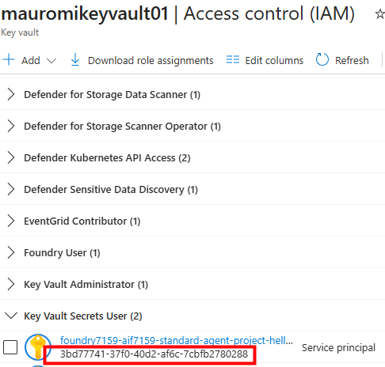
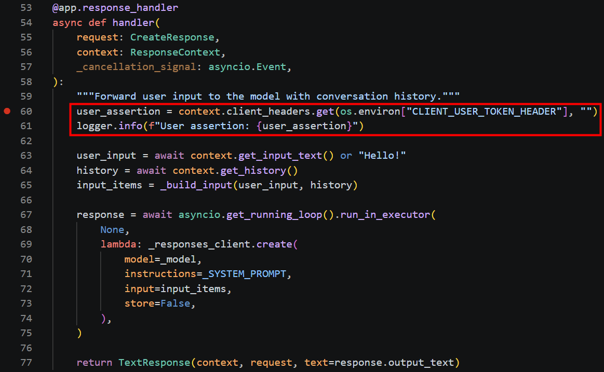
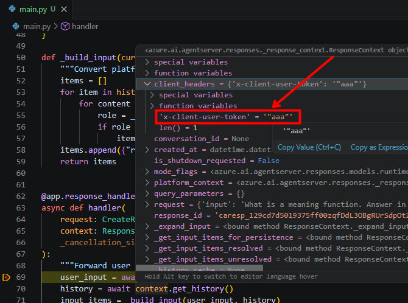

# Microsoft Foundry Hosted Agents — Building, Testing, and Deploying an Agent End‑to‑End

> A complete, hands‑on walkthrough for building a **Foundry Hosted Agent** in Python, running and debugging it locally, securing its secrets with **Azure Key Vault + Managed Identity**, isolating its telemetry in **Application Insights**, upgrading it to the **Microsoft Agent Framework (MAF)**, wiring a **Microsoft Graph** tool through **On‑Behalf‑Of (OBO)**, and finally deploying and invoking it in a **Microsoft Foundry** project with the **Azure Developer CLI (`azd`)**.
>
> This guide is meant to take a reader **from zero to a working, deployed agent**, and to double as **reference documentation** for going deeper on each moving part. It is based on a real, working end‑to‑end setup: the agent (`hello-world-python-responses`) is created, tested locally, deployed into a Foundry project, and invoked — the full round trip.
>
> 📄 **Changelog:** see [`CHANGELOG.md`](CHANGELOG.md) for the version history.

---

## Table of Contents

- [Introduction](#introduction)
- [Who This Guide Is For](#who-this-guide-is-for)
- [Prerequisites](#prerequisites)
- [Final Result](#final-result)
- [1. Objective and Scenario](#1-objective-and-scenario)
- [2. Creating the Tokens for the Registered Applications](#2-creating-the-tokens-for-the-registered-applications)
- [3. Clarifying the Terminology](#3-clarifying-the-terminology)
- [4. Which Agent Server Samples Exist](#4-which-agent-server-samples-exist)
- [5. Schema Change — July 6, 2026 (`0.1.0-preview` → `1.0.0-beta.4`)](#5-schema-change--july-6-2026-010-preview--100-beta4)
- [6. Setting Up the Agent Locally](#6-setting-up-the-agent-locally)
- [7. Storing Secrets: Key Vault and Managed Identity](#7-storing-secrets-key-vault-and-managed-identity)
- [8. Customizing the Sample: monitoring.py, utils.py, and the Handler](#8-customizing-the-sample-monitoringpy-utilspy-and-the-handler)
- [9. First Local Test of the Hosted Agent](#9-first-local-test-of-the-hosted-agent)
- [10. Adding a Dockerfile (Optional)](#10-adding-a-dockerfile-optional)
- [11. From "Responses" to "Responses + Agent Framework (MAF)"](#11-from-responses-to-responses--agent-framework-maf)
- [12. Observability: Isolating Telemetry in Application Insights](#12-observability-isolating-telemetry-in-application-insights)
- [13. Real vs. Simulated Streaming](#13-real-vs-simulated-streaming)
- [14. Adding a Tool to the MAF Agent (Graph + OBO)](#14-adding-a-tool-to-the-maf-agent-graph--obo)
- [15. Installing AZD Extensions](#15-installing-azd-extensions)
- [16. Agent Provisioning and Deployment](#16-agent-provisioning-and-deployment)

---

## Introduction

A **Foundry Hosted Agent** is an agent whose code runs as a dedicated workload on the **Microsoft Foundry** hosting infrastructure. You write ordinary Python; the platform turns it into an HTTP service that speaks Foundry's container protocol, then hosts, scales, and exposes it through a standard endpoint (Playground, Teams, or a raw API).

This document builds one such agent from the ground up, with a very specific requirement in mind: the agent must be able to **read the custom `x-client-*` request headers**, because that is how we securely pass a **user assertion token** into the agent so it can later call downstream APIs (such as Microsoft Graph) **On‑Behalf‑Of (OBO)** the signed‑in user.

The guide follows the natural lifecycle: understand the **scenario and identities** → pick the right **hosting library** and sample → scaffold and configure **locally** → **secure the secrets** → **customize, run, and observe** → upgrade to the **Microsoft Agent Framework** and add a **Graph tool** → **provision, deploy, and invoke** on Foundry. Every step below corresponds to something that was actually executed, with the relevant screenshots included.

---

## Who This Guide Is For

This document is written by a **Senior Cloud Solution Architect** in Microsoft's *Cloud Apps and AI* division, with 8 years of field experience alongside enterprise customers. It grew out of two concrete challenges that come up systematically in projects:

- **How to build a Foundry Hosted Agent end‑to‑end** — from choosing the right sample, to local configuration, to publishing on Microsoft Foundry via `azd`.
- **How to solve delegated authentication** — i.e. how to let the agent, once running on Foundry, access downstream services (e.g. Microsoft Graph) using the credentials of the user connected through the conversational client (Teams, Copilot, WhatsApp, …), through an **On‑Behalf‑Of (OBO)** flow.

### Professional profiles

The document serves **two distinct profiles**, at different depths:

| Profile | Goal | Reference sections |
|---|---|---|
| **CSA / Technical Specialist / Solution Engineer** | Understand, at a high level, the architecture, the design choices, and the trade‑offs — to be able to discuss them with customers | Terminology, Framework choice, Secrets & identity, Final Result |
| **CSA / Developer / Data Scientist** | Guide customers in building the complete solution, from the first line of code to the deploy | All chapters, especially **6, 8, 14, 16** |

> **Recommended level: L400.** Familiarity is assumed with Azure, Python, the basics of OAuth 2.0 / Entra ID authentication, and terminal use.

[↑ Back to top](#table-of-contents)

---

## Prerequisites

### Required knowledge

| Area | Minimum level |
|---|---|
| **Microsoft Azure** | Familiarity with the portal, the CLI (`az`), Resource Groups, RBAC, and Managed Identity |
| **Entra ID / Security** | App Registration, Service Principal, OAuth 2.0, OBO (On‑Behalf‑Of) flows, and RBAC roles |
| **Agentic AI** | Basics of agents, tool calling, and orchestration |
| **Python** | Writing and debugging Python 3.13+; managing virtual environments with `uv` |
| **VS Code** | Using the integrated debugger, the REST Client extension, and the integrated terminal |
| **Bash** | Reading and running shell scripts (Linux/macOS, or WSL on Windows) |

### Required rights

- **Owner** on the Azure Subscription — to create resources, assign [RBAC roles](https://learn.microsoft.com/en-us/azure/foundry/concepts/rbac-foundry?tabs=owner%2Cfoundry#built-in-roles), and manage identities.
- **Administrator** on the development machine — to install tooling (`azd`, `uv`, optionally Docker) and manage local certificates/credentials.

### Tools to install

- **Azure CLI (`az`)** — local authentication and resource management.
- **Azure Developer CLI (`azd`)** — provisioning and deployment of the agent.
- **`uv`** — Python virtual‑environment management.
- **VS Code** with the **Python** and **REST Client** extensions.
- **Docker** *(optional — only for [Chapter 10. Adding a Dockerfile](#10-adding-a-dockerfile-optional))*.

### Entra ID Registered Applications

This lab requires **two Registered Applications** already configured in your Entra ID tenant:

| App Registration | Purpose | Token needed |
|---|---|---|
| `svc-foundry-dataplane-access-dev` | Authentication toward the Microsoft Foundry project — its Service Principal must hold the **Foundry Agent Consumer** role on the project | **App token** (client credentials) |
| `svc-agent-obo-downstream-dev` | **OBO** exchange toward Microsoft Graph (`Files.Read`) — must have the API permissions configured and the authorized clients set | **User token** (delegated) |

The tokens are used in local tests via the **VS Code REST Client** (`.http` files). They can be generated with whatever tool you prefer — for example directly with `az account get-access-token` or via the portal. Alternatively, the **`refresh-tokens.sh`** utility reads its configuration from `token-mapping.json` and automatically updates the tokens in `.vscode/settings.json` (dev environment) with a single command: `./refresh-tokens.sh`. The utility supports both **user tokens** (from the current `az login` session) and **application tokens** (client credentials), selectable entry‑by‑entry in `token-mapping.json` via the `app_id` field. For details, see [Chapter 2. Creating the Tokens for the Registered Applications](#2-creating-the-tokens-for-the-registered-applications).

### Important — [RBAC roles update (July 2026)](https://learn.microsoft.com/en-us/azure/foundry/concepts/rbac-foundry?tabs=owner%2Cfoundry#built-in-roles)

In **July 2026, four new RBAC roles** were introduced for the Foundry Project. A direct consequence for our scenario: the default **least‑privilege** role for **invoking** an agent is no longer **Foundry User** — that role remains valid for **building, developing, and testing** (it allows not only invoking but also modifying the project's agents, reading conversation history, and deleting them — in practice any operation *except* assigning roles to other user principals). Accordingly, we assign the **Foundry Agent Consumer** role to the user principals of this lab, for convenience at the **Foundry Project** scope — though in production it should be scoped to the specific **Foundry Agent**.

The CLI command (the trailing `/agents/<agentName>` can be omitted to set the role at the whole‑project level instead of a single agent):

```bash
az role assignment create --assignee "<principalId>" \
  --role "eed3b665-ab3a-47b6-8f48-c9382fb1dad6" \
  --scope "/subscriptions/<subId>/resourceGroups/<rg-name>/providers/Microsoft.CognitiveServices/accounts/<account>/projects/<projectName>/agents/<agentName>"
```

| Role | Description |
|---|---|
| **Foundry Agent Consumer** | Grants access to interact with agent endpoints in a Foundry project. **Least‑privilege** role for principals that only need to **interact with** agents (this is the one we use to invoke). |
| **Foundry User** (pre‑existing) | Grants reader access to the Foundry project, Foundry resource, and data actions. Least‑privilege role for developers **building and testing** agents. |
| **Foundry Project Manager** | Management actions on Foundry projects, build/develop, and can conditionally assign the *Foundry User* role to other user principals. |
| **Foundry Account Owner** | Full access to manage projects and resources; can conditionally assign the *Foundry User*, ACR, and monitoring roles to other user principals. |
| **Foundry Owner** | Full access to manage projects and resources and to build/develop; can conditionally assign the *Foundry User*, ACR, and monitoring roles. Highly privileged self‑serve role. |

[↑ Back to top](#table-of-contents)

---

## Final Result

By the end of this analysis the **full round trip works**: the agent is created from the *Hello World (Responses, bring‑your‑own)* sample, keeps its secrets in **Key Vault**, is tested locally, upgraded to **MAF**, given a **Microsoft Graph** tool that uses **OBO**, and finally **deployed and invoked** on Foundry. Invoking the deployed agent with a Foundry auth token **plus** the user‑delegated token produces the real end‑to‑end result — the agent answering a question about the user's own OneDrive via OBO:


The rest of this document explains **how** we get there, chapter by chapter.

---

## 1. Objective and Scenario

In this exercise we demonstrate building a **Foundry Hosted Agent end‑to‑end**, analyzing the possible choices that play out across **three different framework levels**:

1. **Agentic frameworks** — for building the internal agentic / multi‑agent system.
2. **Infrastructure frameworks** — to manage the exchange between the external requests that reach the **Foundry Gateway** and the agent's internal business logic (which uses the agentic framework above).
3. **Publishing frameworks** — to publish to Microsoft Foundry through the **AZD** mechanism.

A significant part of this tutorial is dedicated to **authentication**: from the client toward Foundry, and from Foundry toward downstream systems — specifically **Microsoft Graph**, accessed by the agent **on behalf** of the user who authenticates on the **conversational interface** (Teams, Copilot, …).

To that end, the scenario relies on **two Azure Entra ID Registered Applications**:

### `svc-foundry-dataplane-access-dev` — access to the Foundry project

Enables authentication to the Microsoft Foundry project through its **Service Principal**, which holds the **Foundry Agent Consumer** RBAC role on the Foundry project (see the [RBAC roles update](#important--rbac-roles-update-july-2026) above). It is known that the authentication token to the Foundry project — typically used when invoking one of its agents — is **not** passed by the Foundry Gateway *inside* the agent itself; it is used **only** to grant the ability to invoke it. Since the user is therefore not "known" inside the Foundry agent, using the app‑token tied to this app registration avoids having to assign the *Foundry Agent Consumer* role to every potential user.

| App registration | Service Principal | Foundry Agent Consumer role assignment |
|---|---|---|
|  |  |  |

### `svc-agent-obo-downstream-dev` — OBO exchange toward Microsoft Graph

Holds the permission to create a token with the **`Files.Read`** scope for **Microsoft Graph**. This token can be created starting from an **existing user token** — generated for an *approved* application (here **Microsoft Teams Desktop** and **Microsoft Teams Web**) and consented by the connected user — in order to **exchange** it for a Graph‑scoped user‑token associated with the same user.

| App registration | API permissions (Graph `Files.Read`) | Expose an API (authorized clients) |
|---|---|---|
|  |  |  |

[↑ Back to top](#table-of-contents)

---

## 2. Creating the Tokens for the Registered Applications

To create the tokens, this lab uses the console application **`refresh-tokens.sh`**, which reads its configuration from **`token-mapping.json`** and then — using the `client_id` and `client_secret` of the respective registered applications — writes their tokens into the **`settings.json`** file used by the **REST Client** extension of Visual Studio Code for the test invocations toward the Foundry Hosted Agent.

> **In a real scenario**, the two tokens are created inside the applications that invoke the agent — typically the **BOT** connected, upstream, to the conversational client (Teams, Copilot, WhatsApp, or any other channel compatible with the **Bot Framework**).

[↑ Back to top](#table-of-contents)

---

## 3. Clarifying the Terminology

Let's start with the definition. Unlike a **prompt agent** — defined declaratively in the portal — a **hosted agent** is an agent published as a **dedicated workload** (via container or via code) and executed with an **isolated runtime on managed Microsoft infrastructure**.

We say "via container *or* via code" because there are now **two publishing options**:

- **Container‑based** — the historical model: Docker build → push to ACR → Foundry pulls the container and runs it.
- **Code‑based** — the new model: Foundry takes our code directly and runs it in a managed runtime, with no explicit containerization on the user's part.

### Three key concepts

| Concept | What it is |
|---|---|
| **Foundry Agent Service** | A **managed runtime** that executes Foundry agents with orchestration, tools, and context. Foundry is thus a platform for **containers** *and* **code execution**, on top of the "declarative" agents built with the mouse in its **Playground**. |
| **Microsoft Agent Framework (MAF)** | A **framework / authoring library** to build modular, orchestratable AI agents that can use models, tools, and open protocols (MCP, A2A), integrating with Foundry, Azure, and external services. It is a programming model — recommended by Microsoft, unifying the best of the earlier **Semantic Kernel** and **AutoGen** — but it is **optional**. |
| **`azure-ai-agentserver-*`** | **NOT** a framework for *creating agents*, but for **creating the server that exposes them**. It lets you build, via code, the *execution infrastructure* of a Hosted Agent: an HTTP server that "speaks the Foundry container protocol" and manages the **gateway ↔ runtime** communication. |

More on `azure-ai-agentserver-*`:

- **It does not create agents.** It is a framework for creating the server that runs them, not the agent itself.
- **It implements the Foundry container protocol** — the language by which the Foundry gateway sends requests to the agent and the agent's server replies with output, tool calls, errors, streaming, etc.
- **It is runtime‑focused** — handshake, sessions, messages, tool calls, streaming, error handling.
- **It does not imply Docker.** The term "container protocol" does **not** mean a Docker container is required: it is used for **both** container‑based and code‑based Hosted Agents.

### Which library? Agent Framework vs. LangGraph vs. Bring‑Your‑Own

When moving from theory to practice, the [Foundry samples](https://github.com/microsoft-foundry/foundry-samples/tree/main/samples/python/hosted-agents) under `python/hosted-agents` present the first choice: use the **Agent Server** libraries of type *agentframework*, *bring‑your‑own*, or *langgraph*?

| Approach | In short | Startup speed | Architectural control | Operational complexity | Existing‑code portability | When to choose |
|---|---|---|---|---|---|---|
| **Agent Framework** | The most "Foundry‑native" path: ready‑made abstractions for agents, tools, orchestration, and hosting | High | Guided / opinionated | Low | Lower (may require refactoring) | You're starting now, want fast time‑to‑production, few infra decisions |
| **LangGraph** | Model the agent as a graph of states/nodes with fine control over multi‑step flows | Medium (you must design the graph) | High | Medium / high | Good if you already use LangGraph | Complex, deterministic workflows with explicit state and non‑linear paths |
| **Bring‑Your‑Own** | Bring your existing runtime/agent into the hosted model — maximum freedom | Variable | Maximum | Potentially high (integrations, lifecycle, compatibility) | Maximum (reuse almost everything) | You already have a working stack, want to avoid lock‑in, accept more responsibility |

**Summary of the selection criteria:**

- **Agent Framework** → start here for speed, simplicity, fast time‑to‑prod.
- **LangGraph** → choose it for complex workflows with explicit state, branching, retry, human‑in‑the‑loop.
- **Bring‑Your‑Own** → choose it if you already have a runtime, want maximum freedom and zero lock‑in.

### The choice for this implementation

**Bring Your Own**, because the Agent Framework does **not** expose a way to retrieve one of the headers of the Foundry invocation. Since that was indispensable for the scenario shown here, we fell back to the most flexible of the three. This does **not** mean we won't use MAF later — **the agents themselves will all be built with the Agent Framework** — but for the *hosted‑agent infrastructure* we use the **Bring‑Your‑Own** libraries (which, for the record, are also based on the **Responses API**). It would have been more convenient to leverage MAF's Agent Framework adapter, which implements a very high‑level method called `from_agent_framework` that runs the web server exposed by the container — but no matter: we'll write the handler by hand, mapping the gateway's calls onto the agent's internal functions.

[↑ Back to top](#table-of-contents)

---

## 4. Which Agent Server Samples Exist

Regardless of whether we ultimately use MAF, we first list the available samples and find one based on `azure-ai-agentserver-responses`:

```bash
azd ai agent sample list --language python --output json
```

As of **August 17, 2026**, there are **24** samples. In particular, there is **Hello World agent (Responses, without a framework, Python)**, described as:

> *"Minimal Hello World agent using the Responses protocol with a bring‑your‑own approach. Calls a Foundry model via the Responses API and returns the response."*


It is perfect because:

- **Responses protocol + no framework** → it uses `azure-ai-agentserver-responses` (so it reads the `x-client-*` headers).
- It is **minimal** (unlike the *background* / *notetaking* / *toolbox* samples).
- It **already calls an LLM** → exactly our goal: "hook up an LLM without worrying about OBO yet."

### Two important observations

**Different libraries per sample** :
- the [Bring‑Your‑Own sample](https://github.com/microsoft-foundry/foundry-samples/tree/main/samples/python/hosted-agents/bring-your-own/responses/hello-world) uses the Foundry library **`azure.ai.projects` 2.0.1**, whereas 
- the [Agent‑Framework samples like the 01-basic](https://github.com/microsoft-foundry/foundry-samples/tree/main/samples/python/hosted-agents/agent-framework/responses/01-basic) use the MAF **Foundry Hosting** library **`1.0.0a260630`**, which has the limitations mentioned earlier — including not being able to read *all* the headers of the Foundry call via the Responses API (on which both samples are based).

| [**BYO — requirements.txt**](https://github.com/microsoft-foundry/foundry-samples/blob/main/samples/python/hosted-agents/bring-your-own/responses/hello-world/src/hello-world-python-responses/requirements.txt) | [**Agent Framework — requirements.txt**](https://github.com/microsoft-foundry/foundry-samples/blob/main/samples/python/hosted-agents/agent-framework/responses/01-basic/src/agent-framework-agent-basic-responses/requirements.txt) |
|----------------------------|----------------------------------------|
| azure-ai-agentserver-responses==2.0.0b0 | agent-framework-foundry |
| azure-ai-projects==2.0.1 | agent-framework-foundry-hosting>=1.0.0a260630 |
| azure-identity==1.25.3 | azure-identity==1.25.3 |
| debugpy | debugpy |


[↑ Back to top](#table-of-contents)

---

## 5. Schema Change — July 6, 2026 (`0.1.0-preview` → `1.0.0-beta.4`)

**New publishing extension.** The [`azure.yaml`](https://github.com/microsoft-foundry/foundry-samples/blob/main/samples/python/hosted-agents/bring-your-own/responses/hello-world/azure.yaml) of the BYO sample requires the `azure.ai.agents` extension at version **`>=1.0.0-beta.4`** — this new hosted‑agent publishing library removes the need for Bicep infrastructure, as we see in this chapter:

```yaml
requiredVersions:
  extensions:
    azure.ai.agents: '>=1.0.0-beta.4'
```

This change, which happened on **July 6, 2026**, is **not** a simple version bump: it is a **major‑version** jump, from **`0.1.0-preview`** to **`1.0.0-beta.4`** (still in beta), with a restructuring of the definition files.

### Before — dedicated agent schema (extension `azure.ai.agents` `0.x`)

The definition was split across two files, each with its own schema:

| File | Schema | Role |
|---|---|---|
| `agent.manifest.yaml` | `AgentManifest.yaml` | Agent manifest/template (name, parameters, resources) |
| `agent.yaml` | `ContainerAgent.yaml` | Container runtime (kind, protocols, resources, env vars) |

The init command pointed at the dedicated manifest:

```bash
azd ai agent init -m agent.manifest.yaml
```

### After — native `azd` schema (extension `azure.ai.agents` `>=1.0.0-beta.4`)

Everything is consolidated into a **single `azure.yaml`**, which uses the **native `azd` schema** (`azure.yaml.json`, referenced on the first line) — the same as any `azd` project. The agent becomes a normal **service**, and so does the model:

```yaml
# azure.yaml (new format)
name: <project-name>
services:
  ai-project:                 # the Foundry project + the model deployment
    host: azure.ai.project
    deployments: [ ... ]
  <agent-name>:               # the hosted agent
    host: azure.ai.agent
    codeConfiguration: { ... }
    environmentVariables: [ ... ]
infra:
  provider: microsoft.foundry # (or bicep)
```

The init command now points at this file:

```bash
azd ai agent init -m azure.yaml
```

### What changes, in short

| | Before (`0.x`) | After (`1.x` beta) |
|---|---|---|
| **Definition files** | `agent.manifest.yaml` + `agent.yaml` | a single `azure.yaml` |
| **Schema** | dedicated agent schemas | native `azd` schema |
| **Agent** | standalone manifest | `service host: azure.ai.agent` |
| **Model** | resource inside the manifest | `service host: azure.ai.project` |
| **Infrastructure** | implicit | `infra` section (`microsoft.foundry` or `bicep`) |
| **`azd` extension** | `azure.ai.agents 0.x` | `azure.ai.agents >=1.0.0-beta.4` |

**Why it matters.** The new format aligns hosted agents with standard `azd` conventions: a single manifest, the same lifecycle commands (`azd provision`, `azd deploy`), and the same service structure used by any `azd` app. The result is **fewer files, more consistency, and portability** — at the price of still being on a **major beta** (`1.0.0-beta.x`), where names and details can still change.

[↑ Back to top](#table-of-contents)

---

## 6. Setting Up the Agent Locally

### 6.1 Clone the sample

Among all the Foundry samples, the one we want is **Hello World agent (Responses, without a framework, Python)**.

> **Note:** the target project must contain the `gpt-5.4-mini` deployment.

Inside `requirements.txt`, remove what **uv** does not like — **every empty line** and **the comment line**:

Clone the sample into a fresh destination folder and open it in VS Code:

```bash
# 1. choose the target folder name
folder_name=hello-world-responses02

# 2. delete the target folder if it exists
rm -rf "./$folder_name"

# 3. delete the cloning folder (removed again later too)
rm -rf foundry-samples

# 4. clone the repo
git clone --depth 1 https://github.com/microsoft-foundry/foundry-samples.git

# 5. create the target folder
mkdir -p "./$folder_name"

# 6. copy the hello-world source into the target folder
cp -r foundry-samples/samples/python/hosted-agents/bring-your-own/responses/hello-world/* \
  "./$folder_name/"

# 7. remove the cloned folder
rm -rf foundry-samples

# 8. cd into the new folder
cd "./$folder_name"

# 9. open VS Code
code .
```

Now add the following libraries:

```text
python-dotenv==1.2.3
azure-monitor-opentelemetry==1.8.9
agent-framework-core==1.14.0
agent-framework-foundry==1.11.0
azure-keyvault-secrets==4.11.1
```


### 6.2 Create the environment and verify the imports

Create the local virtual environment with **uv**, install the dependencies, and test that all the key imports resolve:

```bash
cd ./src/hello-world-python-responses    # code . --reuse-window
uv init . --python 3.13
uv venv
source .venv/bin/activate
uv add --active $(cat requirements.txt) --prerelease=allow

uv run python -c "
from azure.ai.agentserver.responses import ResponsesAgentServerHost, CreateResponse, ResponseContext, TextResponse
from agent_framework import Agent
from agent_framework_foundry import FoundryChatClient
from azure.identity import DefaultAzureCredential
from azure.ai.projects import AIProjectClient
print('ALL IMPORTS OK')
"
```

Expected output:

```text
Resolving despite existing lockfile due to change in pre-release mode: `allow` vs. `if-necessary-or-explicit`
ALL IMPORTS OK
```

If you see **`ALL IMPORTS OK`**, the configuration is in place. The uv‑generated `pyproject.toml` captures the resolved dependency set:


### 6.3 Variables for running the agent (the `.env` file)

We add a `.env` file in the agent root, with the variables needed **while the agent runs locally**. Keep **no real secrets** here — only "durable" strings such as the `client_id` and the **name** of the secret (`APP-OBO-CLIENT-SECRET`), which is stored in the Key Vault at `KEY_VAULT_URL` under the key `APP_OBO_CLIENT_SECRET_NAME`.

This `.env` holds the **11 variables the agent needs to run locally** — locally there is no Foundry Runtime, so you must provide all **11** yourself. When the agent runs **on Foundry**, two of them — `FOUNDRY_PROJECT_ENDPOINT` and `APPLICATIONINSIGHTS_CONNECTION_STRING` — are **automatically injected by the Foundry Runtime**, so in the cloud you declare only the remaining **9** (see [Chapter 16 — container environment variables](#162-container-environment-variables)).

**And the Key Vault?** At startup, `main.py` retrieves the secret and puts it into `os.environ["APP_OBO_CLIENT_SECRET"]`, so `utils.py` reads it as before. `APP_OBO_CLIENT_SECRET_NAME` is **not** a vault key — it is the local variable that holds the **name** of the Key Vault secret. Reading from the vault requires **Azure RBAC** mode with the **Key Vault Secrets User** role — the topic of [Chapter 7](#7-storing-secrets-key-vault-and-managed-identity).

> [!WARNING]
> **`APPLICATIONINSIGHTS_CONNECTION_STRING` CANNOT be quoted.** It must be written as a single string **without** quotes — otherwise the SDK fails to parse it. (The other variables can stay quoted.)

```dotenv
# --------------------------------------------------------
# .env.example for ha02-azureopenaiagent — copy to .env
# and fill in values. NEVER commit .env to source control.
# --------------------------------------------------------

# --------------------------------------------------------
# Microsoft Azure section
# --------------------------------------------------------
KEY_VAULT_URL=https://mauromikeyvault01.vault.azure.net/
APP_OBO_TENANT_ID=3ad0b905-34ab-4116-93d9-c1dcc2d35af6
APP_OBO_CLIENT_ID=3a0fad96-b026-4f5f-914a-fc6348656f6b
APP_OBO_CLIENT_SECRET_NAME=APP-OBO-CLIENT-SECRET
GRAPH_SCOPES='["https://graph.microsoft.com/Files.Read"]'

# --------------------------------------------------------
# Microsoft Foundry section
# Format: https://<foundry-account>.services.ai.azure.com/api/projects/<project-name>
# --------------------------------------------------------
FOUNDRY_PROJECT_ENDPOINT=https://foundry7159.services.ai.azure.com/api/projects/aif7159-standard-agent-project
AZURE_AI_MODEL_DEPLOYMENT_NAME=gpt-5.4-mini
CLIENT_USER_TOKEN_HEADER=x-client-user-token

# --------------------------------------------------------
# Monitoring section
# IMPORTANT: APPLICATIONINSIGHTS_CONNECTION_STRING CANNOT BE QUOTED.
# It must be a single string without quotes.
# --------------------------------------------------------
APPLICATIONINSIGHTS_CONNECTION_STRING=InstrumentationKey=b8637e87-3083-427a-8b03-32391c706b58;IngestionEndpoint=https://swedencentral-0.in.applicationinsights.azure.com/;LiveEndpoint=https://swedencentral.livediagnostics.monitor.azure.com/;ApplicationId=15bfc2ba-379c-4422-b11c-bbcac3cecac7
AZURE_EXPERIMENTAL_ENABLE_GENAI_TRACING=true
ENABLE_SENSITIVE_DATA=true
```

[↑ Back to top](#table-of-contents)

---

## 7. Storing Secrets: Key Vault and Managed Identity

**Should we store the secrets right next to the variables, in `.env`? No!** We use **Azure Key Vault + Managed Identity**. The standard pattern **decouples secret rotation from deployment**: the OBO client secret lives in the vault, the code reads it at runtime, and `azure.yaml` carries only non‑secret values.

### The challenge — a different identity locally vs. in the container

- **Locally**, access to the Key Vault happens by default through the **developer's credentials** stored via the CLI (`az login` / the user), because authentication uses `DefaultAzureCredential`. So if the user who ran `az login` has at least the **Key Vault Secrets User** RBAC role, they can read the secrets even from code running locally (via the CLI or VS Code).
- **In the Foundry container**, instead, `DefaultAzureCredential` uses the **container's managed identity**. We therefore need to retrieve the object ID of the identity that runs the agent and assign **it** the **Key Vault Secrets User** RBAC role.

### Two planes that must be kept distinct

There are **two separate, independent planes** — the first is *"who gets in"*, the second is *"with which identity the agent presents itself to the outside"*.

**1) Ingress — who can invoke the agent.** Following the "least privilege" principal for strongest security, the caller identity (a user or a service principal or a Managed Identity) should hold the **Foundry Agent Consumer** role **on the project** (not on the agent). Such role was introduced in July 2026 (see the [RBAC roles update](#important--rbac-roles-update-july-2026)). This governs invocation access.

**2) Egress — with which identity the agent accesses remote resources** *(we obtain this identity only after the deployment).* The agent runs under its own **Agent Identity (Microsoft Entra Agent ID)**: a **per‑instance service principal**, distinct both from the caller and from the Foundry account's managed identity. Roles on resources (e.g. **Key Vault Secrets User**) are assigned to **this** identity.

Two handy verification commands (post‑assignment):

```bash
# Identities that can invoke a Foundry Project (Foundry Agent Consumer role):
PROJECT_SCOPE="/subscriptions/<sub>/resourceGroups/<rg>/providers/Microsoft.CognitiveServices/accounts/<account>/projects/<project>"
az role assignment list --scope "$PROJECT_SCOPE" \
  --query "[?roleDefinitionName=='Foundry Agent Consumer'].{principal:principalId, type:principalType, role:roleDefinitionName}" -o table

# Identities that can access the Key Vault resource:
RES_SCOPE="/subscriptions/.../providers/Microsoft.KeyVault/vaults/<kv>"
az role assignment list --scope "$RES_SCOPE" \
  --query "[?principalType=='ServicePrincipal'].{principal:principalId, role:roleDefinitionName}" -o table
```

### Assigning **Foundry Agent Consumer** to the service principal (ingress)

The following three screenshots show how to assign the **Foundry Agent Consumer** role to an *Entra ID registered application* — or, more precisely, to its **Service Principal** instance `svc-foundry-dataplane-access-dev`.


### Assigning **Key Vault Secrets User** to the Agent Identity (egress)

The next three screenshots show how to retrieve the **agent's identity** inside the Foundry portal → select the agent → **Details** → read the **Entra agent identity** ID. That ID is then added to the **Key Vault** IAM with the **Key Vault Secrets User** role.




### Summary

| Needed for… | Correct identity | How to obtain it |
|---|---|---|
| **Invoking** the agent | the caller, with **Foundry Agent Consumer** on the project | `az role assignment list` on the project scope |
| The agent **accessing a resource** | the **Agent Identity** (per‑instance SP) | from the resource's role assignments / the Foundry portal / Microsoft Entra Agent ID |

### Why Key Vault beats `.env`, and what's even better

- **No redeploy on rotation:** rotate the secret in the Key Vault → the agent reads the updated value at the next `get_secret` (or on container restart). **No `azd deploy`.**
- **Even better (remove the secret entirely):** for OBO you can use **Workload Identity Federation** — the app registration trusts the agent's managed identity, which obtains tokens **without a client secret**. Zero secrets to rotate.
- **Library:** the only package to add to `requirements.txt` to access Key Vault programmatically is **`azure-keyvault-secrets`** — which we already added.

### References

- **Foundry RBAC** — roles and assignments on the project: <https://learn.microsoft.com/azure/ai-foundry/concepts/rbac-ai-foundry>
- **Microsoft Entra Agent ID** — the Blueprint → BlueprintPrincipal → Agent Identity model, per‑identity permissions, and OBO / `fmi_path` token exchange: Microsoft Learn, search *"Microsoft Entra Agent ID"*.

[↑ Back to top](#table-of-contents)

---

## 8. Customizing the Sample: monitoring.py, utils.py, and the Handler

### 8.1 Add `monitoring.py` (and fix the logger in `main.py`)

Add two files to this project:
- [`monitoring.py`](https://github.com/maurominella/hosted_agents/blob/main/agents/_common/monitoring.py), and import it in `main.py` — remembering that `load_dotenv()` is called inside `monitoring`.
- [`utils.py`](https://github.com/maurominella/hosted_agents/blob/main/agents/_common/utils.py) (the Graph/OBO helpers we'll flesh out in [Chapter 14](#14-adding-a-tool-to-the-maf-agent-graph--obo)).
---
**Fundamental logging detail:** in `main.py` the `logger` imported from `monitoring` is **overwritten** by the line `logger = logging.getLogger(__name__)`, so our logging settings and filters would **not** be applied to our logs. We remove that line (and the now‑redundant `import logging`) so the logger configuration set in `monitoring.py` is actually used:


`monitoring.py` (initial version):

```python
import os
import logging
from dotenv import load_dotenv

load_dotenv()

if os.environ.get("APPLICATIONINSIGHTS_CONNECTION_STRING"):
    from azure.monitor.opentelemetry import configure_azure_monitor
    configure_azure_monitor(logging_level=logging.INFO)
```

`utils.py` (imports and the Graph endpoint constant):

```python
import os
import ast
import msal       # On-Behalf-Of token exchange (Token C -> Microsoft Graph token)
import requests   # Microsoft Graph REST call

GRAPH_ROOT_CHILDREN = (
    "https://graph.microsoft.com/v1.0/me/drive/root/children"
    "?$select=name,size,folder&$top=200"
)
```

> We refine `monitoring.py` in [Chapter 12](#12-observability-isolating-telemetry-in-application-insights) and complete `utils.py` in [Chapter 14](#14-adding-a-tool-to-the-maf-agent-graph--obo).

### 8.2 Run `main.py` in debug mode

Expected terminal output when the host starts:

```text
2026-07-06 00:22:51,588 INFO azure.ai.agentserver: AgentServerHost starting on 0.0.0.0:8088
2026-07-06 00:22:51,591 INFO azure.ai.agentserver: AgentServerHost started
2026-07-06 00:22:51,592 INFO azure.ai.agentserver: Connectivity:
2026-07-06 00:22:51,592 INFO azure.ai.agentserver: Connectivity: project_endpoint=https://foundry7159.services.ai.azure.com
[2026-07-06 00:22:51 +0200] [397896] [INFO] Running on http://0.0.0.0:8088 (CTRL + C to quit)
2026-07-06 00:22:51,593 INFO hypercorn.error: Running on http://0.0.0.0:8088 (CTRL + C to quit)
```

### 8.3 The handler (bring‑your‑own Responses)

The **key difference** compared to `azure-ai-agentserver-agentframework`: there, `from_agent_framework(agent)` did everything; **here we write the handler ourselves and call the model**. That is the price *and* the power of *bring‑your‑own* — and it gives us access to `context`, hence to the `x-client-*` headers.
Now, add just the following two lines 
```python
user_assertion = context.client_headers.get(os.environ["CLIENT_USER_TOKEN_HEADER"], "")
logger.info(f"User assertion: {user_assertion}")
```
to the `python async def handler` function, and set a breakpoint at the first instruction as shown below:


- We **write the handler ourselves** — in the `agentframework` version it did not exist, because the adapter generated it.
- We **retrieve the token** transmitted via `CLIENT_USER_TOKEN_HEADER` (i.e. `x-client-user-token`).
- `context.get_input_text()` → the user message; `context.get_history()` → the platform‑managed history.
- `_build_input(...)` transforms history + message into the Responses API input format.
- `_responses_client.create(...)` calls the model (blocking → wrapped in `run_in_executor`).
- It returns `TextResponse(... text=response.output_text)`.

[↑ Back to top](#table-of-contents)

---

## 9. First Local Test of the Hosted Agent

We are ready for the first test of this `azure-ai-agentserver-responses` hosted agent. The procedure:

1. Put a **breakpoint** in `main.py` on the line `user_input = await context.get_input_text() or "Hello!"`.
2. Run the **first** REST request from `agent_via_responses_simple.http` — the one **without** `x-client-user-token`.
3. Run the **second** REST request and verify the value in `context.client_headers["x-client-user-token"]`.

Request file (`agent_via_responses_simple.http`):

```http
@baseUrl = http://localhost:8088
@query = What is a meaning function? Please answer in less than 10 words.

POST {{baseUrl}}/responses
Content-Type: application/json
x-client-user-token: aaa

{
  "input": "{{query}}"
}
```

In the debugger we can confirm that the handler receives the request input **and** the `x-client-user-token` header (here set to `aaa`), visible under `context.client_headers`:



And the HTTP response comes back `200 OK` with the model's answer:


### How streaming works here

The client (Foundry Playground, Teams, API...) decides whether it wants `stream: true` or `false`. When you return a `TextResponse`, it is the **host** that bridges: a non‑streaming client receives the complete response; a streaming client gets your text wrapped in the Responses protocol's streaming events. So our current handler **already works for both Playground and Teams** — no need to handle the two cases by hand.

### The real difference (true streaming vs. not)

- **`TextResponse`** = you produce the entire text and then the host delivers it (possibly "packaged" as a stream). The user waits for the model to finish before seeing anything.
- **True streaming (token‑by‑token)** = the model's tokens flow as they are generated. To do this you return a **streaming response** (an async generator of events) instead of a `TextResponse`.

When we add MAF: `await agent.run(text)` → non‑streaming → maps to `TextResponse`. Perfect to start. MAF also offers `agent.run_stream(...)` for true streaming later.

[↑ Back to top](#table-of-contents)


## 10. Adding a Dockerfile (Optional)
In this context, testing the agent within a local Docker container is **not strictly needed**, because later we do a **code deployment**, not a **container deployment**. Still, it is useful to see and costs very little. 


**IMPORTANT**: the identity specified in .env.docker, in this case, uses the Foundry project only to invoke the OpenAI service that the hosted agent uses internally to generate the user question. In other words, in this case we're not using any "Foundry Agents", but we're only using the "Foundry Project" to access its deployments. As a result, the identity specified in .env.docker needs the `Cognitive Services OpenAI User` RBAC role, ***NOT*** the `Foundry User` or `Foundry Agent Consumer`.

Here are the steps:

1. **Duplicate `.env` into `.env.docker`** and add the following 3 lines, so Docker can authenticate to Foundry with a **service principal** that is a *Foundry Agent Consumer* of that project (or agent). Please note that **these label names are fixed** (the names `DefaultAzureCredential` looks for):

   ```dotenv
   AZURE_TENANT_ID=3ad0b905-34ab-4116-93d9-c1dcc2d35af6
   AZURE_CLIENT_ID=b0cc68f2-87d7-491d-8cc2-60624256126e
   AZURE_CLIENT_SECRET=4bp***
   ```

2. **Clean the environment** if needed:

   ```bash
   for id in $(docker images -aq); do docker rmi -f "$id"; done
   for id in $(docker ps -aq); do docker rm -f "$id"; done
   ```

3. **Build the container and run it on port 8080** (mapping to the container's 8088):

   ```bash
   docker build -t hello-world-python-responses .
   docker run --rm -p 8080:8088 --env-file .env.docker hello-world-python-responses
   ```

The `Dockerfile` itself:

```dockerfile
FROM python:3.13-slim
WORKDIR /app

# Copy only the application files — do NOT copy .env (secrets must be
# injected at runtime via environment variables or --env-file).

# Copy requirements first to leverage Docker layer caching:
# pip install is re-executed only when requirements.txt changes,
# not on every source code change.
COPY requirements.txt user_agent/
WORKDIR /app/user_agent
RUN if [ -f requirements.txt ]; then \
    pip install --no-cache-dir --upgrade pip && \
    pip install --no-cache-dir -r requirements.txt; \
    fi

# Copy source code after dependencies. Changes here only invalidate this layer.
COPY main.py utils.py monitoring.py ./

EXPOSE 8088
CMD ["python", "main.py"]
```

> As we'll see in [Chapter 16](#16-agent-provisioning-and-deployment), because we use **code deploy** (`codeConfiguration` in `azure.yaml`), this **Dockerfile is ignored** at deploy time — Foundry builds the image server‑side from `requirements.txt`.

[↑ Back to top](#table-of-contents)

---

## 11. From "Responses" to "Responses + Agent Framework (MAF)"

The downloaded project already works: the handler calls the Foundry model via the "raw" Responses API and returns the text. Now we transform it into the **MAF** version, which brings automatic tool/function calling, multi‑step orchestration and thread/memory management, a one‑line handler (`agent.run`), provider abstraction, and integrated middleware/telemetry — while **keeping the `-responses` host** (access to `x-client-*` and Playground/Teams compatibility).

**Prerequisite (dependencies):** add `agent-framework` (which brings `agent-framework-foundry` → `FoundryChatClient`). Do **not** add `agent-framework-azure-ai` (incompatible with `1.10`).

### Step 1 — Imports: add MAF
```python
# before: nothing
```

```python
# after
from agent_framework import Agent
from agent_framework_foundry import FoundryChatClient
```

### Step 2 — Imports: remove the "raw" Foundry client

```python
# before (to be removed)
from azure.ai.projects import AIProjectClient
```

```python
# after: nothing
```

### Step 3 — Imports: remove the input‑building models

```python
# before (to be removed)
from azure.ai.agentserver.responses.models import (
    MessageContentInputTextContent,
    MessageContentOutputTextContent,
)
```

```python
# after: nothing
```

### Step 4 — Replace the "raw" client with a MAF client + agent

```python
# before
_responses_client = AIProjectClient(
    endpoint=_endpoint, credential=DefaultAzureCredential()
).get_openai_client().responses
```

```python
# after
_chat_client = FoundryChatClient(
    project_endpoint=_endpoint,
    model=_model,
    credential=DefaultAzureCredential(),
)
_agent = Agent(
    _chat_client,                 # 1st positional = client
    _SYSTEM_PROMPT,               # 2nd positional = instructions
    name="BYO Responses Agent",
    # tools=[...],                # <-- MAF tools go here
)
```

### Step 5 — Remove `_ROLE_MAP` and `_build_input`

```python
# before (removed)
_ROLE_MAP = {"output_text": "assistant", "input_text": "user"}

def _build_input(current_input: str, history: list) -> list[dict]:
    """Convert platform history + current message into Responses API input."""
    items = []
    for item in history:
        for content in item.get("content") or []:
            role = _ROLE_MAP.get(content.get("type"))
            text = content.get("text")
            if role and text:
                items.append({"role": role, "content": text})
    items.append({"role": "user", "content": current_input})
    return items
```

### Step 6 — Handler: a single call to the agent
```python
# before (we'll keep only the first 11 rows)
@app.response_handler
async def handler(
    request: CreateResponse,
    context: ResponseContext,
    _cancellation_signal: asyncio.Event,
):
    """Forward user input to the model with conversation history."""
    user_assertion = context.client_headers.get(os.environ["CLIENT_USER_TOKEN_HEADER"], "")
    logger.info(f"User assertion: {user_assertion}")
    
    user_input = await context.get_input_text() or "Hello!"
    history = await context.get_history()
    input_items = _build_input(user_input, history)

    response = await asyncio.get_running_loop().run_in_executor(
        None,
        lambda: _responses_client.create(
            model=_model,
            instructions=_SYSTEM_PROMPT,
            input=input_items,
            store=False,
        ),
    )

    return TextResponse(context, request, text=response.output_text)
```

```python
# after (first 11 rows are the same)
@app.response_handler
async def handler(
    request: CreateResponse,
    context: ResponseContext,
    _cancellation_signal: asyncio.Event,
):
    """Forward user input to the model with conversation history."""
    user_assertion = context.client_headers.get(os.environ["CLIENT_USER_TOKEN_HEADER"], "")
    logger.info(f"User assertion: {user_assertion}")
    
    user_input = await context.get_input_text() or "Hello!"
    user_input = await context.get_input_text() or "Hello!"
    result = await _agent.run(user_input)
    return TextResponse(context, request, text=result.text)
```

**Unchanged:** `app = ResponsesAgentServerHost(...)`, the `@app.response_handler` decorator, `TextResponse`, and the rest of the host.

> **Step 7 — customize and test `monitoring.py` for observability** is large enough to deserve its own chapter → see [Chapter 12](#12-observability-isolating-telemetry-in-application-insights).

[↑ Back to top](#table-of-contents)

---

## 12. Observability: Isolating Telemetry in Application Insights

The application works fine, so let's take the chance to set up Application Insights properly, so we can **isolate only our agent's telemetry**.

### 12.1 A dedicated cloud role name

Give the app a **dedicated cloud role name**, so every trace is stamped with a unique identifier (independent of the logger name and of APIM). In `monitoring.py`, set `OTEL_SERVICE_NAME` **before** `configure_azure_monitor()`, so every telemetry item (traces, requests, dependencies) carries `cloud_RoleName == "hello-world-python-responses"`.

> Only the two highlighted parts below must be added (2 instructions + 4 comment lines).

```python
# before

import os
import logging
from dotenv import load_dotenv
load_dotenv()  # MUST be first: env vars must be set before any import reads them

THISAPP_NAME = os.environ.get("THISAPP_NAME","UNKNOWN_APP")
 
# --- Azure Monitor setup ---------------------------------------------------
# We configure Azure Monitor OURSELVES at INFO level so our logger.info() traces
# reach Application Insights. The agentserver runtime also configures OpenTelemetry
# internally, so the double setup may emit two harmless one-time startup warnings:
#   "Overriding of current LoggerProvider is not allowed"
#   "Overriding of current TracerProvider is not allowed"
# These are cosmetic only: they fire once at startup and do not affect runtime.
# In Application Insights Logs, you can filter for our logs with:
# traces
# | where cloud_RoleName == "THISAPP_NAME"
if os.environ.get("APPLICATIONINSIGHTS_CONNECTION_STRING"):
    os.environ["OTEL_SERVICE_NAME"] = THISAPP_NAME  # force: wins over Aspire's auto-injected value

    from azure.monitor.opentelemetry import configure_azure_monitor
    configure_azure_monitor(logging_level=logging.INFO)  # capture INFO+ in App Insights (default is WARNING)
```


```python
# after

import os
import logging
from dotenv import load_dotenv
load_dotenv()  # MUST be first: env vars must be set before any import reads them

THISAPP_NAME = "hello-world-python-responses02"

 
# --- Azure Monitor setup ---------------------------------------------------
# We configure Azure Monitor OURSELVES at INFO level so our logger.info() traces
# reach Application Insights. The agentserver runtime also configures OpenTelemetry
# internally, so the double setup may emit two harmless one-time startup warnings:
#   "Overriding of current LoggerProvider is not allowed"
#   "Overriding of current TracerProvider is not allowed"
# These are cosmetic only: they fire once at startup and do not affect runtime.
# In Application Insights Logs, you can filter for our logs with:
# traces
# | where cloud_RoleName == "THISAPP_NAME"
if os.environ.get("APPLICATIONINSIGHTS_CONNECTION_STRING"):
    # Give this app a distinct cloud role name so ALL its telemetry (traces, requests,
    # dependencies) is stamped with cloud_RoleName == this value. This is what lets you
    # isolate it in a shared Application Insights resource (e.g. away from APIM noise).
    # Must be set BEFORE configure_azure_monitor() reads the environment.
    os.environ.setdefault("OTEL_SERVICE_NAME", THISAPP_NAME)  # e.g. "hello-world-python-responses"

    from azure.monitor.opentelemetry import configure_azure_monitor
    configure_azure_monitor(logging_level=logging.INFO)  # capture INFO+ in App Insights (default is WARNING)
```

A KQL query to extract all logs tied to our agent:

```sql
traces
| where cloud_RoleName == "hello-world-python-responses"
| project timestamp, message, severityLevel, operation_Id, cloud_RoleName
| order by timestamp desc
```

### 12.2 The problem: `severityLevel` is a fragile filter

`cloud_RoleName` gets us all the logs generated **during** the agent's execution — but that includes telemetry from **other components** writing to the same instrumentation string. `where severityLevel >= 1` tells App Insights to capture **all** INFO+ logs of the process — including uvicorn, the runtime, and the framework, not just ours:


So `severityLevel` and `!startswith "Inbound POST"` are a **fragile, imprecise** filter.

### 12.3 The fix (already integrated): a custom dimension via a log filter

The most reliable way to isolate only the messages written by our code is to **stamp them** with a property we control. We add a logging filter that appends `log_source="app"` to every record from our logger:

```python
# Configure logging - WARNING for everything else, while INFO for this module only
logging.basicConfig(level=logging.WARNING)  # "father" logger at WARNING to avoid noise from other modules
logger = logging.getLogger(__name__)        # "child" logger for this module
logger.setLevel(logging.INFO)               # INFO for more detailed logs from our module

class _AppLogFilter(logging.Filter):
    """Stamp every record from OUR logger with a custom dimension so it can be
    isolated in Application Insights, independently of severity level.
    In App Insights it lands in customDimensions['log_source'] == 'app'."""
    def filter(self, record: logging.LogRecord) -> bool:
        record.log_source = "app"
        return True

logger.addFilter(_AppLogFilter())           # only records going through THIS logger get tagged
if not logger.handlers:                      # avoid duplicate handlers on reload
    ...
```

Now run, ask a question, and use this query to see **only** the logs written by our code:

```sql
traces
| where cloud_RoleName == "hello-world-python-responses02"
| where customDimensions.log_source == "app"
| project timestamp, message, severityLevel, operation_Id
| order by timestamp desc
```

### 12.4 Azure‑side tips

- In **App Insights → Logs**, paste the query and click **Save → Save as query** (e.g. `HelloWorldAgent`); find it under **Queries → Saved queries**.
- Or **Pin to dashboard** for an always‑visible widget.
- For continuous monitoring, create a **New alert rule** from the query (e.g. alert on `severityLevel >= 3` for your `cloud_RoleName`).

[↑ Back to top](#table-of-contents)

---

## 13. Real vs. Simulated Streaming

**Is this true streaming or simulated?** It is **simulated: full‑then‑deliver** — and for now we leave it as is.

With `result = await _agent.run(user_input)` + `TextResponse(...)`: `agent.run()` waits for the **entire** model response; then you return all the text; the host can deliver it to a streaming client by "packaging" it into protocol events, but the tokens do **not** flow in real time. So it is exactly like the default with plain Responses (`create` without `stream=True`): produce‑all‑then‑return. Only **who** makes the call changes (MAF instead of the raw client), not the streaming.

### To get true (token‑by‑token) streaming

1. Use `_agent.run_stream(user_input)` instead of `_agent.run(...)` → MAF gives an async iterator emitting partial updates.
2. Return a **streaming response** of the `-responses` host (an async generator of events) instead of a `TextResponse`, forwarding the chunks from `run_stream`.

| Version | Streaming |
|---|---|
| Default Responses (`create`, no stream) | Simulated (full‑then‑deliver) |
| Current MAF (`agent.run` + `TextResponse`) | Simulated (full‑then‑deliver) |
| MAF streaming (`agent.run_stream` + streaming response) | True (token‑by‑token) |

**Recommendation:** keep the **non‑streaming** version as the baseline and add streaming as an optional advanced variant.

[↑ Back to top](#table-of-contents)

---

## 14. Adding a Tool to the MAF Agent (Graph + OBO)

To test **Microsoft Graph** engagement, we add a **tool** to the agent. First we import the **`utils`** library (which contains `onedrive_root_folders(user_assertion)`), and **`contextvars`** for per‑session ("per‑request") globals.

### The OBO subtlety: never pass the token as a parameter

The function must use the **user token** to access Graph via **OBO**, but that token **cannot** be a tool parameter: the LLM that prepares the tool call **must not** know it (it's a secret). So we **inject the user assertion (Token C) into a `ContextVar`**:

```python
# main.py
from utils import onedrive_root_folders
import contextvars

# Per-request user assertion (Token C), exposed to tools via a ContextVar so it is
# NOT an LLM-visible tool parameter. The handler sets it; the tool reads it.
_current_user_assertion: contextvars.ContextVar[str] = contextvars.ContextVar(
    "current_user_assertion", default=""
)
```

The `APP_OBO_CLIENT_SECRET` is pulled from Key Vault via the `SecretClient` of `azure.keyvault.secrets`:

```python
# main.py
from azure.keyvault.secrets import SecretClient

os.environ["APP_OBO_CLIENT_SECRET"] = SecretClient(
    vault_url=os.environ["KEY_VAULT_URL"],
    credential=DefaultAzureCredential(),
).get_secret(os.environ["APP_OBO_CLIENT_SECRET_NAME"]).value
```

### The helper that calls Graph (`utils.py`)

Instead of implementing the Graph call inside the tool, we write a **helper function** and have the tool invoke it. Being internal (never called by the LLM), it can accept `user_assertion` **as a parameter**. It performs the **token exchange** — from **Token C** it derives **Token D**, the real bearer to Graph:

```python
# utils.py
def onedrive_root_folders(user_assertion: str) -> list[dict]:
    """OBO-exchange the user assertion (Token C) for a Microsoft Graph token,
    then return the biggest folder in the user's OneDrive root.
    Returns a human-readable string and never raises (any failure is reported
    in the returned text)."""
    scopes = ast.literal_eval(
        os.environ.get("GRAPH_SCOPES", '["https://graph.microsoft.com/Files.Read"]')
    )
    token = token_exchange(user_assertion, scopes)  # Token D
    if token.startswith("[graph]"):  # token_exchange returns an error string on failure
        return token
    try:
        resp = requests.get(
            GRAPH_ROOT_CHILDREN,
            headers={"Authorization": f"Bearer {token}"},
            timeout=30,
        )
        if resp.status_code != 200:
            return f"[graph] /me/drive/root/children -> {resp.status_code}: {resp.text[:300]}"
        folders = [
            {"name": it["name"], "size": it["size"], "childCount": it["folder"]["childCount"]}
            for it in resp.json().get("value", [])
            if "folder" in it
        ]
        if not folders:
            return "No folders found in the OneDrive root."
        return f"Here are the folders on your OneDrive root: {folders}"
    except Exception as e:  # noqa: BLE001 - report any failure as text, never crash the tool
        return f"[graph] error: {type(e).__name__}: {e}"
```

### The OBO token exchange (`utils.py`)

To call Graph, the token must have `aud="https://graph.microsoft.com/Files.Read"`. It is obtained by exchanging the user assertion through a `ConfidentialClientApplication` that authenticates **silently**, using its `APP_OBO_CLIENT_ID` and `APP_OBO_CLIENT_SECRET`:

```python
# utils.py
def token_exchange(user_assertion: str, scopes: list) -> str:
    tenant_id = os.environ.get("APP_OBO_TENANT_ID")
    client_id = os.environ.get("APP_OBO_CLIENT_ID")
    client_secret = os.environ.get("APP_OBO_CLIENT_SECRET")
    if not (tenant_id and client_id and client_secret):
        return (
            "[graph] OBO not configured "
            "(set APP_OBO_TENANT_ID / APP_OBO_CLIENT_ID / APP_OBO_CLIENT_SECRET)"
        )
    # Token D: App-OBO (confidential client) exchanges Token C for a Graph token.
    app = msal.ConfidentialClientApplication(
        client_id,
        client_credential=client_secret,
        authority=f"https://login.microsoftonline.com/{tenant_id}",
    )
    result = app.acquire_token_on_behalf_of(user_assertion=user_assertion, scopes=scopes)
    if "access_token" not in result:
        return (
            f"[graph] OBO failed: {result.get('error')}: "
            f"{str(result.get('error_description', ''))[:300]}"
        )
    return result["access_token"]
```

### The async tool wrapper and agent registration (`main.py`)

The tool is the async function `onedrive_root_folders_async`, which calls the "real" `onedrive_root_folders`. We register it on the agent and, notably, set the host's history depth via `ResponsesServerOptions`:

```python
# main.py
_chat_client = FoundryChatClient(
    project_endpoint=_endpoint,
    model=_model,
    credential=DefaultAzureCredential(),
)

async def onedrive_root_folders_async() -> str:
    """Return the name and size of all folders in the signed-in user's OneDrive root.
    Use ONLY for questions about the user's own OneDrive files or folders (e.g.
    "what is the biggest folder in my OneDrive?")."""
    assertion = _current_user_assertion.get()
    if not assertion:
        return "No user token is available, so I cannot access the user's OneDrive."
    # token_exchange + Graph REST are blocking -> run off the event loop.
    return await asyncio.to_thread(onedrive_root_folders, assertion)

_agent = Agent(
    _chat_client,                        # 1st positional = client
    _SYSTEM_PROMPT,                      # 2nd positional = instructions
    name="BYO Responses Agent",
    tools=[onedrive_root_folders_async], # <-- here we can add MAF tools
)

app = ResponsesAgentServerHost(
    options=ResponsesServerOptions(default_fetch_history_count=20),
)
```

### The handler: capture the assertion into the ContextVar (`main.py`)

Functions that do the token exchange (then OBO) need the secondary token — the `user_assertion` — passed via the `x-client-user-token` header. So the handler must first **retrieve it, log its length, and store it** into the `ContextVar` before running the agent:

```python
# main.py
@app.response_handler
async def handler(
    request: CreateResponse,
    context: ResponseContext,
    _cancellation_signal: asyncio.Event,
):
    """Forward user input to the model with conversation history."""
    user_input = await context.get_input_text() or "Hello!"
    user_assertion = context.client_headers.get(os.environ["CLIENT_USER_TOKEN_HEADER"], "")
    logger.info(f"User assertion received. Length: {len(user_assertion)}.")
    _current_user_assertion.set(user_assertion)

    result = await _agent.run(user_input)
    return TextResponse(context, request, text=result.text)

app.run()
```

> The `ContextVar` is a **per‑request** variable: it prevents concurrent requests from overwriting each other, which would happen with a normal global variable.


#### Great! Now we can run our main.py again, and test its ability to invoke MS Chart 
```bash

@baseUrl = http://localhost:8088
@query = Give me the list of folders in my OneDrive root, sorted decreasing size (in Mb). Answer in Italian.


POST {{baseUrl}}/responses
Content-Type: application/json
Authorization: Bearer {{bearertoken_user-token_for_foundry}}
x-client-user-token: {{bearertoken_for_obo}}
 
{
    "input": "{{query}}"
}
```

The output should look like this one:
```bash
HTTP/1.1 200 
x-agent-session-id: 5d223a59f400f617e4118fea84cd54f4f1f2a8b5d8358d019deec13d21be7d1
content-length: 1158
content-type: application/json
x-request-id: 9c521846cdb446a4a358af05b9a198ee
x-platform-server: azure-ai-agentserver-core/2.1.0b1 (python/3.13) azure-ai-agentserver-responses/2.1.0b1 (python/3.13)
date: Mon, 17 Aug 2026 15:52:53 GMT
server: hypercorn-h11
Connection: close

{
  "id": "caresp_ac9f593d3ca762ff00iM706w9uUsz5I0i5sOCZ3pSttH4jqquO",
  "object": "response",
  "output": [
    {
      "type": "message",
      "id": "msg_ac9f593d3ca762ff00Dv6Dkk23uMgNCka4FlB7tgCivJbWAFX1",
      "role": "assistant",
      "content": [
        {
          "type": "output_text",
          "text": "Ecco la lista delle cartelle del tuo OneDrive, ordinate per dimensione decrescente:\n\n1. **deleteme** — **12,56 MB**\n2. **Meetings** — **5,78 MB**\n3. **Apps** — **3,47 MB**\n4. **Microsoft Copilot Chat Files** — **2,31 MB**\n5. **Attachments** — **1,16 MB**\n6. **Recordings** — **1,16 MB**\n7. **Documents** — **0 MB**\n\nSe vuoi, posso anche ordinarle per numero di elementi contenuti.",
          "annotations": [],
          "logprobs": []
        }
      ],
      "status": "completed",
      "response_id": "caresp_ac9f593d3ca762ff00iM706w9uUsz5I0i5sOCZ3pSttH4jqquO",
      "agent_reference": null
    }
  ],
  "created_at": 1786981973,
  "parallel_tool_calls": false,
  "status": "completed",
  "completed_at": 1786981973,
  "response_id": "caresp_ac9f593d3ca762ff00iM706w9uUsz5I0i5sOCZ3pSttH4jqquO",
  "agent_reference": {
    "type": "agent_reference",
    "name": "server-default-agent"
  },
  "model": "",
  "agent_session_id": "5d223a59f400f617e4118fea84cd54f4f1f2a8b5d8358d019deec13d21be7d1",
  "background": false
}
```


[↑ Back to top](#table-of-contents)

---

## 15. Installing AZD Extensions

When we install `microsoft.foundry`, `azd` automatically pulls in all its Foundry dependencies (projects, connections, inspector, routines, skills, toolboxes). So `microsoft.foundry` is effectively the **meta‑package** that bundles everything.

Useful commands:

```bash
# check the installed extensions and their version
azd extension list
# upgrade one extension
azd extension upgrade <extension-id>
# upgrade them all
azd extension upgrade --all
```


[↑ Back to top](#table-of-contents)

---

## 16. Agent Provisioning and Deployment

### 16.1 The AZD environment

Now that we have a working hosted agent, we create the **named deployment profile** — the `azd` **environment**. It lives in `.azure/<name>/` at the project root (next to `azure.yaml`) and contains: subscription, region, and the `.env` from which `azd` resolves the `${...}` placeholders. **It has nothing to do with your code** — it records only the deploy state.

```bash
# Select the folder and reload VS Code
cd ..
cd ..
code . --reuse-window

# Create the environment
azd env new hello-world-responses02-dev
```


> ⚠️ **Do not confuse** this with a possible `.env` in the project root (the one `load_dotenv()` uses in `monitoring.py` for the local `python main.py` run): that is a **different** file, for a **different** purpose. The one under `.azure/…/` belongs only to `azd`.

### 16.2 Container environment variables

**Locally, the agent needs all 11 variables** (see [6.3](#63-variables-for-running-the-agent-the-env-file)) — there is no Foundry Runtime on your machine to inject anything. **On Foundry**, two of them — `FOUNDRY_PROJECT_ENDPOINT` and `APPLICATIONINSIGHTS_CONNECTION_STRING` — are **automatically injected by the Foundry Runtime**, so `azure.yaml` declares only the remaining **9**. Those 9 go into `azure.yaml`'s `environmentVariables`; for the CLI to resolve them at `azd deploy`, they must exist in the environment's own `.env` under `.azure/<env_name>/`.

`azure.yaml` **assumes** those variables exist: if one is missing, `${NAME}` resolves to an **empty string**. Values can be written directly into the `.env`, or set with `azd env set X y`; `azd env get-values` reads them back.

**`azure.yaml` — the 9 container variables:**

```yaml
environmentVariables:
  - name: AZURE_AI_MODEL_DEPLOYMENT_NAME
    value: ${AZURE_AI_MODEL_DEPLOYMENT_NAME}
  - name: KEY_VAULT_URL
    value: ${KEY_VAULT_URL}
  - name: APP_OBO_TENANT_ID
    value: ${APP_OBO_TENANT_ID}
  - name: APP_OBO_CLIENT_ID
    value: ${APP_OBO_CLIENT_ID}
  - name: APP_OBO_CLIENT_SECRET_NAME
    value: ${APP_OBO_CLIENT_SECRET_NAME}
  - name: GRAPH_SCOPES
    value: ${GRAPH_SCOPES}
  - name: CLIENT_USER_TOKEN_HEADER
    value: ${CLIENT_USER_TOKEN_HEADER}
  - name: AZURE_EXPERIMENTAL_ENABLE_GENAI_TRACING
    value: ${AZURE_EXPERIMENTAL_ENABLE_GENAI_TRACING}
  - name: ENABLE_SENSITIVE_DATA
    value: ${ENABLE_SENSITIVE_DATA}
```

**Under what name is the agent published on Foundry?** This is controlled by the **`name` key of the service** being published (`hello-world-python-responses`), as highlighted below:


Key characteristics of the **environment** `.env`:

- The only pre‑existing variable is `AZURE_ENV_NAME`, added automatically when we create the environment — we leave it.
- Add the **9 variables** that must be injected into the container.
- Add the **2 variables** for deploying into an **existing** project, **or** the **2 variables** for a **new** project.
- `FOUNDRY_PROJECT_ENDPOINT` is needed not because its value is injected into the container, but because the `azd` CLI must know **where** the Foundry project is.
- ⚠️ For a **new** project you **cannot** specify the Foundry resource name — only the resource group and the project name.

**Minimal environment `.env` (grouped):**

```dotenv
# -- Pre-existing (auto-added by `azd env new`) --
AZURE_ENV_NAME="hello-world-responses05-dev"

# -- Common --
AZURE_SUBSCRIPTION_ID=eca2eddb-0f0c-4351-a634-52751499eeea
AZURE_LOCATION=swedencentral

# -- Agent-dedicated (the 9 container variables) --
KEY_VAULT_URL=https://mauromikeyvault01.vault.azure.net/
APP_OBO_TENANT_ID=3ad0b905-34ab-4116-93d9-c1dcc2d35af6
APP_OBO_CLIENT_ID=3a0fad96-b026-4f5f-914a-fc6348656f6b
APP_OBO_CLIENT_SECRET_NAME=APP-OBO-CLIENT-SECRET
GRAPH_SCOPES='["https://graph.microsoft.com/Files.Read"]'
AZURE_AI_MODEL_DEPLOYMENT_NAME=gpt-5.4-mini
CLIENT_USER_TOKEN_HEADER=x-client-user-token
AZURE_EXPERIMENTAL_ENABLE_GENAI_TRACING=true
ENABLE_SENSITIVE_DATA=true

# -- For deploy into an EXISTING project --
FOUNDRY_PROJECT_ENDPOINT=https://foundry7159.services.ai.azure.com/api/projects/aif7159-standard-agent-project
AZURE_AI_PROJECT_ID=/subscriptions/eca2eddb-0f0c-4351-a634-52751499eeea/resourceGroups/rg-aifoundry7159/providers/Microsoft.CognitiveServices/accounts/foundry7159/projects/aif7159-standard-agent-project

# -- For deploy into a NEW project (instead of the two above) --
AZURE_RESOURCE_GROUP="rg-mauromi0001-foundry-dev"
AZURE_AI_PROJECT_NAME="mm-foundry-account0001-project01"
```

### 16.3 Do we always provision? It depends…

Inside `azure.yaml`, under `services:`, there are **two services**: **a)** `ai-project` (`host: azure.ai.project`) and **b)** `hello-world-python-responses` (`host: azure.ai.agent`):

```yaml
name: hello-world-python-responses
services:
  ai-project:
    host: azure.ai.project
    deployments:
      - name: gpt-5.4-mini
        model:
          format: OpenAI
          name: gpt-5.4-mini
          version: '2026-03-17'
        sku:
          name: GlobalStandard
          capacity: 10
  hello-world-python-responses:
    host: azure.ai.agent
    metadata:
      tags:
        - AI Agent Hosting
        - Responses Protocol
        - Bring Your Own
        - Python
    project: src/hello-world-python-responses
    language: python
    codeConfiguration:
      runtime: python_3_13
      entryPoint: main.py
    uses:
      - ai-project
    kind: hosted
```

Two cases:

| | Deploy into an **existing** Foundry project | Deploy into a **new** Foundry project |
|---|---|---|
| **`azure.yaml`** | **Remove** the `ai-project` service (everything from `ai-project:` to `capacity: 10`) **and** the `uses: - ai-project` reference at the bottom of the agent service | **Keep** both services |
| **Env vars** | (use the existing‑project vars) | add `AZURE_SUBSCRIPTION_ID` and `AZURE_LOCATION` |
| **Provision** | **No** `azd provision` | Run `azd provision` |

For the **new‑project** path, `azd provision` creates everything:

```console
mauromi@mauromistudio01:~/git_repos/hosted_agents/agents/hello-world-responses01$ azd provision
Provisioning Azure resources (azd provision)
Provisioning Azure resources can take some time.

Subscription: MngEnvMCAP883652-mauromi (eca2eddb-0f0c-4351-a634-52751499eeea)
Location: Sweden Central

SUCCESS: Your application was provisioned in Azure in 1 minute 43 seconds.
You can view the resources created under the resource group rg-mm-hello-world-responses01-dev in Azure Portal:
https://portal.azure.com/#@/resource/subscriptions/eca2eddb-0f0c-4351-a634-52751499eeea/resourceGroups/rg-mm-hello-world-responses01-dev/overview
```

> **Practical rule — one environment ≈ one deploy target.** A reused environment carries over the values already in its `.env`. To continue/update a deployment, reuse the environment; to start clean (e.g. change the target project), create a new env or overwrite values with `azd env set`. Don't mix two targets in one environment.

### 16.4 And now — Deployment!

**1. Verify the environment `.env`.** Provision or not, confirm the variables and the project you are about to deploy to:

```bash
azd env get-values
# must see your existing project
azd ai project show --output json
```

```json
{
  "endpoint": "https://foundry7159.services.ai.azure.com/api/projects/aif7159-standard-agent-project",
  "source": "azdEnv",
  "sourceDetail": "azd env",
  "azdEnv": "hello-world-responses02-dev"
}
```

**2. Verify `.agentignore` and `.azdignore` (in the root).** Because `project: .` zips the **entire** folder and this project was born with the old flow (without an ignore file), **without them** `azd` would also package `.venv`, `__pycache__`, and — above all — `.azure`, which contains your **secrets**. So creating these files is **indispensable**. `.agentignore` is read by the **agents extension's code deploy**; `.azdignore` by **`azd` core**. Keep them **identical**:

```gitignore
# Allowlist model: exclude everything, then re-include ONLY what the agent
# needs at runtime. This mirrors the COPY set of the Dockerfile
# (requirements.txt + main.py + utils.py + monitoring.py).
#
# To add a runtime file, add another `!<file>` line below.
/*
!main.py
!monitoring.py
!utils.py
!requirements.txt
```

**3. `azd deploy` ties `azure.yaml` + environment.** It reads `azure.yaml` (the *what*), takes the active environment (`.azure/<env>/.env`: the *where* + the `${...}` values), resolves the placeholders, and publishes to the target.

**4. How it picks the files: NOT from the Dockerfile.** We use **code deploy** (`codeConfiguration` in `azure.yaml`), so the **Dockerfile is ignored**. `azd` zips the service folder (`project: .`), excludes what `.agentignore` lists, uploads the ZIP; **Foundry builds the image server‑side**, installs from `requirements.txt`, and runs `entryPoint: main.py`.

#### Deploy method: Code or Docker Container?

Decided by the presence of `codeConfiguration` in `azure.yaml`, **not** by the Dockerfile:

- **Code deploy:** active when the `codeConfiguration` branch is present (`runtime: python_3_13` / `entryPoint: main.py`).
- **Container deploy:** active when `codeConfiguration` is **absent** — `azd` builds the Dockerfile and pushes it to the Foundry project's ACR.

> If you ever see `Packaging container` in the logs while expecting a code deploy, `azd` took the container path by mistake → check that `codeConfiguration` is present and correct.

#### Run the deployment

```console
mauromi@mauromistudio01:~/git_repos/hosted_agents/agents/hello-world-responses01$ azd deploy

Service                         Status        Duration
──────────────────────────────  ────────────  ──────────
● hello-world-python-responses  Done          1m25s

- Agent playground (portal): https://ai.azure.com/nextgen/r/7KLt2w8MQ1GmNFJ1FJnu6g,rg-aifoundry7159,,foundry7159,aif7159-standard-agent-project/build/agents/hello-world-python-responses/build?version=1
- Agent endpoint (responses): https://foundry7159.services.ai.azure.com/api/projects/aif7159-standard-agent-project/agents/hello-world-python-responses/endpoint/protocols/openai/responses?api-version=v1

Next:
  azd ai agent show hello-world-python-responses
  verify it's running

  see src/hello-world-python-responses/README.md
  find the sample-specific payload

  azd ai agent invoke hello-world-python-responses '<payload>'
  test with the sample-specific payload

SUCCESS: Your application was deployed to Azure in 1 minute 25 seconds.
```

#### What the deploy adds to the environment `.env`

After `azd deploy` (into an existing Foundry project), the environment `.env` gains the published agent's endpoints, name, and version:

```dotenv
# -- added after the deployment --
AGENT_HELLO_WORLD_PYTHON_RESPONSES_ENDPOINT="https://foundry7159.services.ai.azure.com/api/projects/aif7159-standard-agent-project/agents/hello-world-python-responses/versions/1"
AGENT_HELLO_WORLD_PYTHON_RESPONSES_NAME="hello-world-python-responses"
AGENT_HELLO_WORLD_PYTHON_RESPONSES_RESPONSES_ENDPOINT="https://foundry7159.services.ai.azure.com/api/projects/aif7159-standard-agent-project/agents/hello-world-python-responses/endpoint/protocols/openai/responses?api-version=v1"
AGENT_HELLO_WORLD_PYTHON_RESPONSES_VERSION=1
```

### 16.5 Granting the deployed agent access to Key Vault

The agent's **Egress identity** (see [Chapter 7](#7-storing-secrets-key-vault-and-managed-identity)) only exists **after** the deployment. Now that the agent is deployed, retrieve its **Entra agent identity** from the Foundry portal → select the agent → **Details** → copy the ID:


Then, on the **Key Vault** → Access control (IAM) → **Add role assignment**, grant that identity the **Key Vault Secrets User** role: pick the role, choose *User, group, or service principal*, search by the identity's object ID, select the agent's service identity, and confirm:


### 16.6 What if I need to re‑deploy?

The short answer is **`azd deploy` for almost everything**:

| What we changed | Command |
|---|---|
| Code (`main.py`, `utils.py`, …) | `azd deploy` |
| `requirements.txt` | `azd deploy` (the remote build reinstalls) |
| Value of an env var in the `azd` environment (`azd env set …`) | `azd deploy` |
| `azure.yaml`: add/remove an env var, cpu/memory | `azd deploy` |
| `azure.yaml`: model/infra (deployments, sku, capacity) | `azd provision` → then `azd deploy` |

> **Rule:** `azd deploy` covers code, dependencies, and env‑var values. You need `azd provision` only if you touch the **infrastructure** (model, capacity, resources). Every `azd deploy` creates a **new immutable version** of the agent.

#### ⚠️ There are TWO `.env` files (a typical source of confusion)

| File | What it is for | Effect on the deploy |
|---|---|---|
| `.env` in the project root | Local run only (`python main.py`, via `python-dotenv`) | **None.** Editing it does NOT change the agent on Foundry |
| `.azure/<env>/.env` (`azd` environment) | Source of the `${...}` in `azure.yaml` at deploy | Change here + `azd deploy` → the container gets the new values |

To change a value in the container, put it in the **`azd` environment**: `azd env set NAME_VAR new_value` then `azd deploy`.

> **Note:** if you change only the endpoint/agent‑card (not env, not code), there is the shortcut `azd ai agent endpoint update`, which does **not** create a new version.

### 16.7 Invoking the hosted agent on Foundry

First, recall that the agent must **read from Key Vault**, and to do so we must assign the RBAC role using the **agent's identity** — as described in [Chapter 7, plane 2 (Egress)](#7-storing-secrets-key-vault-and-managed-identity) — *which we obtain only after the deployment* (see [16.5](#165-granting-the-deployed-agent-access-to-key-vault)).

At that point we can invoke the agent from a client able to pass it **both** tokens: the **authorization token for Foundry** *plus* the **user‑delegated token** for the app registration that performs the token exchange to obtain the MS Graph user token. Here is the result — the deployed agent answering a question about the user's own OneDrive, end‑to‑end:


### Appendix — Python packages and dependencies

`requirements.txt` is the input we manage by hand. It is used **locally** by `uv` (to create the virtual environment) and **at deploy time** by the hosted‑agent build in Foundry (installed with `pip` inside the container). So it must be resolvable by **both `uv` and `pip`**; `pyproject.toml` and `uv.lock` are generated by `uv` from it.

**Two mandatory rules:**

1. **Use the sub‑packages you import, NOT the `agent-framework` meta‑package.** The meta drags in all integrations (openai, anthropic, bedrock, redis, hyperlight…). `hyperlight` requires `hyperlight-sandbox-backend-wasm`, which `pip` **cannot** install in the container (`uv` locally can, `pip` in the build cannot → deploy fails).

   | Import in code | Package in `requirements.txt` |
   |---|---|
   | `from agent_framework import ...` | `agent-framework-core` |
   | `from agent_framework_foundry import ...` | `agent-framework-foundry` |

2. **No comments (`#`) in `requirements.txt`.** The install script uses `uv add $(cat requirements.txt)`: every line becomes an argument, so a comment line would be read as a package name → error.

**Current `requirements.txt`:**

```text
azure-ai-agentserver-responses==1.0.0b8
azure-ai-projects==2.0.1
azure-identity==1.25.3
debugpy==1.8.21
python-dotenv==1.2.2
azure-monitor-opentelemetry==1.8.9
agent-framework-core==1.10.0
agent-framework-foundry==1.0.1
```

`--prerelease=allow` is necessary because some versions are pre‑release (e.g. `azure-ai-agentserver-responses==1.0.0b8`).

**Local environment creation (script):**

```bash
# 1. mkdir the new folder and cd into it
# 2. initialize the uv project (creates pyproject.toml)
uv init . --python 3.13
# 3. create the local virtual environment
uv venv
# 4. activate the environment:
source .venv/bin/activate         # Linux/macOS
# .\.venv\Scripts\activate.ps1    # Windows
# 5. add the libraries (--active is ESSENTIAL: uses the active venv):
uv add --active $(cat requirements.txt) --prerelease=allow   # in bulk (NO comments in the file!)
# 6. verify the installed packages
uv pip list
# 7. sync the structure (only with a pre-existing pyproject.toml)
uv sync --active --prerelease=allow
# 8. deactivate
deactivate
```

> If a package installs locally with `uv` but fails in the build with `pip`, the cause is almost always a package `pip` cannot fetch (like `hyperlight-sandbox-backend-wasm`): declare only the specific sub‑packages you actually use, never the meta.

[↑ Back to top](#table-of-contents)
