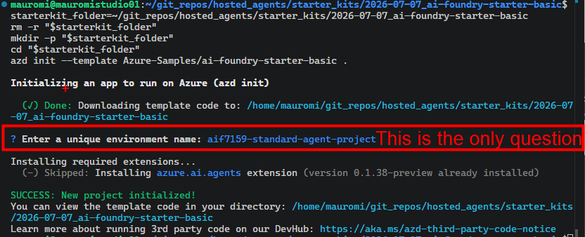
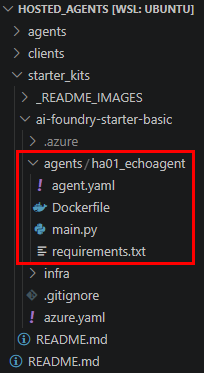
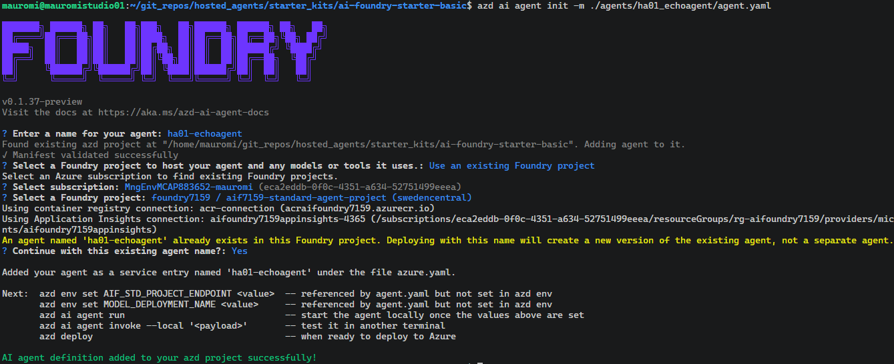
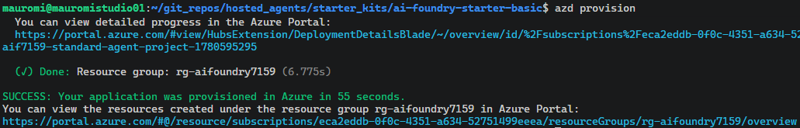
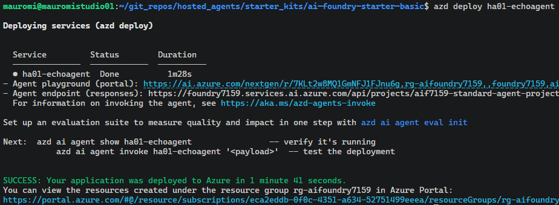
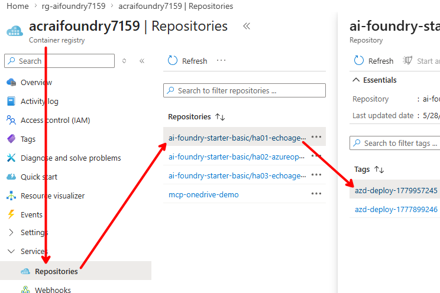
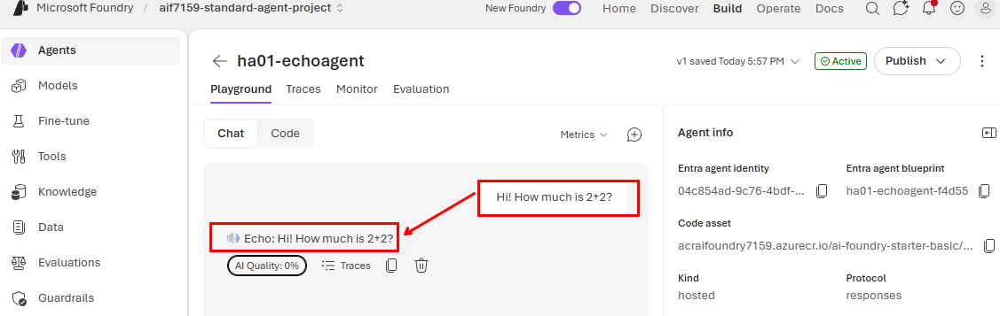

# Starter Kit generation

## Download the starter kit from [azd-ai-starter-basic](https://github.com/Azure-Samples/azd-ai-starter-basic)
```
azd init --template Azure-Samples/ai-foundry-starter-basic
```

### During this step, specify the environment name (same as Microsoft Foundry Project name, for example)

```
mauromi@mauromistudio01:~/git_repos/hosted_agents/starter_kits$ azd init --template Azure-Samples/ai-foundry-starter-basic

Let's get your development environment ready.

Discover and install Azure development tools such as Azure CLI, GitHub Copilot CLI, and Azure AI extensions.
To skip this check, set AZD_SKIP_FIRST_RUN=true or run azd config set tool.firstRunCompleted true.

? Would you like to check your Azure development tools?: Yes


  ✓ Azure CLI (2.83.0)
  ✓ GitHub Copilot CLI (installed)
  ✓ Azure Tools VS Code Extension (0.12.6)
  ✓ Bicep VS Code Extension (0.43.8)
  ○ GitHub Copilot Chat VS Code Extension — not installed
  ○ Azure MCP Server — not installed
  ✓ azd AI Agent Extensions (0.1.37-preview)

All recommended tools are installed. You're all set!

Initializing an app to run on Azure (azd init)

  (✓) Done: Downloading template code to: /home/mauromi/git_repos/hosted_agents/starter_kits/ai-foundry-starter-basic

? Enter a unique environment name: aif7159-standard-agent-project

Installing required extensions...
  (-) Skipped: Installing azure.ai.agents extension (version 0.1.37-preview already installed)

SUCCESS: New project initialized!
You can view the template code in your directory: /home/mauromi/git_repos/hosted_agents/starter_kits/ai-foundry-starter-basic
Learn more about running 3rd party code on our DevHub: https://aka.ms/azd-third-party-code-notice

Change to the project directory:
  cd ai-foundry-starter-basic
```

## Add source code to the agent
For example we may create the "agents" folder in the starter kit root, then a subfolder with the specific agent name and finally the following 4 files:<br/>


## Create/review the manifest (file `agent.yaml`)
```yaml
# Unique identifier/name for this agent
name: ha01-echoagent

# Brief description of what this agent does
description: >
  This sample demonstrates how to create a custom AI agent answer a simple question.  
  It is useful for testing, debugging, and learning how to build custom agents.

metadata:
  # Categorization tags for organizing and discovering agents
  tags:
    - AI Agent Hosting
    - Azure AI AgentServer
    - Custom Agent Implementation
    - Microsoft Agent Framework

template:
  name: ha01-echoagent
  kind: hosted
  protocols:
    - protocol: responses
      version: v1
  environment_variables:
    # https://<foundry_account>.services.ai.azure.com/api/projects/<foundry_project>, gpt-4o
    - name: AIF_STD_PROJECT_ENDPOINT    
      value: ${AIF_STD_PROJECT_ENDPOINT}
    - name: MODEL_DEPLOYMENT_NAME
      value: ${MODEL_DEPLOYMENT_NAME}
```

## Authenticate with `azd`
`azd auth login`

## Complete the configuration in the local repo
Run `azd ai agent init -m ./agents/ha01_echoagent/agent.yaml`<br/>


## Check the updated `azure.yaml` ***manifest***
```yaml
# yaml-language-server: $schema=https://raw.githubusercontent.com/Azure/azure-dev/main/schemas/v1.0/azure.yaml.json

requiredVersions:
    extensions:
        azure.ai.agents: '>=0.1.0-preview'
name: ai-foundry-starter-basic
services:
    ha01-echoagent:
        project: src/ha01-echoagent
        host: azure.ai.agent
        language: docker
        docker:
            remoteBuild: true
        config:
            container:
                resources:
                    cpu: "0.5"
                    memory: 1Gi
            startupCommand: python main.py
infra:
    provider: bicep
    path: ./infra
```

## Provision Azure Resources
**IMPORTANT**: this provisioning phase will consider ***ALL*** services listed under *services* key in azure.yaml. This means that if there are more than one hosted agent defined there, it will need to find it under the *src/* folder.<br/><br/>
`azd provision`<br/>


## Deploy the image into ACR and the agent into Foundry Project
`azd deploy ha01-echoagent`<br/>



### As a result, in the ACR we get


## Let's test it in the Azure portal (with 0% `AI Quality`)



## Variables injection
Run the following commands from the azd project folder:
```bash
azd env set AIF_STD_PROJECT_ENDPOINT "https://foundry7159.services.ai.azure.com/api/projects/aif7159-standard-agent-project"
azd env set MODEL_DEPLOYMENT_NAME "gpt-4o"
azd env set APPLICATIONINSIGHTS_CONNECTION_STRING "InstrumentationKey=***;IngestionEndpoint=ht.."
```
